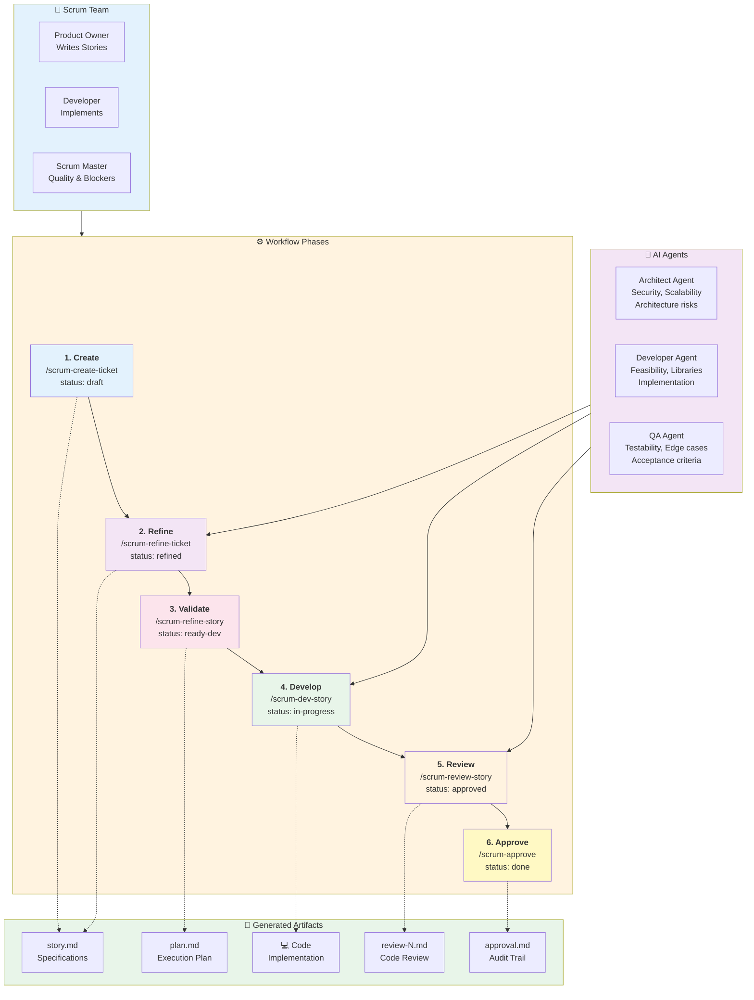
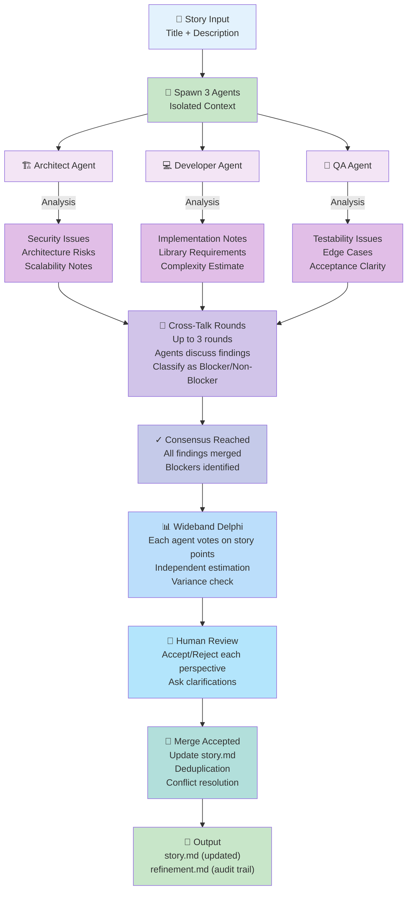
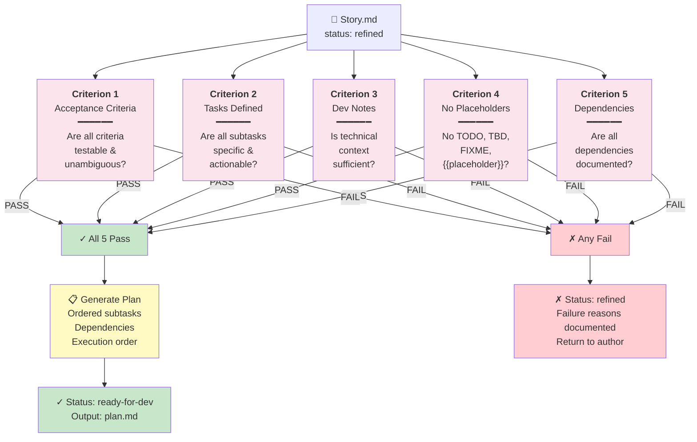
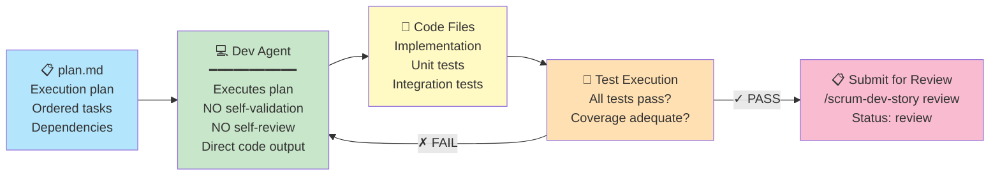
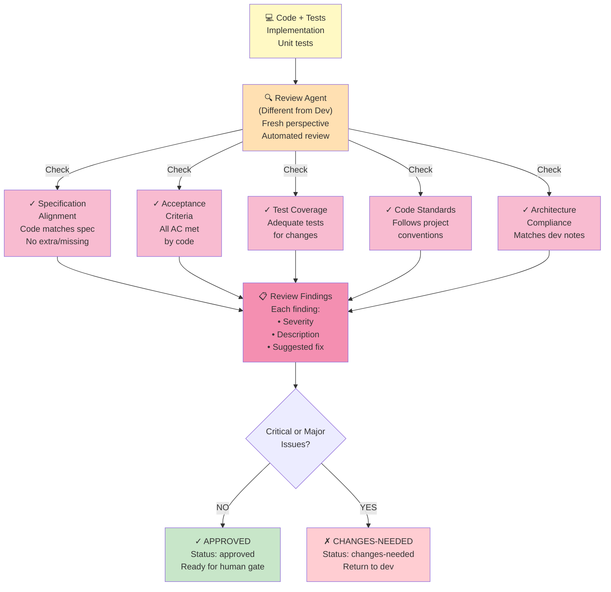
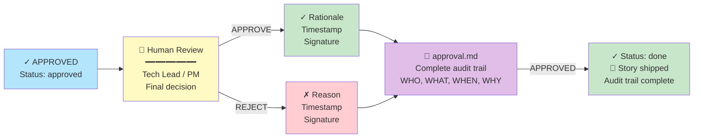
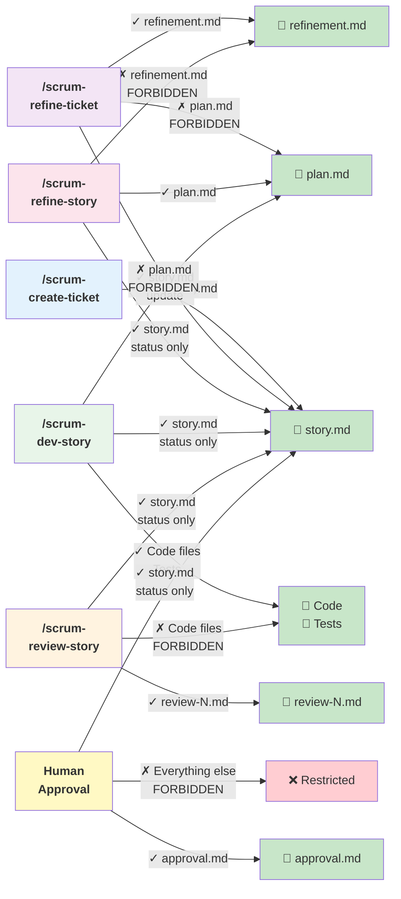
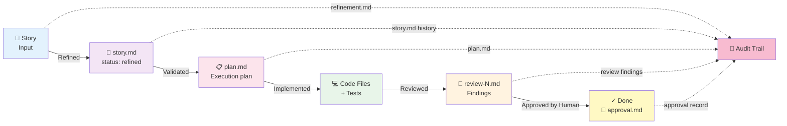
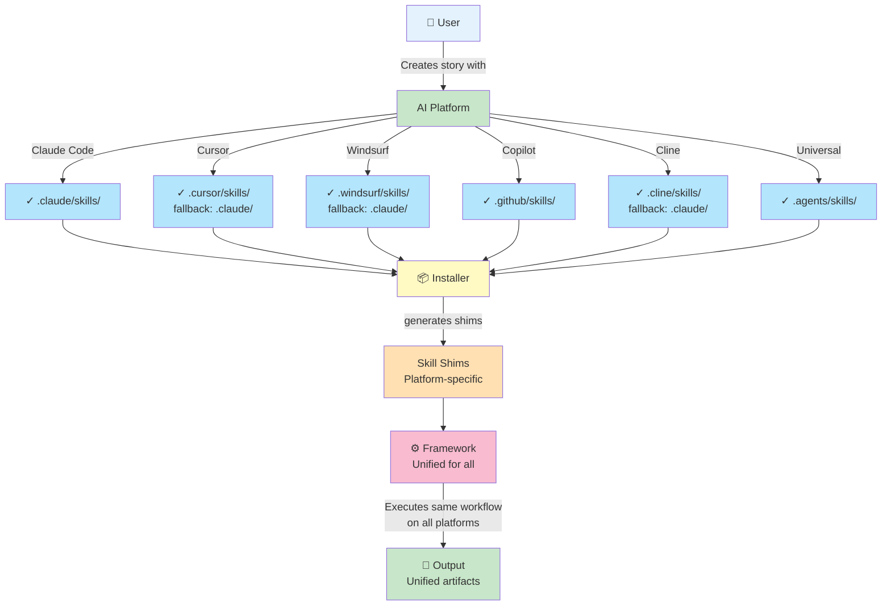
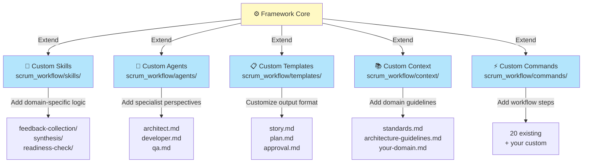

# 🏗️ Scrum Workflow Architecture — Visual Guide

Visuelle Erklärung wie Scrum Workflow intern funktioniert.

---

## System Overview



**Key Features:** Phase isolation • Write boundaries • Human gates • Complete audit trail

---

## Story Lifecycle State Machine

```mermaid
stateDiagram-v2
    [*] --> draft: /scrum-create-ticket
    
    draft --> refinement: /scrum-refine-ticket
    
    refinement --> refined: Agents complete<br/>Cross-talk done<br/>Estimation ready
    
    refined --> refined: /scrum-refine-story<br/>Criteria FAIL<br/>Fix & Retry
    
    refined --> ready-for-dev: /scrum-refine-story<br/>All 5 Criteria PASS
    
    ready-for-dev --> in-progress: /scrum-dev-story<br/>Start implementation
    
    in-progress --> in-progress: Fix code<br/>Run tests
    
    in-progress --> review: /scrum-dev-story review<br/>Ready for code review
    
    review --> approved: /scrum-review-story<br/>No critical issues
    
    review --> changes-needed: /scrum-review-story<br/>Critical/Major issues found
    
    changes-needed --> in-progress: /scrum-dev-story<br/>Fix findings
    
    approved --> done: /scrum-approve<br/>Human sign-off
    
    done --> [*]
    
    note right of draft
        Story created, not yet refined
    end note
    
    note right of refined
        Refinement done, awaiting validation
    end note
    
    note right of ready-for-dev
        Spec validated, OK to implement
    end note
    
    note right of changes-needed
        Code review found issues
        Developer fixes and re-submits
    end note
    
    note right of done
        Human approved, story complete
    end note
```

---

## Phase 1: Multi-Agent Refinement



---

## Phase 2: Immutable Validation



**Key Point:** Agent can ONLY validate, CANNOT modify story. This ensures the spec is immutable.

---

## Phase 3: Development



**Principle:** Inversion of Control — Agent receives plan and just executes it. No creativity, no second-guessing, no self-review.

---

## Phase 4: Code Review



---

## Phase 5: Human Approval



**Critical Point:** No AI can mark a story as DONE. Only humans can approve. This is the ultimate safeguard.

---

## File Write Boundaries



**Purpose:** Phase isolation. Each command can ONLY modify its own files, preventing interference between phases.

---

## Data Flow: From Story to Shipped



**Complete Traceability:** Every step is recorded, making the workflow auditable and compliant.

---

## Multi-Platform Support



**Platform Independence:** Install once, run on any AI platform. No lock-in.

---

## Performance & Resource Usage

```mermaid
xychart-beta
    title "Token Usage by Phase"
    x-axis [Create, Refine, Validate, Develop, Review, Approve]
    y-axis "Tokens (estimated)" 0 --> 10000
    line [100, 5000, 1000, 8000, 2000, 200]
    
    note "Phase 1 (Refine) uses most tokens<br/>Phase 3 (Develop) variable based on story size<br/>Phases 2,4,6 are lightweight"
```

**Resource Distribution:**
- **Create:** ~100 tokens (trivial)
- **Refine:** ~5,000 tokens (3 agents analyzing)
- **Validate:** ~1,000 tokens (rule checking)
- **Develop:** ~8,000 tokens (code implementation, variable)
- **Review:** ~2,000 tokens (separate agent reviewing)
- **Approve:** ~200 tokens (human decision, trivial)

**Total per story:** ~16,300 tokens (typical)

---

## Extension Points



---

## Next Steps

- 📖 Read [GETTING-STARTED.md](./GETTING-STARTED.md) for practical walkthrough
- 🎯 Read [BENEFITS.md](./BENEFITS.md) for why this works
- 📚 Read [README.md](./README.md) for complete reference
- 🏗️ Read [docs/architecture-framework.md](./docs/architecture-framework.md) for deep dive

---

**Version:** 1.2.0  
**Last Updated:** 2026-04-09
