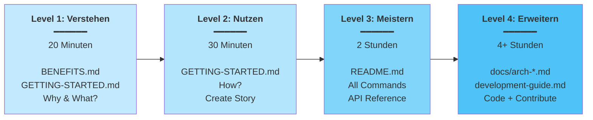

# 📑 Scrum Workflow — Documentation Index

Schneller Überblick aller Dokumentationen und wo du anfangen solltest.

---

## 🎯 Start Here (Wähle deine Rolle)

### 👶 Ich bin komplett neu hier
→ **[GETTING-STARTED.md](./GETTING-STARTED.md)** (15 Minuten)
- ✅ Schritt-für-Schritt Installation
- ✅ Alle 6 Workflow-Phasen erklärt (mit Mermaid Diagrammen)
- ✅ Mit praktischen Beispielen
- ✅ Am Ende: Erste Story erstellt

### 🎯 Ich will die Tool-Vorteile verstehen
→ **[BENEFITS.md](./BENEFITS.md)** (10 Minuten)
- ✅ Probleme die Scrum Workflow löst
- ✅ Vorher/Nachher Vergleich (mit Visualisierungen)
- ✅ ROI Berechnung
- ✅ Konkrete Story-Beispiele

### ⚡ Ich brauche schnelle Command-Übersicht
→ **[WORKFLOW-QUICK-REFERENCE.md](./WORKFLOW-QUICK-REFERENCE.md)** (5 Minuten)
- ✅ Alle 20 Commands visuell erklärt
- ✅ Mermaid Diagramme für jeden Command
- ✅ Cheatsheet & Timeline
- ✅ Zum Ausdrucken/Bookmarken

### 🏗️ Ich will die Architecture verstehen
→ **[ARCHITECTURE-VISUAL.md](./ARCHITECTURE-VISUAL.md)** (20 Minuten)
- ✅ System Overview Diagramm
- ✅ State Machine visuell
- ✅ Jede Phase ausführlich erklärt
- ✅ Data Flow & Extension Points

### 📚 Ich brauche Dokumentation zu einem Thema
→ **[DOCUMENTATION-GUIDE.md](./DOCUMENTATION-GUIDE.md)** (10 Minuten)
- ✅ Map aller 49 Dokumente
- ✅ Navigation by Use Case
- ✅ Wo findet man was?

### 📖 Ich brauche alle Infos in einer Datei
→ **[README.md](./README.md)** (30 Minuten)
- ✅ Vollständige Referenz
- ✅ Alle Commands
- ✅ State Machine
- ✅ Design Principles

---

## 📚 Dokumentation nach Kategorie

### Für Product Owner / Business
```
BENEFITS.md                       — Warum Scrum Workflow?
GETTING-STARTED.md               — Wie nutze ich es?
README.md (Workflow Section)      — Wie läuft mein Feature ab?
```

### Für Entwickler
```
GETTING-STARTED.md (Phase 4)      — Wie implementiere ich?
scrum_workflow/commands/          — Was machen die Commands?
scrum_workflow/context/           — Coding Standards?
docs/development-guide.md         — Wie entwickle ich lokal?
```

### Für Tech Lead / Architect
```
README.md (Design Principles)     — Philosophie?
docs/architecture-framework.md    — Wie funktioniert das System?
scrum_workflow/agents/            — Was machen die Agents?
docs/integration-architecture.md  — Wie passt alles zusammen?
```

### Für QA / Test Engineer
```
GETTING-STARTED.md (Phase 2)      — Welche Test-Kriterien?
scrum_workflow/agents/qa.md       — QA Perspective?
scrum_workflow/skills/            — Welche Skills gibt es?
```

### Für Compliance / Security
```
BENEFITS.md (Auditability)        — Audit Trail?
README.md (State Machine)         — Wer darf was?
docs/architecture-framework.md    — Wie ist Approval implementiert?
```

---

## 🗂️ Dokument-Struktur

```
scrum_workflow/
│
├─ 📄 INDEX.md                    ← Du bist hier!
├─ 📄 README.md                   ← Vollständige Referenz
├─ 📄 GETTING-STARTED.md          ← Onboarding (15 min)
├─ 📄 BENEFITS.md                 ← Warum Scrum Workflow?
├─ 📄 DOCUMENTATION-GUIDE.md      ← Alle Dokumente erklärt
│
├─ 📁 docs/                       ← Technische Deep-Dives
│  ├─ index.md                    ← Master Index
│  ├─ project-overview.md
│  ├─ source-tree-analysis.md
│  ├─ development-guide.md        ← Dev Setup
│  ├─ architecture-framework.md   ← System Design
│  ├─ architecture-cli-installer.md
│  └─ integration-architecture.md
│
├─ 📁 scrum_workflow/             ← Framework (read-only)
│  ├─ config.yaml                 ← Framework Configuration
│  │
│  ├─ 📁 agents/
│  │  ├─ README.md
│  │  ├─ architect.md
│  │  ├─ developer.md
│  │  └─ qa.md
│  │
│  ├─ 📁 commands/ (20 Commands)
│  │  ├─ README.md                ← Command Index
│  │  ├─ create-ticket.md
│  │  ├─ refine-ticket.md
│  │  ├─ dev-story.md
│  │  ├─ review-story.md
│  │  ├─ approve.md
│  │  └─ ...15 weitere
│  │
│  ├─ 📁 context/
│  │  ├─ index.md                 ← Domain Context Map
│  │  ├─ standards.md
│  │  └─ architecture-guidelines.md
│  │
│  ├─ 📁 templates/
│  │  ├─ story.md
│  │  ├─ plan.md
│  │  └─ approval.md
│  │
│  ├─ 📁 skills/                  ← Special Capabilities
│  │  ├─ readiness-check/
│  │  ├─ synthesis/
│  │  └─ feedback-collection/
│  │
│  └─ 📁 data/
│     ├─ estimation-scale.yaml
│     └─ severity-levels.yaml
│
├─ 📁 create-scrum-workflow/       ← CLI Installer
│  ├─ README.md
│  ├─ PLATFORM-VALIDATION.md
│  └─ breaking-changes.md
│
└─ 📁 _scrum-output/               ← Generated Artifacts (auto)
   ├─ context/
   ├─ docs/
   ├─ skills/
   └─ sprints/
      └─ SW-001/
         ├─ story.md
         ├─ refinement.md
         ├─ plan.md
         ├─ review-N.md
         └─ approval.md
```

---

## ✅ Checkliste: What to Read

- [ ] **BENEFITS.md** — Verstehe den Wert (10 min)
- [ ] **GETTING-STARTED.md** — Installiere und erstelle erste Story (15 min)
- [ ] **README.md** — Vollständige Referenz speichern (für später)
- [ ] **DOCUMENTATION-GUIDE.md** — Wissen wo man Docs findet (5 min)
- [ ] **docs/development-guide.md** — Falls du contribute möchtest (30 min)

**Total: ~60 Minuten bis du produktiv bist**

---

## 🚀 Schnelle Links

**Installation & First Steps:**
- [Installation Guide](./create-scrum-workflow/README.md)
- [Quick Start](./GETTING-STARTED.md)

**Commands & Usage:**
- [All 20 Commands](./scrum_workflow/commands/README.md)
- [Command Reference](./README.md#commands-reference)

**Technical Reference:**
- [Architecture Framework](./docs/architecture-framework.md)
- [Source Code Guide](./docs/source-tree-analysis.md)

**Development:**
- [Dev Setup](./docs/development-guide.md)
- [Contributing Guide](./docs/development-guide.md#pull-request-process)

---

## 📞 Häufige Fragen

**F: Wo ist meine Story-Datei?**
A: `_scrum-output/sprints/SW-XXX/story.md`

**F: Wie sieht das Workflow aus?**
A: [README.md → The Workflow Section](./README.md#-the-workflow)

**F: Welche Commands gibt es?**
A: [scrum_workflow/commands/README.md](./scrum_workflow/commands/README.md)

**F: Wie installiere ich?**
A: [GETTING-STARTED.md → Phase 1](./GETTING-STARTED.md#phase-1-installation-5-minuten)

**F: Wie konfiguriere ich das Framework?**
A: [README.md → Configuration](./README.md#configuration)

**F: Kann ich es mit meinem Tool XYZ nutzen?**
A: Ja! Siehe [Supported Platforms](./README.md#supported-platforms)

---

## 🎓 Lern-Pfad



### Was du in jedem Level lernst:

**Level 1 (20 min):** 
- Warum Scrum Workflow?
- Welche Probleme löst es?
- Wie funktioniert der Workflow?

**Level 2 (30 min):** 
- Installation durchführen
- Erste Story erstellen
- Alle 6 Phasen verstehen

**Level 3 (2h):** 
- Alle 20 Commands nutzen
- State Machine verstehen
- Design Principles lernen

**Level 4 (4+h):** 
- Framework-Interna verstehen
- Erweiterungen schreiben
- Zur Community beitragen

---

## 📞 Support

**Fragen zur Dokumentation?** 
→ Siehe [DOCUMENTATION-GUIDE.md](./DOCUMENTATION-GUIDE.md)

**Technische Probleme?**
→ Siehe [docs/development-guide.md](./docs/development-guide.md#troubleshooting)

**Feature Request?**
→ [Contributing Guide](./docs/development-guide.md#pull-request-process)

---

**Stand:** 2026-04-09  
**Version:** 1.2.0

Viel Erfolg! 🚀
