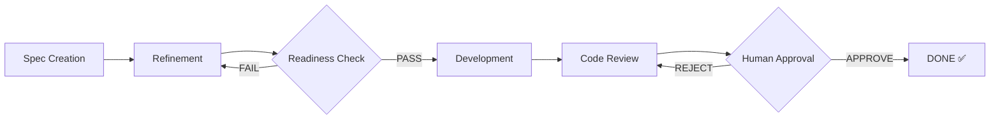

# BMAD Scrum Workflow

**Version:** 1.0.0
**Status:** Production Ready ✅

A spec-first, AI-assisted development workflow with human oversight at critical gates. Built for Claude Code and compatible AI coding assistants.

---

## 🚀 Quick Start

```bash
# 1. Install framework (choose method)
cp -r /path/to/scrum_workflow/scrum_workflow ./scrum_workflow
cp -r /path/to/scrum_workflow/.claude/skills/bmad-* .claude/skills/

# 2. Create directories
mkdir -p _bmad-output/{planning-artifacts,implementation-artifacts}
mkdir -p sprints

# 3. Generate project context (Phase 0)
/create-project-context  # Analyze project, create context files

# 4. Create first story
/create-ticket  # Create story from epic requirements
```

**📖 Full Installation Guide:** [docs/01-installation.md](scrum_workflow/docs/01-installation.md)

---

## ✨ Features

- **Spec-First Development**: Story fully specified before coding starts
- **Multi-Agent Refinement**: Backend, Frontend, QA, Architecture perspectives
- **Guard Conditions**: Quality gates enforced at each phase
- **Human Approval Gate**: No story ships without explicit sign-off
- **Complete Audit Trail**: Every phase generates documented output
- **Atomic Writes**: NFR1 compliance for concurrent safety
- **Write Boundary Rules**: Phase isolation prevents unauthorized modifications

---

## 📋 Workflow Overview



### Commands

| Command | Purpose |
|---------|---------|
| `/create-project-context` | **Phase 0**: Generate project context files |
| `/create-ticket` | Phase 1: Create story from epic |
| `/refine-ticket SW-XXX` | Phase 2: Multi-agent refinement |
| `/dev-story SW-XXX` | Phase 3: Implement story (requires: ready) |
| `/dev-story SW-XXX review` | Phase 4: Code review |
| Human approval | Phase 5: Final gate |

**📖 Full Documentation:** [docs/00-index.md](scrum_workflow/docs/00-index.md)

---

## 📁 Project Structure

```
your-project/
├── .claude/
│   └── skills/           # BMAD workflow skills
├── _bmad-output/
│   ├── planning-artifacts/      # Epics, PRD, Architecture
│   └── implementation-artifacts/ # Story files
├── scrum_workflow/
│   ├── agents/           # Agent definitions
│   ├── commands/         # Command workflows
│   ├── workflows/        # Phase workflows
│   ├── templates/        # Output templates
│   ├── context/          # Domain context
│   └── docs/             # Documentation
└── sprints/              # SW-101, SW-102, etc.
```

---

## 🎯 Status Transitions

```
draft → refinement → ready → in-dev → in-review → done
   ↑                   ↓          ↓          ↑
   └───────────────────┴──────────┴──────────┘
              (rejection cycles)
```

**Critical Rules:**
- `/dev-story` requires `status: ready` (STRICT)
- No automatic `done` transition (human gate)
- Each phase writes only specific files

---

## 📚 Documentation

| Document | Description |
|----------|-------------|
| [Installation](scrum_workflow/docs/01-installation.md) | Setup for new projects |
| [Quick Start](scrum_workflow/docs/02-quick-start.md) | 5-minute overview |
| [Command Reference](scrum_workflow/docs/04-command-reference.md) | All commands |
| [Implementation Patterns](scrum_workflow/docs/12-implementation-patterns.md) | 16 patterns with code |
| [Examples](scrum_workflow/docs/09-examples.md) | Complete file examples |

---

## 🔧 Configuration

Create `config.yaml` in project root:

```yaml
platform: claude-code
project_name: "Your Project"
project_key: "PREFIX"  # for story IDs like PREFIX-101

active_agents:
  - architect
  - developer
  - qa
```

---

## 🛡️ Guard Conditions

**Before Development:**
- Story must be `status: ready`
- All 4 readiness criteria must PASS
- `plan.md` must exist

**Before Approval:**
- Code review must exist (`review-N.md`)
- Human must explicitly approve
- No automatic DONE transition

---

## 📊 Completed Epics

✅ **Epic 1:** Framework Setup & Project Onboarding
✅ **Epic 2:** Spec-First Ticket Creation
✅ **Epic 3:** Multi-Agent Story Refinement
✅ **Epic 4:** Development, Review & Approval

---

## 🤝 Contributing

This framework is designed to be extended. See:
- [Extension Points](scrum_workflow/docs/14-extension-points.md)
- [Framework Architecture](scrum_workflow/docs/08-framework-architecture.md)

---

## 📝 License

[Your License Here]

---

**Version:** 1.0.0
**Last Updated:** 2026-03-25
**Documentation:** [scrum_workflow/docs/00-index.md](scrum_workflow/docs/00-index.md)
