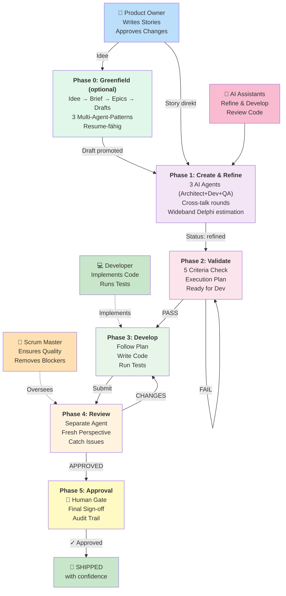
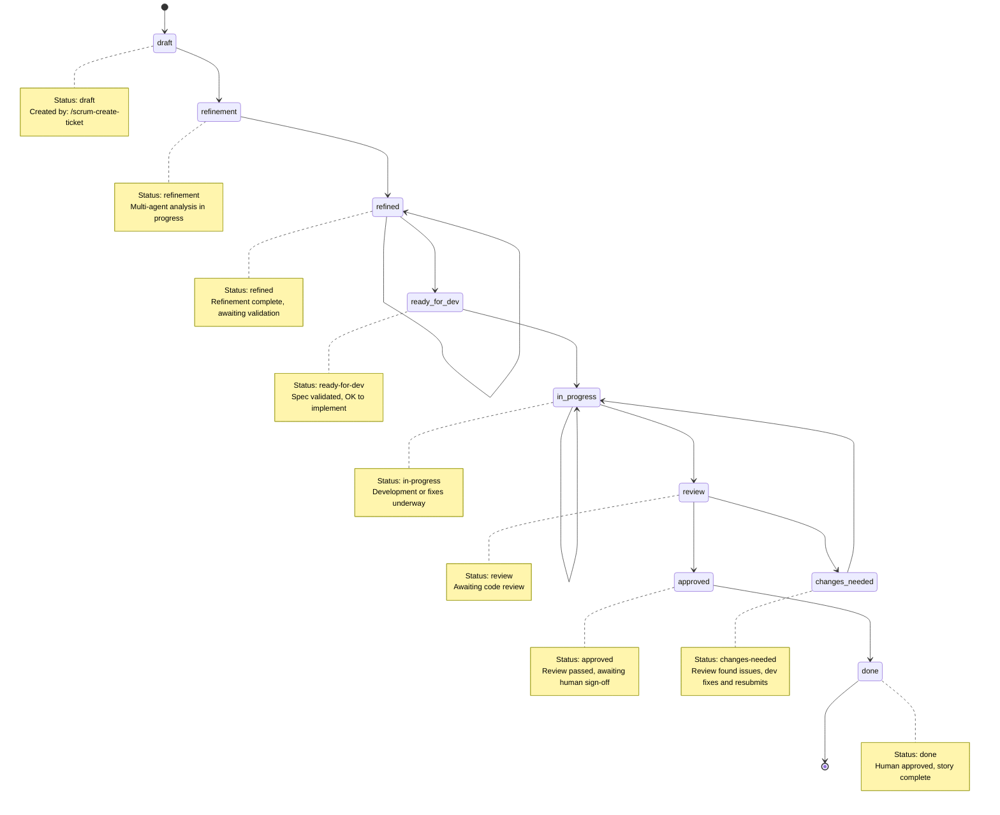

# Scrum Workflow

**Version:** 1.3.0  
**Status:** Production-Ready with 23 Commands  
**Platform Support:** Claude Code, Cursor, Windsurf, GitHub Copilot, Cline, Universal

A spec-first, AI-assisted development workflow with human oversight at critical gates. Built for Claude Code and compatible AI coding assistants.

---

## 📁 Project Structure (v1.2.0+)

The repository is organized as an npm monorepo with clear separation of concerns:

```
scrum-workflow/                 # Root — clean, minimal
├── src/                        # Application source code
│   ├── core/                   # @scrum-workflow/core (workflow engine)
│   │   ├── skills/             # 20+ workflow skills
│   │   ├── commands/           # CLI commands
│   │   ├── templates/          # Installation templates
│   │   ├── context/            # Framework context & standards
│   │   ├── agents/             # AI agent definitions
│   │   ├── __tests__/          # Core tests
│   │   └── package.json        # Core library metadata
│   │
│   ├── cli/                    # create-scrum-workflow (scaffolder & CLI)
│   │   ├── bin/                # CLI entry point
│   │   ├── src/                # CLI implementation
│   │   ├── templates/          # Installation templates  
│   │   ├── test/               # CLI tests
│   │   ├── scripts/            # Utility scripts
│   │   └── package.json        # CLI package metadata
│   │
│   └── docs/                   # Documentation
│       ├── index.md            # Master docs index
│       ├── development-guide.md
│       ├── architecture-*.md
│       └── ...
│
├── package.json                # Monorepo root (workspaces: src/core, src/cli)
├── README.md                   # You are here
└── story.md                    # Current story/task tracking
```

**Key Points:**
- **`src/core/`** = The workflow engine (@scrum-workflow/core, reusable, independent)
- **`src/cli/`** = The scaffolding CLI tool (creates projects with src/core installed as `scrum_workflow/`)
- **`src/docs/`** = All documentation and guides (organized, out of root)
- **Monorepo**: Single `npm install`, shared root dependencies, separate packages

**Backward Compatibility:**
- User projects install with `frameworkPath: "scrum_workflow"` (unchanged, still works)
- Only **repository** structure changed; user **installations** completely unaffected
- Existing projects continue to work without any migration

---

## 🌱 Greenfield: Von der Idee zum Ticket

**Neu in v1.3:** Wenn du ein Projekt bei null startest und nur eine Idee hast, musst du nicht sofort Tickets schreiben. Der Greenfield-Flow führt dich von einer rohen Idee über einen strukturierten Product Brief zu Epics und schließlich zu Ticket-Drafts — alles mit Multi-Agent-Patterns von [agentic-patterns.com](https://www.agentic-patterns.com/patterns?tag=multi-agent).

```bash
# 1. Idee einfangen → Product Brief (3 Agents parallel + aggressive Interview-Loop)
/scrum-create-brief "A habit tracker that gamifies daily routines for ADHD users"
# → _scrum-output/briefs/PB-001.md (status: complete, keine offenen Fragen)

# 2. Brief → Epics (Plan-Then-Execute: ein Agent, eine deterministische Entscheidung)
/scrum-decompose-epics PB-001
# → _scrum-output/epics/index.md + EP-001..EP-00N/epic.md

# 3. Pro Epic → Story-Drafts (Orchestrator-Worker: N Subagents parallel)
/scrum-draft-stories EP-001
# → _scrum-output/epics/EP-001/draft-stories.md (N Kandidaten)

# 4. Einzelne Drafts als Tickets promoten (Human-Gate pro Ticket)
/scrum-create-ticket SW-001 --from-epic EP-001 --from-draft 1
# → bestehender Lifecycle: refine → dev → review → approve
```

**Multi-Agent-Patterns im Einsatz:**

| Phase | Pattern | Wirkung |
|-------|---------|---------|
| Brief-Brainstorming | *Iterative Multi-Agent Brainstorming* | Product + Architect + QA liefern parallel Perspektiven — keine Engineering-Tunnelvision |
| Brief-Interview | *Reflection Loop* (aggressive) | Läuft bis keine offenen Fragen mehr bleiben — kein halbgarer Brief |
| Epic-Decomposition | *Plan-Then-Execute* | Ein Agent committet sich auf den gesamten Epic-Graph — keine Drift |
| Story-Drafting | *Orchestrator-Worker* | N Subagents drafts in parallel, map-reduce zum Aggregate — Speed-up bei großen Epics |

**Resume-fähig:** Jeder Greenfield-Command speichert einen State-File und kann nach Ctrl-C oder Crash per `--resume` fortgesetzt werden.

Details: [src/docs/greenfield-workflow.md](./src/docs/greenfield-workflow.md)

---

## 🚀 Quick Start

### 1. Installation (3 minutes)

```bash
# Clone this repository
git clone <repo-url>
cd scrum-workflow

# Install root + workspace dependencies (src/core and src/cli)
npm install

# Link CLI globally (for development)
npm -w src/cli link

# Install into your project
cd /path/to/your-project
create-scrum-workflow install
```

**What gets installed:**
- 20 workflow commands (skill shims)
- Framework files (read-only)
- Configuration files (your customizations)
- Output directories for artifacts

### 2. Initialize Your Project (2 minutes)

```bash
# Generate project context from your codebase
/scrum-create-project-context

# This analyzes your code and creates domain-specific context
# for smarter AI assistance throughout the workflow
```

### 3. Create Your First Story (1 minute)

```bash
/scrum-create-ticket SW-001 "Add user authentication with OAuth2"
```

**That's it!** Your story is created. Now refine it, develop it, review it, and approve it using the commands below.

---

## 📊 How It Works



**In a nutshell:** Spec → Validate → Code → Review → Ship (with human gate at the end)

---

## ✨ Why Use Scrum Workflow?

### Problem It Solves
- **AI reliability:** AI makes mistakes → structured phases with human gates prevent bad code shipping
- **Slow feedback loops:** Developers implement from vague specs → spec-first approach catches ambiguities before coding
- **Isolated blindspots:** Developer writes code AND reviews own work → separate reviewer agents catch missed issues
- **No audit trail:** Who decided what when? → all decisions recorded with reasoning

### What You Get

| Challenge | Solution |
|-----------|----------|
| **Unclear requirements** | Multi-agent refinement (architect, developer, QA perspectives) |
| **Slow implementation** | AI-powered development following clear, validated specs |
| **Poor code quality** | Separate code review agent + immutable spec validation |
| **No traceability** | Complete audit trail of all decisions and changes |
| **Bottlenecks** | Parallel agent analysis, validated gates, human approval only at end |
| **Tool-lock** | Framework works across Claude Code, Cursor, Windsurf, Copilot, Cline |

### Real-World Impact
- **50% faster specs** — Multi-agent refinement finds gaps in hours, not days
- **Zero bad merges** — Code review agent + human sign-off prevent regressions
- **Clear accountability** — Every change recorded with who, what, when, why
- **Framework-agnostic** — Works with any AI coding assistant platform

---

## 📋 The Workflow

Every story follows a strict lifecycle. No phase can be skipped. Each transition is guarded.

```
draft → refinement → refined → ready-for-dev → in-progress → review → approved → done
                                                                ↓
                                                          changes-needed
                                                                ↓
                                                           in-progress (fix & re-review)
```

**Want the full walkthrough?** See [GETTING-STARTED.md](./src/docs/GETTING-STARTED.md) for step-by-step with examples.

### Phase-by-Phase Explanation

#### Phase 1: Create Story (`draft`)

```bash
/scrum-create-ticket SW-001 "Add user authentication with OAuth2"
```

Takes a natural language description and produces a structured story file with YAML frontmatter, acceptance criteria in Given/When/Then format, and initial estimation. This is the entry point -- no development begins until a spec exists.

**Output:** `_scrum-output/sprints/SW-001/story.md` with `status: draft`

---

#### Phase 2a: Multi-Agent Refinement (`draft` → `refinement` → `refined`)

```bash
/scrum-refine-ticket SW-001
```

Spawns three specialized AI agents in parallel, each analyzing the story from their expert perspective with isolated context:

| Agent | Focus |
|-------|-------|
| **Architect** | Architectural risks, scalability, security, dependencies |
| **Developer** | Technical feasibility, implementation complexity, libraries |
| **QA** | Testability, acceptance criteria clarity, edge cases |

The agents then engage in **cross-talk rounds** (up to 3) where they comment on each other's findings, classify disagreements as blockers/non-blockers, and work toward consensus. Security issues are automatically marked as blockers.

After cross-talk, **Wideband Delphi estimation** collects independent story point estimates from all three agents, with variance checking and re-estimation rounds if estimates diverge.

You review each perspective individually (accept/reject), and accepted findings are merged into the story via deduplication and conflict resolution.

**Why `refined` exists as a separate status:** The multi-agent refinement is expensive (3 agents, cross-talk, estimation). The `refined` status marks "refinement complete" so that if validation fails in the next phase, you only re-run the lightweight validation -- not the full 3-agent process.

**Output:** Updated `story.md` with `status: refined`, `refinement.md` with full audit trail

---

#### Phase 2b: Validation Gate (`refined` → `ready-for-dev`)

```bash
/scrum-refine-story SW-001
```

A validation-only agent checks the story against an **immutable 5-criterion checklist**:

| # | Criterion | What it checks |
|---|-----------|---------------|
| 1 | Acceptance Criteria | All criteria are testable and unambiguous |
| 2 | Tasks Defined | All subtasks are specific and actionable |
| 3 | Dev Notes | Sufficient technical context for implementation |
| 4 | No Placeholders | No TODO, TBD, FIXME, or `{{placeholder}}` markers |
| 5 | Dependencies | All dependencies identified and documented |

The agent **cannot modify** the story -- it can only validate. This is the [Feature List as Immutable Contract](https://www.agentic-patterns.com/patterns/feature-list-as-immutable-contract) pattern.

- **PASS:** Status becomes `ready-for-dev`, execution plan (`plan.md`) is assembled
- **FAIL:** Status stays `refined`, failure reasons documented. Fix issues and re-run

**Output:** `plan.md` with ordered subtasks and dependencies (on PASS)

---

#### Phase 3: Development (`ready-for-dev` → `in-progress`)

```bash
/scrum-dev-story SW-001
```

Implements the story following the specification and execution plan. The dev agent uses [Inversion of Control](https://www.agentic-patterns.com/patterns/inversion-of-control) -- it receives a plan and **just executes it**:

- No self-validation (separate command does that)
- No self-review (separate agent does that)
- No planning (plan already exists)
- Direct output to code files (no summary reports)

When implementation is complete, trigger the review:

```bash
/scrum-dev-story SW-001 review
```

This transitions the story to `review` status after verifying all tasks are complete and tests pass.

**Output:** Implemented code, `story.md` updated to `in-progress` then `review`

---

#### Phase 4: Code Review (`review` → `approved` or `changes-needed`)

```bash
/scrum-review-story SW-001
```

A **separate AI agent** (ideally a different model) reviews the code using the [AI-Assisted Code Review](https://www.agentic-patterns.com/patterns/ai-assisted-code-review-verification) pattern. The reviewer evaluates against:

| # | Criterion | What it checks |
|---|-----------|---------------|
| 1 | Specification Alignment | Code matches story spec (no extra, no missing features) |
| 2 | Acceptance Criteria | All AC satisfied by implementation |
| 3 | Test Coverage | Adequate tests for the changes |
| 4 | Code Standards | Follows project conventions |
| 5 | Architecture Compliance | Follows patterns from Dev Notes |

Each finding gets a severity (Critical/Major/Minor) and a suggested fix.

- **APPROVED:** No critical issues. Status becomes `approved`
- **CHANGES-NEEDED:** Critical/major issues found. Status becomes `changes-needed`

**Why `changes-needed` is a separate status:** It provides explicit visibility into stories that went back for rework after review. Without it, you can't distinguish "first implementation" from "fixing review findings" -- important for tracking and metrics.

If changes are needed, the developer fixes the issues and re-submits:

```bash
/scrum-dev-story SW-001        # Fix findings (status: changes-needed → in-progress)
/scrum-dev-story SW-001 review # Re-submit for review (status: in-progress → review)
/scrum-review-story SW-001     # Re-review
```

**Output:** `review-N.md` with findings table, verdict, and suggested fixes

---

#### Phase 5: Human Approval (`approved` → `done`)

This is the final gate. No AI agent can mark a story as done -- only an explicit human decision.

The approval workflow presents the review findings and asks for a clear APPROVE or REJECT decision. An audit trail (`approval.md`) records the decision, approver, and rationale.

**Output:** `approval.md`, story status becomes `done`

---

## Status State Machine

### All 9 Valid Status Values

| Status | Set By | Guard | Meaning |
|--------|--------|-------|---------|
| `draft` | `/scrum-create-ticket` | -- | Story created, not yet refined |
| `refinement` | `/scrum-refine-ticket` | status == draft | Multi-agent refinement in progress |
| `refined` | `/scrum-refine-ticket` | refinement complete | Refinement done, awaiting validation |
| `ready-for-dev` | `/scrum-refine-story` | all 5 criteria PASS | Validated, implementation allowed |
| `in-progress` | `/scrum-dev-story` | status == ready-for-dev | Implementation in progress |
| `review` | `/scrum-dev-story review` | status == in-progress | Code review requested |
| `approved` | `/scrum-review-story` | verdict == APPROVED | Review passed |
| `changes-needed` | `/scrum-review-story` | verdict == CHANGES-NEEDED | Review found issues |
| `done` | Human approval | explicit sign-off | Human approved, story complete |

### All Valid Transitions



| From | To | Trigger | Guard |
|------|----|---------|-------|
| `draft` | `refinement` | `/scrum-refine-ticket` | status == draft |
| `refinement` | `refined` | `/scrum-refine-ticket` | agents complete |
| `refined` | `ready-for-dev` | `/scrum-refine-story` | all 5 criteria PASS |
| `refined` | `refined` | `/scrum-refine-story` | any criterion FAIL |
| `ready-for-dev` | `in-progress` | `/scrum-dev-story` | status == ready-for-dev |
| `in-progress` | `review` | `/scrum-dev-story review` | status == in-progress |
| `review` | `approved` | `/scrum-review-story` | verdict == APPROVED |
| `review` | `changes-needed` | `/scrum-review-story` | verdict == CHANGES-NEEDED |
| `changes-needed` | `in-progress` | `/scrum-dev-story` | developer fixes findings |
| `approved` | `done` | Human approval | explicit sign-off |

**Any transition not listed above is forbidden.** Commands reject invalid status with actionable error messages.

---

## Commands Reference

**Visual Overview:** See [ALL-COMMANDS.md](./src/docs/ALL-COMMANDS.md) for all 20 commands as Mermaid diagrams

### Greenfield (3 Commands, optional Phase 0)

| Command | Phase | Artifact Transition |
|---------|-------|---------------------|
| `/scrum-create-brief "raw idea"` | Capture Idea | → `PB-XXX.md` (`status: complete`) |
| `/scrum-decompose-epics PB-XXX` | Decompose | → `EP-001.md` ... (`status: planned`) + brief → `decomposed` |
| `/scrum-draft-stories EP-XXX` | Draft Candidates | → `draft-stories.md` + epic → `drafted` |

### Story Lifecycle (6 Commands)

| Command | Phase | Status Transition |
|---------|-------|-------------------|
| `/scrum-create-ticket SW-XXX "description"` | Create (freeform) | → `draft` |
| `/scrum-create-ticket SW-XXX --from-epic EP-XXX --from-draft N` | Create (from draft) | → `draft` + epic → `in-progress` |
| `/scrum-refine-ticket SW-XXX` | Refine | `draft` → `refinement` → `refined` |
| `/scrum-refine-story SW-XXX` | Validate | `refined` → `ready-for-dev` |
| `/scrum-dev-story SW-XXX` | Develop | `ready-for-dev` → `in-progress` |
| `/scrum-dev-story SW-XXX review` | Submit | `in-progress` → `review` |
| `/scrum-review-story SW-XXX` | Review | `review` → `approved` / `changes-needed` |
| `/scrum-approve SW-XXX` | Approve | `approved` → `done` |

### Documentation & Research

| Command | Purpose |
|---------|---------|
| `/scrum-create-project-context` | Analyze codebase, generate project context and domain skills |
| `/scrum-create-project-docs` | Generate business logic documentation |
| `/scrum-create-architecture-docs` | Generate architecture documentation |
| `/scrum-research technical <topic>` | Technical research with web search |
| `/scrum-research general <topic>` | Business/market/strategic research |

### Agentic Patterns Used

| Command | Pattern | Why |
|---------|---------|-----|
| `/scrum-create-brief` | [Iterative Multi-Agent Brainstorming](https://www.agentic-patterns.com/patterns/iterative-multi-agent-brainstorming) + [Reflection Loop](https://www.agentic-patterns.com/patterns/reflection) | Parallel perspectives + aggressive open-question resolution |
| `/scrum-decompose-epics` | [Plan-Then-Execute](https://www.agentic-patterns.com/patterns/plan-then-execute-pattern) | Single agent commits to the full epic graph upfront — no drift |
| `/scrum-draft-stories` | [Orchestrator-Worker](https://www.agentic-patterns.com/patterns) | N parallel subagents draft one story each; map-reduce aggregation |
| `/scrum-refine-ticket` | [Sub-Agent Spawning](https://www.agentic-patterns.com) | 3 isolated agents prevent groupthink |
| `/scrum-refine-story` | [Feature List as Immutable Contract](https://www.agentic-patterns.com/patterns/feature-list-as-immutable-contract) | Agent validates but cannot modify requirements |
| `/scrum-dev-story` | [Inversion of Control](https://www.agentic-patterns.com/patterns/inversion-of-control) | Agent executes plan without self-review |
| `/scrum-review-story` | [AI-Assisted Code Review](https://www.agentic-patterns.com/patterns/ai-assisted-code-review-verification) | Separate reviewer catches implementer blind spots |

---

## Installation

### From npm (once published)

```bash
npx create-scrum-workflow install
```

### From local source

```bash
cd create-scrum-workflow && npm link
cd /path/to/your-project
create-scrum-workflow install
```

### Installer Commands

| Command | Description |
|---------|-------------|
| `create-scrum-workflow install` | Interactive installation with platform selection |
| `create-scrum-workflow install -y` | Non-interactive with defaults |
| `create-scrum-workflow install --dry-run` | Preview what would be installed |
| `create-scrum-workflow update` | Update framework, preserve your customizations |
| `create-scrum-workflow update --dry-run` | Preview what would change |
| `create-scrum-workflow status` | Show file integrity (unchanged/modified/missing) |
| `create-scrum-workflow validate` | Full installation verification (6 checks) |

### Supported Platforms

| Platform | Skill Directory | Notes |
|----------|----------------|-------|
| Claude Code | `.claude/skills/` | Recommended, cross-compat scan |
| Cursor | `.cursor/skills/` | Fallback: `.claude/skills/` |
| Windsurf | `.windsurf/skills/` | Fallback: `.claude/skills/` |
| GitHub Copilot | `.github/skills/` | Strict directory convention |
| Cline | `.cline/skills/` | Fallback: `.claude/skills/` |
| Universal | `.agents/skills/` | Cross-platform standard |

---

## Project Structure

```
your-project/
├── .claude/skills/                    # Skill shims (platform-dependent)
│   ├── scrum-create-ticket/SKILL.md
│   ├── scrum-refine-ticket/SKILL.md
│   ├── scrum-refine-story/SKILL.md
│   ├── scrum-dev-story/SKILL.md
│   ├── scrum-review-story/SKILL.md
│   └── ... (10 skills total)
├── _scrum-output/
│   ├── context/                       # Project context files
│   ├── docs/                          # Generated documentation
│   ├── skills/                        # Generated domain skills
│   └── sprints/                       # Story artifacts
│       └── SW-001/
│           ├── story.md               # Story specification
│           ├── refinement.md          # Refinement audit trail
│           ├── plan.md                # Execution plan
│           ├── review-1.md            # Code review findings
│           └── approval.md            # Human approval record
├── scrum_workflow/                     # Framework (read-only during execution)
│   ├── agents/                        # Agent definitions (architect, developer, qa)
│   ├── commands/                      # Command orchestrations
│   ├── workflows/                     # Phase-specific workflows
│   ├── skills/                        # Internal skills (validation, synthesis)
│   ├── templates/                     # Output templates
│   ├── context/                       # Standards and guidelines
│   ├── data/                          # Reference data (estimation scale)
│   └── config.yaml                    # Framework configuration
└── .scrum-workflow-lock.json          # Installation integrity tracking
```

### Write Boundary Rules

Each command can only write specific files. This prevents phases from interfering with each other:

| Command | May Write | May NOT Write |
|---------|-----------|---------------|
| `/scrum-create-ticket` | `story.md` | Everything else |
| `/scrum-refine-ticket` | `refinement.md`, `story.md` (update) | `plan.md`, `review-*.md`, `approval.md` |
| `/scrum-refine-story` | `plan.md`, `story.md` (status only) | `refinement.md`, `review-*.md` |
| `/scrum-dev-story` | Code files, `story.md` (status only) | `refinement.md`, `plan.md`, `approval.md` |
| `/scrum-review-story` | `review-N.md`, `story.md` (status only) | `refinement.md`, `plan.md`, code files |
| Approval | `approval.md`, `story.md` (status only) | Everything else |

---

## Configuration

`scrum_workflow/config.yaml`:

```yaml
platform: claude-code

active_agents:
  - architect
  - developer
  - qa

token_budgets:
  claude-code:
    coordination: 4000
    sub_agent: 2000

# Refinement settings
refinement_max_rounds: 3          # Max cross-talk rounds
estimation_variance_threshold: 2   # SP variance before re-estimation
early_exit_on_consensus: true      # Exit when only non-blockers remain
security_auto_blocker: true        # Security issues = automatic blockers
keep_agent_temp_files: false       # Keep agent temp files for debugging
```

---

## 📚 Documentation

### Start Here

| Document | Time | Audience |
|----------|------|----------|
| **[GETTING-STARTED.md](./src/docs/GETTING-STARTED.md)** | 15 min | Product Owner, Developer, Tech Lead |
| **[DOCUMENTATION-GUIDE.md](./src/docs/DOCUMENTATION-GUIDE.md)** | 10 min | Anyone looking for specific docs |

### Technical Reference

| Document | Type | Audience |
|----------|------|----------|
| [core/commands/README.md](./src/core/commands/README.md) | Command Reference | Developer |
| [docs/index.md](./src/docs/index.md) | Master Index | All |
| [docs/source-tree-analysis.md](./src/docs/source-tree-analysis.md) | File-by-File Guide | Developer, Architect |
| [docs/development-guide.md](./src/docs/development-guide.md) | Dev Setup & Testing | Developer |
| [docs/architecture-framework.md](./src/docs/architecture-framework.md) | Framework Design | Architect, Senior Dev |
| [docs/architecture-cli-installer.md](./src/docs/architecture-cli-installer.md) | Installer Design | Developer |
| [docs/integration-architecture.md](./src/docs/integration-architecture.md) | CLI ↔ Framework | Architect |

### Framework Reference

| Document | Audience |
|----------|----------|
| [core/agents/README.md](./src/core/agents/README.md) | How agents work |
| [core/context/index.md](./src/core/context/index.md) | Domain context discovery |
| [core/templates/README.md](./src/core/templates/README.md) | Output templates |
| [core/skills/README.md](./src/core/skills/README.md) | Internal skills |

---

## 🛠️ Development Guide (Contributing to Scrum Workflow)

### Repository Structure for Developers

```
core/                       # Workflow Engine (@scrum-workflow/core package)
  ├── commands/             # /scrum-* commands (20+ workflow commands)
  ├── agents/               # AI agent definitions (Architect, Developer, QA, etc.)
  ├── skills/               # Command implementations
  ├── templates/            # Installation templates (for user projects)
  ├── context/              # Framework context & standards
  ├── __tests__/            # Core tests
  └── package.json          # @scrum-workflow/core metadata

cli/                        # CLI Scaffolder (create-scrum-workflow)
  ├── bin/                  # CLI entry point
  ├── src/                  # Install logic, path resolution, validation
  ├── templates/            # CLI-side templates (mirrors core/)
  ├── test/                 # Unit & integration tests for installer
  ├── scripts/              # Utility scripts (template sync, validation)
  └── package.json          # CLI package metadata

package.json                # Monorepo root (npm workspaces: [src/core, src/cli])
```

### Setup for Development

```bash
# Install root + all workspaces
npm install

# Run tests for a workspace
npm -w src/core test          # Test core engine
npm -w src/cli test           # Test CLI installer
npm test --workspaces         # All tests

# Link CLI globally (for testing locally)
npm -w src/cli link
create-scrum-workflow install /tmp/test-project

# Build/sync templates (if modifying)
npm -w src/cli run sync-templates
```

### Key Development Points

1. **Core** (`src/core/` → `@scrum-workflow/core`)
   - Workflow engine — commands, agents, skills
   - Published to npm for external use (from `src/core/`)
   - Fully independent (no external framework lock-in)
   - Templates in `src/core/templates/`
   - Tests in `src/core/__tests__/`

2. **CLI** (`src/cli/` → `create-scrum-workflow`)
   - Scaffolding tool — installs core into user projects
   - Dependency: `@scrum-workflow/core` (workspace: file:../core)
   - Templates mirrored from `src/core/templates/` for installer bundle
   - Path resolution: uses relative paths (`../../../templates/scrum_workflow` from test location)
   - Binary entry: `src/cli/bin/create-scrum-workflow.js`

3. **User Projects** (after installation)
   - Generated structure: `scrum_workflow/` (framework path — unchanged)
   - Config: `scrum_workflow/config.yaml` (installed by CLI)
   - Skills/templates: all in `scrum_workflow/` subdirectory
   - Completely backward compatible — no migration needed

4. **Changes Impact**
   - Modify **src/core/** → Rebuild templates → CLI installs new version
   - Modify **src/cli/** → Test installer with `npm -w src/cli test` before merging
   - Modify both → Run full test suite (`npm test --workspaces`)

5. **Documentation** (`src/docs/`)
   - All guides, references, and architectural docs
   - Linked from README and main docs index
   - Organized by topic (development, architecture, etc.)

### Branch & PR Workflow

1. Branch from `main` for any feature/fix
2. Update story and test files during development
3. Run `npm test --workspaces` before opening PR
4. PR must pass all AC (acceptance criteria) from story.md
5. Approved via `/scrum-review-story` and human sign-off

---

## Design Principles

1. **Spec-First**: No code without a specification. No implementation without a plan.
2. **Separation of Concerns**: Different agents for refinement, implementation, and review. No agent reviews its own work.
3. **Explicit over Implicit**: Every status transition is guarded. Every decision is auditable. Every phase produces documented output.
4. **Human Gate**: AI assists, humans decide. No story ships without explicit human sign-off.
5. **Write Boundaries**: Phase isolation. The dev agent cannot modify the plan. The review agent cannot modify code.
6. **Atomic Operations**: All file writes are atomic (temp file + rename) to prevent corruption.

---

## Next Steps

1. **New to Scrum Workflow?** → [GETTING-STARTED.md](./src/docs/GETTING-STARTED.md) (15 min walkthrough)
2. **Need to find docs?** → [DOCUMENTATION-GUIDE.md](./src/docs/DOCUMENTATION-GUIDE.md) (doc map)
3. **Install now** → Use Quick Start above or see Installation section
4. **Want to contribute?** → [docs/development-guide.md](./src/docs/development-guide.md)

---

**Last Updated:** 2026-04-18  
**Version:** 1.3.0 (Production-Ready)  
**Master Documentation:** [docs/index.md](./src/docs/index.md)  
**Quick Navigation:** [DOCUMENTATION-GUIDE.md](./src/docs/DOCUMENTATION-GUIDE.md)
