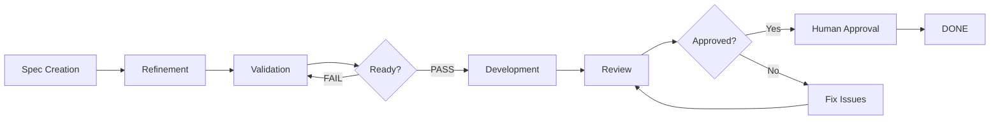
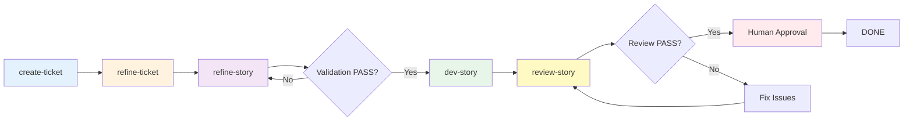

# Scrum Workflow

**Version:** 1.0.0
**Status:** Production Ready

A spec-first, AI-assisted development workflow with human oversight at critical gates. Built for Claude Code and compatible AI coding assistants.

---

## Quick Start

```bash
# 1. Link CLI locally (from the create-scrum-workflow directory)
cd create-scrum-workflow && npm link

# 2. Install into your project (interactive prompts guide you)
cd /path/to/your-project
create-scrum-workflow install

# 3. Generate project context (Phase 0)
/scrum-create-project-context

# 4. Create first story
/scrum-create-ticket
```

The installer handles everything: framework files, skill registration, output directories, and platform configuration.

**Full Installation Guide:** [docs/01-installation.md](scrum_workflow/docs/01-installation.md)

---

## Features

- **Spec-First Development**: Story fully specified before coding starts
- **Multi-Agent Refinement**: Backend, Frontend, QA, Architecture perspectives
- **Guard Conditions**: Quality gates enforced at each phase
- **Human Approval Gate**: No story ships without explicit sign-off
- **Complete Audit Trail**: Every phase generates documented output
- **Atomic Writes**: NFR1 compliance for concurrent safety
- **Write Boundary Rules**: Phase isolation prevents unauthorized modifications
- **Multi-Platform Support**: Claude Code, Cursor, Windsurf, GitHub Copilot, Cline, Universal
- **Smart Updates**: `npx create-scrum-workflow update` preserves your customizations

---

## Workflow Overview



### Three-Agent Workflow (Epic 11)

Scrum Workflow now supports a **three-agent workflow** that splits the monolithic dev-story into focused, single-responsibility agents. Each agent applies a specific agentic pattern for maximum focus and enables per-step model selection.



### Commands

| Command | Purpose |
|---------|---------|
| `/scrum-create-project-context` | **Phase 0**: Generate project context files |
| `/scrum-create-ticket` | Phase 1: Create story from epic |
| `/scrum-refine-ticket SW-XXX` | Phase 2: Multi-agent refinement |
| `/scrum-refine-story SW-XXX` | Phase 2b: Validation (Feature List as Immutable Contract) |
| `/scrum-dev-story SW-XXX` | Phase 3: Implement story (Inversion of Control) |
| `/scrum-review-story SW-XXX` | Phase 4: Code review (AI-Assisted Code Review) |
| `/scrum-create-project-docs` | Generate business logic documentation |
| `/scrum-create-architecture-docs` | Generate architecture documentation |
| `/scrum-research technical <topic>` | Technical research with agentic patterns |
| `/scrum-research general <topic>` | General research for broader topics |
| Human approval | Phase 5: Final gate |

### Three-Agent Pattern Reference

| Command | Agentic Pattern | Purpose |
|---------|-----------------|---------|
| `/scrum-refine-story` | [Feature List as Immutable Contract](https://www.agentic-patterns.com/patterns/feature-list-as-immutable-contract) | Validation-only agent that checks story against immutable checklist |
| `/scrum-dev-story` | [Inversion of Control](https://www.agentic-patterns.com/patterns/inversion-of-control) | Simplified implementation agent that follows story spec without modification |
| `/scrum-review-story` | [AI-Assisted Code Review](https://www.agentic-patterns.com/patterns/ai-assisted-code-review-verification) | Review-only agent with separate perspective from implementer |

**Tip:** For best results, use a **different model** for `/scrum-review-story` than the one used for `/scrum-dev-story`. Different models have different blind spots, reducing groupthink and catching issues the implementer missed.

**Full Documentation:** [docs/00-index.md](scrum_workflow/docs/00-index.md)

---

## Installation

### Install from npm (once published)

```bash
npx create-scrum-workflow install
```

### Install from local source (development)

```bash
# 1. Link the CLI globally from the installer directory
cd create-scrum-workflow
npm link

# 2. Run the installer in your target project
cd /path/to/your-project
create-scrum-workflow install
```

The interactive installer prompts for:
- **Target directory** — where to install (defaults to current directory)
- **Project name** — auto-detected from directory name
- **Platforms** — Claude Code, Cursor, Windsurf, GitHub Copilot, Cline, Universal
- **Framework directory** — where to place framework files (default: `scrum_workflow`)

### Update

```bash
npx create-scrum-workflow update
```

Smart updates preserve your customizations — modified files are backed up, framework files are refreshed, and a new lock file is generated.

### Status

```bash
npx create-scrum-workflow status
```

Shows installation integrity: unchanged, modified, or missing files.

---

## Project Structure

After installation, your project will contain:

```
your-project/
├── .claude/skills/         # Registered workflow skills (platform-dependent)
├── _scrum-output/
│   ├── context/          # Project context and domain knowledge
│   ├── docs/             # Generated documentation
│   ├── skills/           # Generated skill files
│   └── sprints/          # SW-101, SW-102, etc.
├── scrum_workflow/
│   ├── agents/           # Agent definitions
│   ├── commands/         # Command workflows
│   ├── workflows/        # Phase workflows
│   ├── templates/        # Output templates
│   ├── context/          # Domain context
│   └── docs/             # Documentation
└── .scrum-workflow-lock.json  # Installation integrity tracking
```

---

## Status Transitions

```
draft → refinement → refined → ready-for-dev → in-progress → review → approved → done
   ↑                   ↓            ↓               ↓           ↓          ↑
   └───────────────────┴────────────┴───────────────┴───────────┴──────────┘
                         (validation/rejection cycles)
```

**Critical Rules:**
- `/scrum-refine-story` requires `status: refinement` (STRICT)
- `/scrum-dev-story` requires `status: ready-for-dev` (STRICT)
- `/scrum-review-story` requires `status: review` (STRICT)
- No automatic `done` transition (human gate)
- Each phase writes only specific files

---

## Documentation

| Document | Description |
|----------|-------------|
| [Installation](scrum_workflow/docs/01-installation.md) | Setup for new projects |
| [Quick Start](scrum_workflow/docs/02-quick-start.md) | 5-minute overview |
| [Command Reference](scrum_workflow/docs/04-command-reference.md) | All commands |
| [Implementation Patterns](scrum_workflow/docs/12-implementation-patterns.md) | 16 patterns with code |
| [Examples](scrum_workflow/docs/09-examples.md) | Complete file examples |

---

## Guard Conditions

**Before Validation (`/scrum-refine-story`):**
- Story must be `status: refinement`
- All 5 validation criteria must PASS

**Before Development (`/scrum-dev-story`):**
- Story must be `status: ready-for-dev`
- `plan.md` must exist

**Before Review (`/scrum-review-story`):**
- Story must be `status: review`
- All tasks must be marked complete [x]

**Before Approval:**
- Code review must exist (`review-N.md`)
- Status must be `approved`
- Human must explicitly approve
- No automatic DONE transition

---

## Supported Platforms

| Platform | Skill Directory |
|----------|----------------|
| Claude Code (recommended) | `.claude/skills` |
| Cursor | `.cursor/skills` |
| Windsurf | `.windsurf/skills` |
| GitHub Copilot | `.github/skills` |
| Cline | `.cline/skills` |
| Universal | `.agents/skills` |

---

## Completed Epics

- **Epic 1:** Framework Setup & Project Onboarding
- **Epic 2:** Spec-First Ticket Creation
- **Epic 3:** Multi-Agent Story Refinement
- **Epic 4:** Development, Review & Approval
- **Epic 5:** Standalone CLI Installer (`create-scrum-workflow`)
- **Epic 6:** Business Logic Documentation Agent
- **Epic 7:** Architecture Documentation Agent
- **Epic 8:** Installer Integration (Epic 6 & 7 Skills)
- **Epic 9:** Research Agent — Technical & General
- **Epic 11:** Agent Pattern Split — Three-Agent Workflow

---

## Contributing

This framework is designed to be extended. See:
- [Extension Points](scrum_workflow/docs/14-extension-points.md)
- [Framework Architecture](scrum_workflow/docs/08-framework-architecture.md)

---

## License

[Your License Here]

---

**Version:** 1.2.0
**Last Updated:** 2026-04-01
**Documentation:** [scrum_workflow/docs/00-index.md](scrum_workflow/docs/00-index.md)
