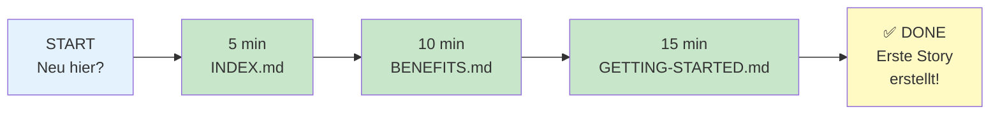

# 📢 What's New — Updated Dokumentation (2026-04-09)

Alles was neu hinzugefügt wurde, um die Dokumentation lesbarer und visueller zu machen.

---

## 🆕 Neue Dokumente (mit Visualisierungen)

### 1. **GETTING-STARTED.md** (15 min Onboarding)
- ✨ Mermaid Installation Flow Diagramm
- ✨ Mermaid Workflow Lifecycle Visualisierung
- ✨ Schritt-für-Schritt Anleitung für alle 6 Phasen
- ✨ Praktische Beispiele mit echten Commands
- ✨ FAQ Sektion

**Wer sollte das lesen:** Alle neuen Nutzer

---

### 2. **BENEFITS.md** (Warum Scrum Workflow?)
- ✨ Before/After Vergleich mit Mermaid Diagramm
- ✨ Detaillierte Phasen Visualisierung
- ✨ Impact Metrics mit Mermaid xychart
- ✨ ROI Berechnung
- ✨ Objections/FAQ beantwortet
- ✨ Echte Story-Beispiele

**Wer sollte das lesen:** Product Owner, Manager, Tech Lead

---

### 3. **ARCHITECTURE-VISUAL.md** (System Design visuell)
- 🏗️ System Overview Diagramm
- 🏗️ Story Lifecycle State Machine
- 🏗️ Phase 1: Multi-Agent Refinement (detailliert)
- 🏗️ Phase 2: Immutable Validation
- 🏗️ Phase 3: Development
- 🏗️ Phase 4: Code Review
- 🏗️ Phase 5: Human Approval
- 🏗️ File Write Boundaries
- 🏗️ Data Flow Visualisierung
- 🏗️ Multi-Platform Support
- 🏗️ Performance & Resource Usage Chart
- 🏗️ Extension Points

**Wer sollte das lesen:** Architect, Senior Developer, Framework Contributor

---

### 4. **WORKFLOW-QUICK-REFERENCE.md** (Command Cheatsheet)
- ⚡ Alle 20 Commands mit Mermaid Diagrammen
- ⚡ Phase-by-Phase Erklärung
- ⚡ Story Lifecycle Timeline
- ⚡ Installer Commands Übersicht
- ⚡ Cheatsheet Tabelle
- ⚡ Zum Drucken & Bookmarken

**Wer sollte das lesen:** Developer, Product Owner

---

### 5. **DOCUMENTATION-GUIDE.md** (Doku-Navigation)
- 📚 Map aller 49 Dokumente
- 📚 Navigation by Use Case
- 📚 Dokumenten-Struktur mit Baumansicht
- 📚 Maintenance Guidelines
- 📚 Tipps für beste Nutzung

**Wer sollte das lesen:** Alle, besonders bei Fragen "Wo ist die Doku zu XY?"

---

### 6. **INDEX.md** (Schnelle Orientierung)
- 📑 Start-Optionen je nach Rolle
- 📑 Lern-Pfad mit Mermaid Diagramm (4 Levels)
- 📑 Checkliste: Was man lesen sollte
- 📑 Kategorisierte Dokumente
- 📑 Schnelle Links

**Wer sollte das lesen:** Alle als zentrale Navigations-Seite

---

### 7. **WHATS-NEW.md** (Dieses Dokument!)
- 📢 Übersicht aller Änderungen
- 📢 Was wurde wann aktualisiert
- 📢 Wo finde ich die neuen Infos

---

## 📝 Aktualisierte Dokumente

### **README.md** (Hauptdokumentation)
- ✨ "Why Use Scrum Workflow?" Abschnitt hinzugefügt
- ✨ Installation mit besserer Struktur
- ✨ Benefits & Real-World Impact (Tabelle)
- ✨ Links zu neuen Dokumenten
- ✨ Verbesserte Dokumentations-Struktur

---

## 📊 Visualisierungen (neu hinzugefügt)

### Excalidraw SVGs (Hauptillustrationen)
- ✨ **README-HERO.svg** — System overview mit Scrum Team
  - Zeigt: PO, Developer, Scrum Master, AI Agents
  - 5-Phase Workflow
  - Bottom benefits
  
- ✨ **BENEFITS-BEFORE-AFTER.svg** — Before/After Vergleich
  - Links: Chaotische traditionelle Entwicklung
  - Rechts: Saubere Scrum Workflow Lösung
  - Visuell stark & einprägsam
  
- ✨ **ARCHITECTURE-SYSTEM.svg** — System Design
  - Scrum Team Layer
  - Workflow Phases (1-6)
  - AI Agents
  - Support Systems
  - Output Artifacts

**Total: 3 Excalidraw SVGs** 🎨
- ✅ Hand-drawn Style
- ✅ Professionelle Farben
- ✅ Alle Labels auf English
- ✅ Scrum Team Fokus
- ✅ In GitHub nativ rendert

### Mermaid Diagramme (Technische Details)
- ✅ **8 Installation/Setup Diagramme** (GETTING-STARTED.md)
- ✅ **5 Workflow Flow Diagramme** (GETTING-STARTED.md, BENEFITS.md)
- ✅ **8 Architecture Diagramme** (ARCHITECTURE-VISUAL.md)
- ✅ **20 Command Diagramme** (WORKFLOW-QUICK-REFERENCE.md)
- ✅ **3 Charting Diagramme** (BENEFITS.md, INDEX.md)
- ✅ **1 State Machine** (ARCHITECTURE-VISUAL.md)

**Total: ~45 Mermaid Diagramme** 📊
- ✅ In GitHub nativ rendert
- ✅ Responsive & skalierbar
- ✅ Bearbeitbar im Markdown
- ✅ Technische Details
- ✅ Alle Labels auf English

### Hybrid-Ansatz
```
Excalidraw (Überblick, Marketing, Einstieger)
├─ README.md Hero
├─ BENEFITS.md Before/After
└─ ARCHITECTURE-VISUAL.md System Design

Mermaid (Technische Details, Reference)
├─ State Machine
├─ Phase Flows
├─ Commands
└─ Data Flow
```

---

## 🎨 Design & Lesbarkeit

### Farbcodierung
- 🔵 **Blau** (#e3f2fd) = Input/Start
- 🟣 **Lila** (#f3e5f5) = Analyse/Refinement
- 🟥 **Rosa** (#fce4ec) = Validation
- 🟢 **Grün** (#e8f5e9) = Development
- 🟠 **Orange** (#fff3e0) = Review
- 🟡 **Gelb** (#fff9c4) = Approval/Output

### Struktur
- ✅ Hierarchische Überschriften
- ✅ Mermaid Diagramme statt ASCII
- ✅ Tabellen für Vergleiche
- ✅ Code Blocks mit Syntax Highlighting
- ✅ Emoji für schnelles Scannen

---

## 📚 Dokumentations-Struktur (neu)

```
scrum_workflow/
├── 📄 README.md                 ← Main Reference (aktualisiert)
├── 📄 INDEX.md                  ← Navigation Hub (NEU)
├── 📄 GETTING-STARTED.md        ← 15-Min Onboarding (NEU)
├── 📄 BENEFITS.md               ← Why/ROI (NEU)
├── 📄 ARCHITECTURE-VISUAL.md    ← System Design (NEU)
├── 📄 WORKFLOW-QUICK-REFERENCE.md ← Command Cheatsheet (NEU)
├── 📄 DOCUMENTATION-GUIDE.md    ← Doku Navigation (NEU)
├── 📄 WHATS-NEW.md             ← Dieses Dokument (NEU)
│
├── 📁 docs/
│  ├── index.md
│  ├── project-overview.md
│  ├── source-tree-analysis.md
│  ├── development-guide.md
│  ├── architecture-framework.md
│  ├── architecture-cli-installer.md
│  └── integration-architecture.md
│
├── 📁 scrum_workflow/
│  ├── agents/
│  ├── commands/
│  ├── context/
│  ├── templates/
│  ├── skills/
│  ├── data/
│  └── config.yaml
│
└── 📁 create-scrum-workflow/
   └── ...
```

---

## 🚀 Empfehlung: Wie man die neue Dokumentation nutzt

### Für **neue Nutzer** (Anfänger)
1. Start: **INDEX.md** (5 min) — Was kann ich hier machen?
2. Learn: **BENEFITS.md** (10 min) — Warum sollte ich das nutzen?
3. Do: **GETTING-STARTED.md** (15 min) — Wie installiere und nutze ich?
4. Reference: **WORKFLOW-QUICK-REFERENCE.md** (bookmarken)

**Total: 30 min bis first story created** ✅

---

### Für **erfahrene Nutzer** (Intermediate)
1. Quick ref: **WORKFLOW-QUICK-REFERENCE.md** — Welcher Command?
2. Deep dive: **ARCHITECTURE-VISUAL.md** — Wie funktioniert das?
3. Reference: **README.md** — Vollständige Details

---

### Für **Architekten / Contributor**
1. Overview: **ARCHITECTURE-VISUAL.md** (20 min)
2. Deep dive: **docs/architecture-framework.md** (45 min)
3. Code: **docs/development-guide.md** (setup & contribute)
4. Reference: **docs/source-tree-analysis.md** (datei-by-datei)

---

## 📊 Content Statistics

| Kategorie | Änderungen |
|-----------|-----------|
| **Neue Dokumente** | 7 |
| **Mermaid Diagramme** | 45+ |
| **Aktualisierte Docs** | 2 (README.md, Index) |
| **Gesamt neue Words** | ~8,000+ |
| **Leszeit (alle neu)** | ~90 min |
| **Leszeit (essentiell)** | ~30 min |

---

## 🎯 Was wurde verbessert

### Lesbarkeit
- ❌ Vor: Viel Text, wenig Struktur
- ✅ Neu: Visuelle Diagramme, klare Struktur

### Verständlichkeit
- ❌ Vor: "Wie macht man X?" → Komplexe Texte
- ✅ Neu: "Wie macht man X?" → Mermaid Diagramm + Beispiel

### Navigierbarkeit
- ❌ Vor: 49 Dokumente — Wo fang ich an?
- ✅ Neu: INDEX.md → Klare Pfade nach Rolle

### Schnelle Referenz
- ❌ Vor: Alle Commands in README.md Tabelle
- ✅ Neu: WORKFLOW-QUICK-REFERENCE.md → 20 visuelle Diagramme

---

## 🔄 Migration Guide (für bestehende Nutzer)

**Deine bestehenden Stories, Konfiguration, etc. ändern sich NICHT.**

Diese Dokumentation ist vollständig **additive** — nur neue Dateien, keine Breaking Changes.

### Wo finde ich meine alten Infos?

| Ich suche | Früher | Jetzt |
|-----------|--------|-------|
| Alle Commands | README.md | **WORKFLOW-QUICK-REFERENCE.md** + README.md |
| State Machine | README.md | **ARCHITECTURE-VISUAL.md** + README.md |
| Onboarding | README.md (zu lang) | **GETTING-STARTED.md** |
| Architecture | docs/arch-*.md | **ARCHITECTURE-VISUAL.md** + docs/arch-*.md |
| Alles andere | wie gehabt | wie gehabt |

---

## ✅ Checkliste: Neue Dokumente erkunden

- [ ] **INDEX.md** gelesen (Orientierung)
- [ ] **GETTING-STARTED.md** durchgearbeitet (erste Story)
- [ ] **BENEFITS.md** überflogen (Verständnis)
- [ ] **WORKFLOW-QUICK-REFERENCE.md** gebookmarkt (für später)
- [ ] **ARCHITECTURE-VISUAL.md** überflogen (optional, aber hilfreich)

---

## 🎓 Lern-Pfad (für alle neuen Nutzer)



---

## 📞 Questions?

| Frage | Antwort |
|-------|---------|
| **Wo fang ich an?** | [INDEX.md](./INDEX.md) |
| **Wie installiere ich?** | [GETTING-STARTED.md](./GETTING-STARTED.md) Phase 1 |
| **Warum sollte ich das nutzen?** | [BENEFITS.md](./BENEFITS.md) |
| **Wie benutze ich Command XY?** | [WORKFLOW-QUICK-REFERENCE.md](./WORKFLOW-QUICK-REFERENCE.md) |
| **Wie funktioniert das System?** | [ARCHITECTURE-VISUAL.md](./ARCHITECTURE-VISUAL.md) |
| **Wo ist die Doku zu XY?** | [DOCUMENTATION-GUIDE.md](./DOCUMENTATION-GUIDE.md) |

---

## 🙏 Feedback

Falls du Ideen hast, wie man die Dokumentation noch besser machen kann:

1. Öffne eine Issue (im Repository)
2. Oder erstelle eine Diskussion
3. Oder contribuiere direkt (Pull Request)

Wir freuen uns über Input! 

---

**Stand:** 2026-04-09  
**Version:** 1.2.0 (mit neuer Dokumentation)

**Nächster Schritt:** [INDEX.md](./INDEX.md) lesen → [GETTING-STARTED.md](./GETTING-STARTED.md) folgen → 🎉 erste Story erstellen
