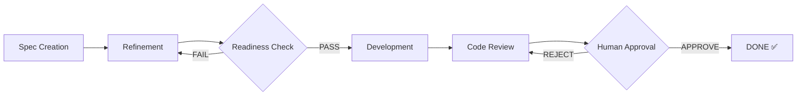
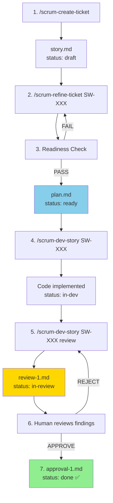
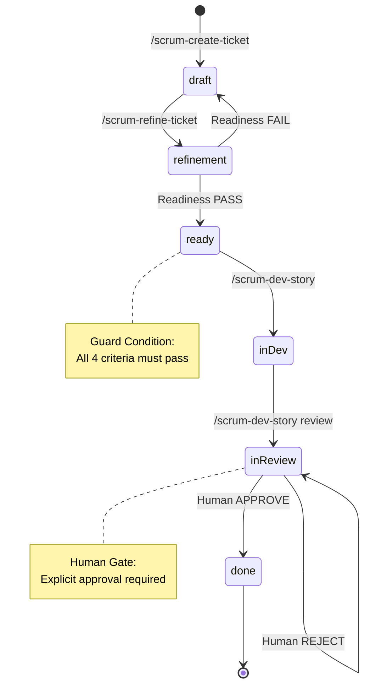

# Quick Start

**← Back to [Index](00-index.md)** | **← Previous: [Installation](01-installation.md)** | **Next → [Workflow Overview](03-workflow-overview.md)**

---

## The Workflow in 5 Minutes

The Scrum Workflow is a **spec-first, AI-assisted development process** with human oversight at critical gates. Each story passes through distinct phases with explicit handoffs and audit trails.



---

## Essential Commands

| Command | What It Does |
|---------|--------------|
| `/scrum-create-project-context` | **Phase 0**: Analyze project and create context files |
| `/scrum-create-ticket` | Phase 1: Create a new story from epic requirements |
| `/scrum-refine-ticket SW-XXX` | Phase 2: Multi-agent refinement of story details |
| `/scrum-dev-story SW-XXX` | Phase 3: Implement the story (requires status: ready) |
| `/scrum-dev-story SW-XXX review` | Phase 4: Trigger code review (after implementation) |
| Human approval | Phase 5: Final gate - story not DONE without explicit approval |

---

## Critical Rules

1. **Never skip status phases** - The state machine enforces order
2. **Respect guard conditions** - `/scrum-dev-story` only works at `status: ready`
3. **Follow write boundary rules** - Each phase writes only specific files
4. **Human gate is mandatory** - No story ships without explicit approval

---

## Typical Story Lifecycle

**Phase 0: Setup (once per project)**
```bash
/scrum-create-project-context  # Generate context files
```

**Phase 1-5: Per story**


---

## Quick Reference: Status Meanings



| Status | Meaning | Can Run Next |
|--------|---------|--------------|
| `draft` | Story created, not refined | `/scrum-refine-ticket` |
| `refinement` | Agents adding perspectives | Wait for readiness |
| `ready` | Ready for development | `/scrum-dev-story` |
| `in-dev` | Development in progress | `/scrum-dev-story review` |
| `in-review` | Awaiting human approval | Human decision |
| `done` | Story complete ✅ | None (terminal) |

---

## Guard Conditions

**Before `/scrum-dev-story`:**
```bash
# Story MUST be in 'ready' status
# If 'draft' or 'refinement', run /scrum-refine-ticket first
```

**Before approval:**
```bash
# Review MUST exist (review-N.md)
# Human MUST explicitly approve (no automatic DONE)
```

---

## Quick Checklist

### Before Creating Story
- [ ] Epic exists with requirements
- [ ] Acceptance criteria defined
- [ ] Story scope is manageable

### Before Development
- [ ] Story status is `ready`
- [ ] `plan.md` exists with subtasks
- [ ] All agent perspectives reviewed

### Before Approval
- [ ] All tasks marked [x]
- [ ] Code review completed
- [ ] Review findings reviewed

---

## Common First-Time Mistakes

❌ **DON'T**: Try to run `/scrum-dev-story` when status is `draft`
✅ **DO**: Run `/scrum-refine-ticket` first to get to `ready`

❌ **DON'T**: Manually change status in story.md
✅ **DO**: Let workflows handle status transitions

❌ **DON'T**: Approve without reading review findings
✅ **DO**: Review all Critical and Major findings before approving

---

## Next Steps

- [Workflow Overview](03-workflow-overview.md) - Detailed end-to-end flow
- [Command Reference](04-command-reference.md) - All commands documented
- [Examples](09-examples.md) - See complete story.md files

---

**← Back to [Index](00-index.md)** | **← Previous: [Installation](01-installation.md)** | **Next → [Workflow Overview](03-workflow-overview.md)**
