# Phase-by-Phase Details

**← Back to [Index](00-index.md)** | **← Previous: [State Machine](05-state-machine.md)** | **Next → [Write Boundary Rules](07-write-boundary-rules.md)**

---

## Phase 1: Spec Creation (`/scrum-create-ticket`)

**Purpose:** Create story file from epic requirements

**Input:** Epic requirements, user acceptance criteria

**Output:** `_scrum-output/sprints/SW-XXX/story.md`

**Status Change:** → `draft`

### What gets created
```markdown
---
schema_version: 1
ticket: "SW-XXX"
title: "Story Title"
status: "draft"
---

## Story
As a [role],
I want [feature],
So that [benefit].

## Acceptance Criteria
**Given** [precondition]
**When** [action]
**Then** [expected outcome]

## Tasks / Subtasks
- [ ] Task 1
  - [ ] Subtask 1.1
```

### See also
[Examples: Complete story.md](09-examples.md#example-1-complete-storymd)

---

## Phase 2: Multi-Agent Refinement (`/scrum-refine-ticket`)

**Purpose:** Enrich story with diverse agent perspectives

### Agent Perspectives
- **Backend Agent:** Database, API, performance considerations
- **Frontend Agent:** UI/UX, user interaction, responsive design
- **QA Agent:** Testing strategy, edge cases, automation
- **Architecture Agent:** System design, patterns, scalability

### Readiness Check Gate
Validates 4 criteria before allowing `/scrum-dev-story`:
- ✅ Description complete and clear
- ✅ Acceptance criteria comprehensive
- ✅ Estimation provided
- ✅ Tasks/subtasks broken down

### If FAIL
Status reverted to `draft` with documented reasons

### See also
[Story Completion Checklist](10-checklist.md)

---

## Phase 3: Development (`/scrum-dev-story`)

**Implementation Pattern: Red-Green-Refactor**

1. **Red Phase:** Write failing tests first
2. **Green Phase:** Implement minimal code to pass
3. **Refactor Phase:** Improve structure while keeping tests green

### Write Boundary Rules
- ✅ MAY write: Code files, `story.md` (status only)
- ❌ MAY NOT write: `plan.md`, `refinement.md`, review files

### See also
[Implementation Patterns](12-implementation-patterns.md)

---

## Phase 4: Code Review (`/scrum-dev-story SW-XXX review`)

### Severity Levels

| Severity | Description | Examples |
|----------|-------------|----------|
| **Critical** | Blocks story completion | Security vulnerability, data corruption |
| **Major** | Impacts quality/maintainability | Architecture violation, missing error handling |
| **Minor** | Style/optimization | Code style, documentation improvement |

### Incremental Reviews
- First review: `review-1.md`
- Subsequent: `review-2.md`, `review-3.md`, etc.

### See also
[Examples: Complete review-N.md](09-examples.md#example-2-complete-review-nmd)

---

## Phase 5: Human Approval Gate

**Re-Review Cycle:**
For rejected stories, the cycle continues until human approves.

### Approval Flow
```
Review findings presented
    ↓
Human reviews findings
    ↓
Decision: APPROVE or REJECT
    ↓
APPROVE → approval-N.md + status: done ✅
REJECT → approval-N.md + status: in-review
```

### See also
[Examples: Complete approval-N.md](09-examples.md#example-3-complete-approval-nmd)

---

## Phase Handoffs

Each phase creates output that becomes input for next phase:

```mermaid
flowchart LR
    subgraph P1["Phase 1: Spec Creation"]
        F1["story.md<br/>status: draft"]
    end

    subgraph P2["Phase 2: Refinement"]
        F2["refinement.md"]
        F3["story.md<br/>status: ready"]
    end

    subgraph P3["Phase 3: Development"]
        F4["Code files"]
        F5["story.md<br/>status: in-dev"]
    end

    subgraph P4["Phase 4: Code Review"]
        F6["review-N.md"]
        F7["story.md<br/>status: in-review"]
    end

    subgraph P5["Phase 5: Approval"]
        F8["approval-N.md"]
        F9["story.md<br/>status: done ✅"]
    end

    F1 --> F2
    F2 --> F3
    F3 --> F4
    F4 --> F5
    F5 --> F6
    F6 --> F7
    F7 --> F8
    F8 --> F9

    style F9 fill:#90EE90,stroke:#228B22,stroke-width:3px
    style F7 fill:#FFD700,stroke:#DAA520,stroke-width:2px
    style F3 fill:#87CEEB,stroke:#4682B4,stroke-width:2px
```



---

## Related Documentation

- [Workflow Overview](03-workflow-overview.md) - End-to-end flow
- [Command Reference](04-command-reference.md) - Command syntax
- [Implementation Patterns](12-implementation-patterns.md) - Code patterns

---

**← Back to [Index](00-index.md)** | **← Previous: [State Machine](05-state-machine.md)** | **Next → [Write Boundary Rules](07-write-boundary-rules.md)**
