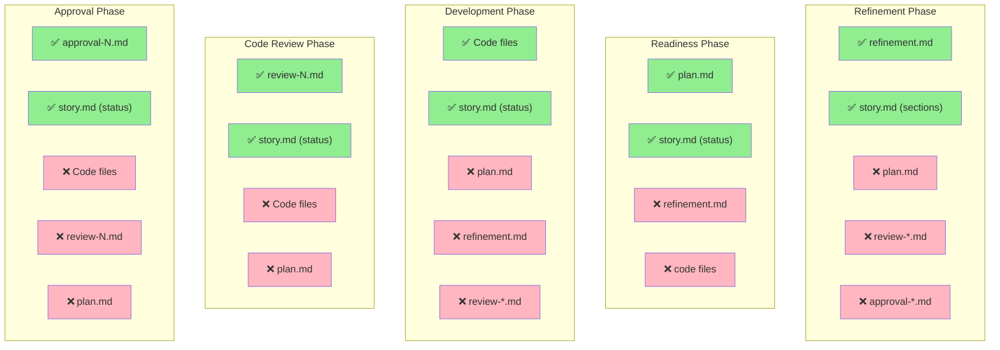

# Write Boundary Rules

**← Back to [Index](00-index.md)** | **← Previous: [Phase Details](06-phase-details.md)** | **Next → [Framework Architecture](08-framework-architecture.md)**

---

## The Principle

Each workflow phase may **only** write specific files. This enforces:
- Specification integrity
- Phase isolation
- Audit trail preservation
- Concurrent safety

---

## Write Permissions Matrix



```
┌─────────────────┬─────────────────────────────────────┐
│ Phase           │ MAY WRITE                           │
├─────────────────┼─────────────────────────────────────┤
│ Refinement      │ refinement.md, story.md (sections)  │
│ Readiness       │ plan.md, story.md (status→ready)    │
│ Development     │ Code files, story.md (status→in-dev)│
│ Code Review     │ review-N.md, story.md (status→review)│
│ Approval        │ approval-N.md, story.md (status→done)│
└─────────────────┴─────────────────────────────────────┘

┌─────────────────┬─────────────────────────────────────┐
│ Phase           │ MAY NOT WRITE                       │
├─────────────────┼─────────────────────────────────────┤
│ Refinement      │ plan.md, review-*.md, approval-*.md │
│ Readiness       │ refinement.md, code files           │
│ Development     │ plan.md, refinement.md, review-*.md │
│ Code Review     │ code files, plan.md, refinement.md  │
│ Approval        │ code files, review-*.md, plan.md    │
└─────────────────┴─────────────────────────────────────┘
```

---

## NFR1: Atomic Write Guarantee

### ❌ NOT Atomic (Race Condition Possible)
```bash
echo "status: done" >> story.md  # Multiple writes = corruptible
```

### ✅ Atomic (Single Syscall)
```python
def write_atomic(path: str, content: str) -> None:
    """Write file atomically (NFR1 compliance)."""
    import tempfile
    import os

    tmp_path = f"{path}.tmp"
    with open(tmp_path, 'w') as f:
        f.write(content)

    os.rename(tmp_path, path)  # Single syscall
```

---

## Phase-Specific Rules

### Refinement Phase
**MAY WRITE:**
- `_scrum-output/sprints/SW-XXX/refinement.md` (new)
- `_scrum-output/sprints/SW-XXX/story.md` (sections only)

**MAY NOT WRITE:**
- `plan.md` (created by readiness check)
- Code files (development only)
- Review/approval files (later phases)

### Readiness Check Phase
**MAY WRITE:**
- `_scrum-output/sprints/SW-XXX/plan.md` (new)
- `_scrum-output/sprints/SW-XXX/story.md` (status → ready)

**MAY NOT WRITE:**
- `refinement.md` (read-only during check)
- Code files

### Development Phase
**MAY WRITE:**
- Code files (project-specific)
- `_scrum-output/sprints/SW-XXX/story.md` (status → in-dev)

**MAY NOT WRITE:**
- `plan.md` (read-only during dev)
- `refinement.md`
- Review files

### Code Review Phase
**MAY WRITE:**
- `_scrum-output/sprints/SW-XXX/review-N.md` (new)
- `_scrum-output/sprints/SW-XXX/story.md` (status → in-review)

**MAY NOT WRITE:**
- Code files (implementation is frozen)
- `plan.md`
- `refinement.md`

### Approval Phase
**MAY WRITE:**
- `_scrum-output/sprints/SW-XXX/approval-N.md` (new)
- `_scrum-output/sprints/SW-XXX/story.md` (status → done)

**MAY NOT WRITE:**
- Code files
- `review-N.md` (read-only)
- `plan.md`
- `refinement.md`

---

## Enforcement

### Validation Pattern
```python
class WriteBoundaryValidator:
    """Validate file write permissions."""

    def __init__(self, phase: str):
        self.phase = phase
        self.allowed = self._allowed_files()
        self.prohibited = self._prohibited_files()

    def validate_write(self, path: str) -> bool:
        """Check if write is allowed."""
        if path in self.prohibited:
            raise WriteBoundaryError(
                f"Phase {self.phase} cannot write {path}"
            )
        return True
```

### See also
[Implementation Patterns](12-implementation-patterns.md) - Pattern 3: Write Boundary Validation

---

## Common Violations

❌ **DON'T**: Modify `plan.md` during development
✅ **DO**: Follow plan.md, create new story if needed

❌ **DON'T**: Change code during review
✅ **DO**: Document findings in review-N.md

❌ **DON'T**: Update refinement after readiness check
✅ **DO**: Re-run refinement if story needs major changes

---

## Related Documentation

- [Implementation Patterns](12-implementation-patterns.md) - Pattern 3: Write Boundary Validation
- [Error Recovery](13-error-recovery.md) - Recovery strategies
- [Common Anti-Patterns](11-anti-patterns.md) - What NOT to do

---

**← Back to [Index](00-index.md)** | **← Previous: [Phase Details](06-phase-details.md)** | **Next → [Framework Architecture](08-framework-architecture.md)**
