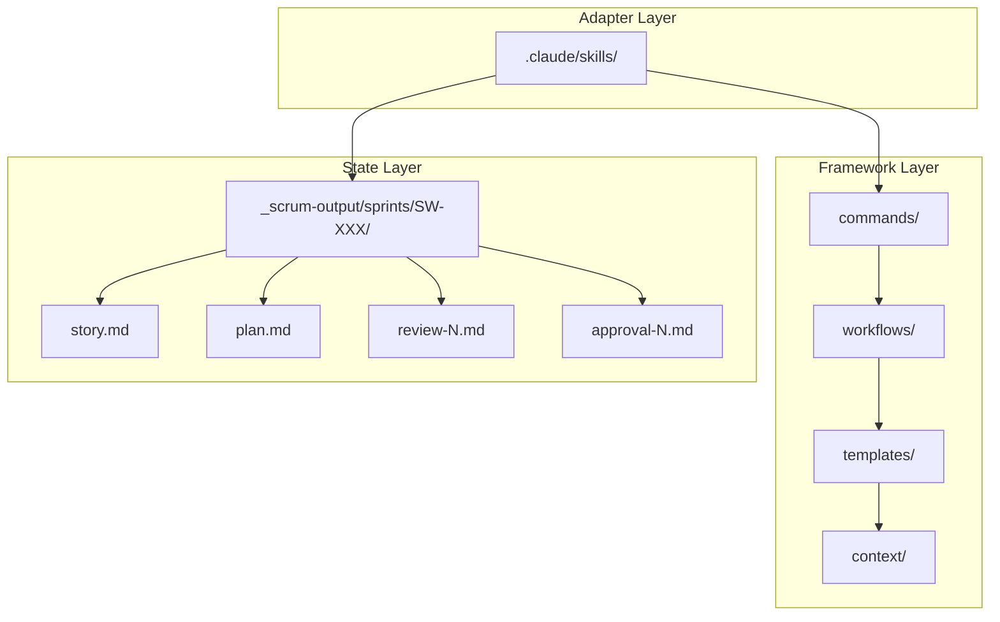

# Framework Architecture

**← Back to [Index](00-index.md)** | **← Previous: [Write Boundary Rules](07-write-boundary-rules.md)** | **Next → [Examples](09-examples.md)**

---

## Three-Layer Separation



---

## Framework Layer

**Location:** `scrum_workflow/`

**Contents:**
- `commands/` - Command definitions and triggers
- `workflows/` - Phase-specific workflow instructions
- `templates/` - Output file templates
- `context/` - Domain-specific context files
- `agents/` - Agent role definitions
- `skills/` - Reusable skill components
- `data/` - Schemas and validation rules
- `config.yaml` - Framework configuration

**Purpose:** Provides reusable workflow definitions and patterns

---

## Adapter Layer

**Location:** `.claude/skills/`

**Contents:**
- `create-ticket` - Spec creation command
- `dev-story` - Development command
- `refine-ticket` - Refinement command
- `create-project-context` - Project context setup

**Purpose:** Adapts framework to AI coding assistant (Claude Code, Copilot, etc.)

**Note:** Skills are platform-specific adapters that invoke framework workflows

---

## State Layer

**Location:** `_scrum-output/sprints/SW-XXX/`

**Contents:**
- `story.md` - Story specification and status
- `refinement.md` - Agent perspectives
- `plan.md` - Ordered implementation plan
- `review-N.md` - Code review findings
- `approval-N.md` - Human approval record

**Purpose:** Project-specific state and audit trail

---

## File Ownership

| File | Owner | Modifier | Access |
|------|-------|----------|--------|
| Framework files | Framework | Framework setup | Read-only during execution |
| Skills | Adapter | Platform | Invokes workflows |
| State files | Project | Workflows | Written by specific phases |

---

## Data Flow

```
┌──────────────┐
│ User Command │
│ (/scrum-create-ticket)
└──────┬───────┘
       │
       ▼
┌──────────────┐
│ Adapter Layer│
│ (Skill)      │
└──────┬───────┘
       │
       ▼
┌──────────────┐
│ Framework    │
│ (Workflow)   │
└──────┬───────┘
       │
       ▼
┌──────────────┐
│ State Layer  │
│ (story.md)   │
└──────────────┘
```

---

## Extension Points

### Adding New Commands
1. Create command file in `scrum_workflow/commands/`
2. Create workflow in `scrum_workflow/workflows/`
3. Create skill in `.claude/skills/`

### Customizing Agents
Edit `scrum_workflow/agents/*.md` to change agent behavior

### Adding Templates
Add templates to `scrum_workflow/templates/` for new output formats

---

## See also

[Extension Points](14-extension-points.md) - Customization guide
[Implementation Patterns](12-implementation-patterns.md) - Code patterns

---

**← Back to [Index](00-index.md)** | **← Previous: [Write Boundary Rules](07-write-boundary-rules.md)** | **Next → [Examples](09-examples.md)**
