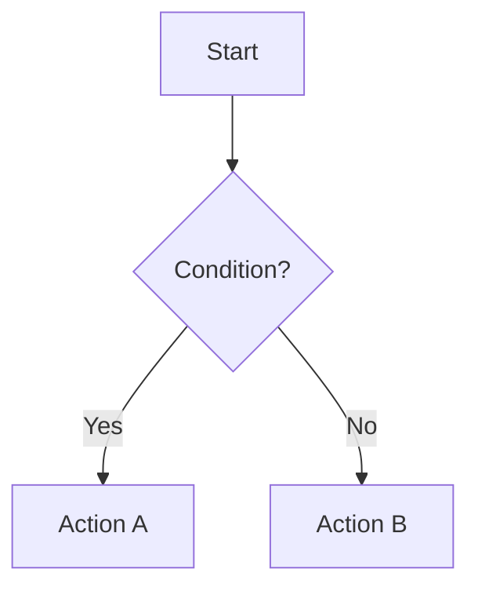

# Business Logic Documentation

## Overview

<!-- Fill from documentarian analysis -->

**Total Rules Documented:** {{total_rules}}
**Domain Areas Detected:** {{domain_areas}}
**Analysis Timestamp:** {{analysis_timestamp}}

Summary of business rules, validations, guard clauses, and business constants discovered in the codebase. Rules are grouped by domain area for navigation.

## Business Rules

Business rules grouped by domain area. Each domain area contains the rules discovered in that part of the codebase.

### {{domain_area}}

<!-- Repeat this subsection for each detected domain area (e.g., Authentication, Billing, Permissions) -->

#### {{rule_name}}

- **Description:** {{plain language explanation of what the rule enforces}}
- **Source:** `[Source: path/to/file.ext:LINE]` (use LINE-N-N for ranges, comma-separate for multiple files)
- **Business Context:** {{business constraint or policy this rule implements}}

<!-- For complex rules with multi-branch decision trees, include a Mermaid flowchart: -->

<!-- Fill from documentarian analysis -->

## Validation Rules

Input validations, data integrity checks, and constraint enforcement found in the codebase.

### {{validation_name}}

- **Description:** {{what this validation checks}}
- **Source:** `[Source: path/to/file.ext:LINE]` (use LINE-N-N for ranges, comma-separate for multiple files)
- **Business Context:** {{plain language explanation of the constraint}}

<!-- For complex validations with multiple branches, include a Mermaid flowchart -->

<!-- Fill from documentarian analysis -->

## Guard Clauses & Access Control

Authorization checks, precondition enforcement, and rejection logic found in the codebase.

### {{guard_name}}

- **Description:** {{what this guard clause protects}}
- **Source:** `[Source: path/to/file.ext:LINE]` (use LINE-N-N for ranges, comma-separate for multiple files)
- **Business Context:** {{plain language explanation of the access control or precondition}}

<!-- Fill from documentarian analysis -->

## Business Constants & Configuration

Constants and enums with business meaning that define limits, thresholds, allowed values, and status definitions.

### {{constant_name}}

- **Description:** {{what this constant or enum represents}}
- **Source:** `[Source: path/to/file.ext:LINE]` (use LINE-N-N for ranges, comma-separate for multiple files)
- **Value:** {{the constant value or enum members}}
- **Business Context:** {{plain language explanation of the business constraint}}

<!-- Fill from documentarian analysis -->
