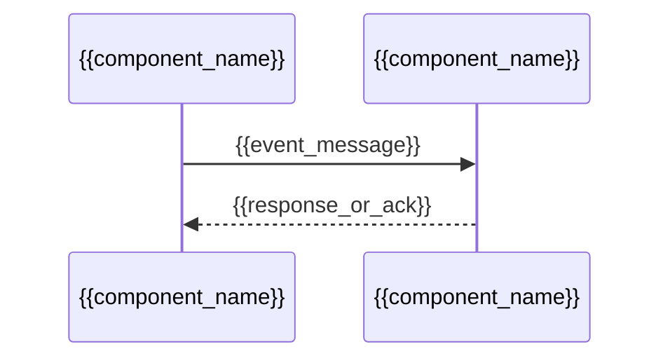
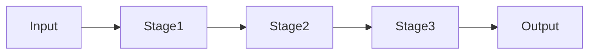
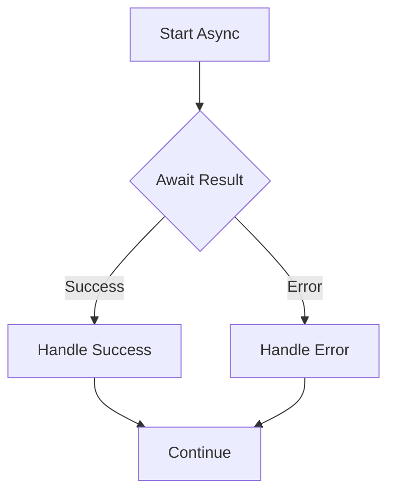

# Workflow & State Machine Documentation

## Overview

<!-- Fill from documentarian analysis -->

**Total Workflows Documented:** {{total_workflows}}
**State Machines:** {{state_machine_count}}
**Event Flows:** {{event_flow_count}}
**Process Pipelines:** {{pipeline_count}}
**Async Workflows:** {{async_workflow_count}}
**Analysis Timestamp:** {{analysis_timestamp}}

Summary of workflows, state machines, event flows, and processing pipelines discovered in the codebase. Workflows are grouped by type for navigation.

## State Machines

State machines and status transition flows found in the codebase. Each state machine shows all possible states, transitions, and the triggers that cause state changes.

### {{state_machine_name}}

- **Description:** {{plain language explanation of what this state machine manages}}
- **Entry Point:** `[Source: path/to/file.ext:LINE]` (use LINE-N-N for ranges, comma-separate for multiple files)
- **States:** {{list of all states in this machine}}
- **Initial State:** {{the starting state}}
- **Final States:** {{terminal states, if any}}

```mermaid
stateDiagram-v2
    [*] --> {{initial_state}}
    {{initial_state}} --> {{next_state}} : {{trigger_event}}
    {{next_state}} --> {{another_state}} : {{another_trigger}}
    {{final_state}} --> [*]
```

<!-- Fill from documentarian analysis -->

## Event Flows

Event-driven communication patterns showing how components emit, handle, and propagate events through the system.

### {{event_flow_name}}

- **Description:** {{plain language explanation of this event flow}}
- **Trigger:** `[Source: path/to/file.ext:LINE]` (where the event is emitted or published)
- **Participants:** {{list of components/services involved in this flow}}



<!-- Fill from documentarian analysis -->

## Process Pipelines

Multi-step processing chains and data transformation flows where data passes through sequential stages.

### {{pipeline_name}}

- **Description:** {{plain language explanation of what this pipeline processes}}
- **Entry Point:** `[Source: path/to/file.ext:LINE]` (where the pipeline is defined or invoked)
- **Stages:** {{list of processing stages in order}}



<!-- Fill from documentarian analysis -->

## Async Workflows

Asynchronous control flows, promise chains, callback sequences, and background job processing patterns.

### {{async_workflow_name}}

- **Description:** {{plain language explanation of this async workflow}}
- **Entry Point:** `[Source: path/to/file.ext:LINE]` (where the async operation is initiated)
- **Flow:** {{description of the async sequence}}



<!-- Fill from documentarian analysis -->
