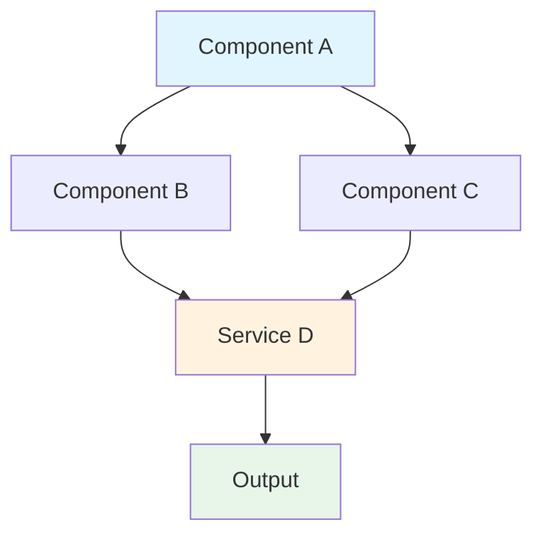
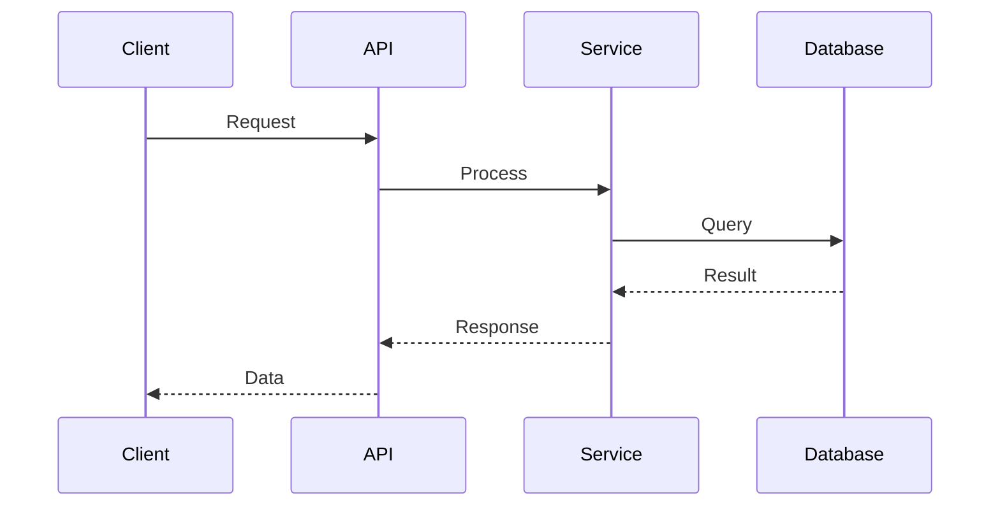
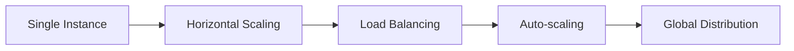

<!-- GUIDANCE: This template generates AI-optimized technical research documents.
     Fill all {{placeholder}} values with actual research content.
     Keep the frontmatter fields synchronized with the document content.

     research_confidence: Set dynamically based on Reflection Loop (Step 8) quality score.
     - high: Quality score >= 0.80 (all criteria met, multiple sources, comprehensive coverage)
     - medium: Quality score 0.50-0.79 (most criteria met, some gaps or fewer sources)
     - low: Quality score < 0.50 (significant gaps, few sources, or structural issues)

     If confidence is LOW, a "Quality Notes" section will be added to the document explaining issues and recommendations.
-->

## Executive Summary

<!-- GUIDANCE: Write 2-3 paragraphs structured for AI context extraction.
     Paragraph 1: What was researched and why (research scope and motivation)
     Paragraph 2: Key findings with specific, verifiable facts
     Paragraph 3: Strategic recommendations and confidence level
     Use bullet points for key findings to enable easy extraction.
-->

{{executive_summary_paragraph_1}}

**Key Findings:**
- {{key_finding_1}}
- {{key_finding_2}}
- {{key_finding_3}}

{{executive_summary_paragraph_2}}

**Strategic Recommendations:**
1. {{recommendation_1}}
2. {{recommendation_2}}
3. {{recommendation_3}}

{{executive_summary_paragraph_3_with_confidence_statement}}

## Table of Contents

1. [Executive Summary](#executive-summary)
2. [Research Methodology](#research-methodology)
3. [Technical Landscape](#technical-landscape)
4. [Technology Stack Analysis](#technology-stack-analysis)
5. [Integration Patterns](#integration-patterns)
6. [Implementation Approaches](#implementation-approaches)
7. [Performance & Scalability](#performance--scalability)
8. [Security Considerations](#security-considerations)
9. [Strategic Recommendations](#strategic-recommendations)
10. [Implementation Roadmap](#implementation-roadmap)
11. [Future Outlook](#future-outlook)
12. [References](#references)

## Research Methodology

<!-- GUIDANCE: Document the research approach, sources, and verification methods.
     Include source table for transparency and verification support.
-->

### Research Scope

**Primary Focus:**
- {{primary_focus_area_1}}
- {{primary_focus_area_2}}
- {{primary_focus_area_3}}

**Secondary Areas:**
- {{secondary_area_1}}
- {{secondary_area_2}}

### Sources

| Source | Type | Content | Verification |
|--------|------|---------|--------------|
| {{source_name_1}} | {{source_type}} | {{brief_description}} | {{verification_status}} |
| {{source_name_2}} | {{source_type}} | {{brief_description}} | {{verification_status}} |

<!-- GUIDANCE: Add rows for each source. source_type: documentation, codebase, api, or paper. verification_status: verified, unverified, or partial. -->

### Verification Approach

- All claims cross-referenced against multiple sources where possible
- Production validation status tracked for technical recommendations
- Implementation examples documented where available
- Confidence levels applied to uncertain information

## Technical Landscape

<!-- GUIDANCE: Describe the broader technical context, architecture patterns, and design principles.
     Include Mermaid diagrams for architecture visualization.
-->

### Architecture Patterns

{{architecture_pattern_description}}

<!-- GUIDANCE: Include Mermaid flowchart for architecture visualization.
     Use flowchart TD for top-down diagrams or flowchart LR for left-right flow.
-->

<!-- GUIDANCE: Replace the example diagram with actual architecture from research.
     Use style directives to highlight key components.
-->

### Design Principles

- **{{principle_1}}**: {{principle_description}}
- **{{principle_2}}**: {{principle_description}}
- **{{principle_3}}**: {{principle_description}}

## Technology Stack Analysis

<!-- GUIDANCE: Analyze languages, frameworks, tools, and platforms.
     Include confidence levels for technology recommendations.
-->

### Languages

| Language | Use Case | Maturity | Confidence |
|----------|----------|----------|------------|
| {{language_1}} | {{use_case}} | {{maturity}} | {{confidence}} |
| {{language_2}} | {{use_case}} | {{maturity}} | {{confidence}} |

### Frameworks

| Framework | Purpose | Version | Confidence |
|-----------|---------|---------|------------|
| {{framework_1}} | {{purpose}} | {{version}} | {{confidence}} |
| {{framework_2}} | {{purpose}} | {{version}} | {{confidence}} |

<!-- GUIDANCE: maturity: stable, beta, or experimental. confidence: high, medium, or low based on source verification. -->

### Tools

- **{{tool_1}}**: {{tool_description_and_purpose}}
- **{{tool_2}}**: {{tool_description_and_purpose}}

### Platforms

- **{{platform_1}}**: {{platform_description}}
- **{{platform_2}}**: {{platform_description}}

## Integration Patterns

<!-- GUIDANCE: Document API patterns, communication protocols, and data exchange.
     Include Mermaid sequence diagrams for integration flow visualization.
-->

### API Design Patterns

{{api_pattern_description}}

### Communication Protocols

| Protocol | Use Case | Trade-offs |
|----------|----------|------------|
| {{protocol_1}} | {{use_case}} | {{trade_offs}} |
| {{protocol_2}} | {{use_case}} | {{trade_offs}} |

### Integration Flow

<!-- GUIDANCE: Include Mermaid sequence diagram for integration flow.
     Show the interaction between components/services.
-->

<!-- GUIDANCE: Replace with actual integration flow from research.
     Use descriptive participant names and clear message labels.
-->

## Implementation Approaches

<!-- GUIDANCE: Document best practices, framework comparisons, and deployment strategies.
     Provide actionable guidance for implementation teams.
-->

### Best Practices

- **{{best_practice_1}}**: {{detailed_explanation}}
- **{{best_practice_2}}**: {{detailed_explanation}}
- **{{best_practice_3}}**: {{detailed_explanation}}

### Framework Comparison

| Criteria | {{framework_a}} | {{framework_b}} | Recommendation |
|----------|-----------------|-----------------|----------------|
| Performance | {{rating}} | {{rating}} | {{preference}} |
| Learning Curve | {{rating}} | {{rating}} | {{preference}} |
| Community | {{rating}} | {{rating}} | {{preference}} |
| Documentation | {{rating}} | {{rating}} | {{preference}} |

### Deployment Strategies

1. **{{strategy_name}}**
   - Description: {{strategy_description}}
   - When to use: {{use_case_guidance}}
   - Trade-offs: {{pros_and_cons}}

## Performance & Scalability

<!-- GUIDANCE: Document benchmarks, optimization techniques, and scaling patterns.
     Include quantitative data where available.
-->

### Benchmarks

| Metric | Value | Context | Confidence |
|--------|-------|---------|------------|
| {{metric_1}} | {{value}} | {{test_context}} | {{confidence}} |
| {{metric_2}} | {{value}} | {{test_context}} | {{confidence}} |

### Optimization Techniques

- **{{technique_1}}**: {{description_and_impact}}
- **{{technique_2}}**: {{description_and_impact}}

### Scaling Patterns

## Security Considerations

<!-- GUIDANCE: Document security frameworks, compliance requirements, and vulnerabilities.
     Include actionable security recommendations.
-->

### Security Framework

- **Authentication**: {{authentication_approach}}
- **Authorization**: {{authorization_model}}
- **Encryption**: {{encryption_standards}}

### Compliance Requirements

| Standard | Applicability | Status |
|----------|---------------|--------|
| {{standard_1}} | {{when_applicable}} | {{required\|optional\|not_applicable}} |
| {{standard_2}} | {{when_applicable}} | {{required\|optional\|not_applicable}} |

### Known Vulnerabilities

- **{{vulnerability_1}}**: {{description_and_mitigation}}
- **{{vulnerability_2}}**: {{description_and_mitigation}}

## Strategic Recommendations

<!-- GUIDANCE: Provide prioritized, actionable recommendations.
     Use priority levels to guide implementation sequencing.
-->

### Priority Matrix

| Priority | Recommendation | Impact | Effort |
|----------|----------------|--------|--------|
| P1 (Critical) | {{recommendation}} | {{high\|medium\|low}} | {{high\|medium\|low}} |
| P2 (High) | {{recommendation}} | {{high\|medium\|low}} | {{high\|medium\|low}} |
| P3 (Medium) | {{recommendation}} | {{high\|medium\|low}} | {{high\|medium\|low}} |

### Actionable Insights

1. **{{insight_title}}**
   - Rationale: {{why_this_matters}}
   - Implementation: {{how_to_implement}}
   - Expected Outcome: {{measurable_result}}

2. **{{insight_title}}**
   - Rationale: {{why_this_matters}}
   - Implementation: {{how_to_implement}}
   - Expected Outcome: {{measurable_result}}

## Implementation Roadmap

<!-- GUIDANCE: Provide a phased approach with milestones and risk assessment.
     Enable teams to plan implementation based on research findings.
-->

### Phased Approach

**Phase 1: Foundation ({{duration}})**
- {{phase_1_task_1}}
- {{phase_1_task_2}}
- Milestone: {{phase_1_milestone}}

**Phase 2: Core Implementation ({{duration}})**
- {{phase_2_task_1}}
- {{phase_2_task_2}}
- Milestone: {{phase_2_milestone}}

**Phase 3: Optimization ({{duration}})**
- {{phase_3_task_1}}
- {{phase_3_task_2}}
- Milestone: {{phase_3_milestone}}

### Risk Assessment

| Risk | Probability | Impact | Mitigation |
|------|-------------|--------|------------|
| {{risk_1}} | {{probability}} | {{impact}} | {{mitigation_strategy}} |
| {{risk_2}} | {{probability}} | {{impact}} | {{mitigation_strategy}} |

## Future Outlook

<!-- GUIDANCE: Document emerging trends, innovation opportunities, and long-term considerations.
     Help teams anticipate future developments.
-->

### Emerging Trends

- **{{trend_1}}**: {{trend_description_and_implications}}
- **{{trend_2}}**: {{trend_description_and_implications}}

### Innovation Opportunities

1. {{opportunity_1}}
2. {{opportunity_2}}

### Long-term Considerations

- {{consideration_1}}
- {{consideration_2}}

## References

<!-- GUIDANCE: List all sources with URLs and access dates.
     Use the {{source_url}} placeholder for URLs and include access dates for verification.
-->

| # | Source | URL | Access Date |
|---|--------|-----|-------------|
| 1 | {{source_name_1}} | {{source_url_1}} | {{access_date_1}} |
| 2 | {{source_name_2}} | {{source_url_2}} | {{access_date_2}} |
| 3 | {{source_name_3}} | {{source_url_3}} | {{access_date_3}} |

<!-- GUIDANCE: Add additional source rows as needed.
     Ensure all sources cited in the document are listed here.
     Access dates help track source freshness and enable re-verification.
-->

---

**Research Completion Date:** {{date}}
**Document Version:** 1.0
**Confidence Level:** {{research_confidence}}
