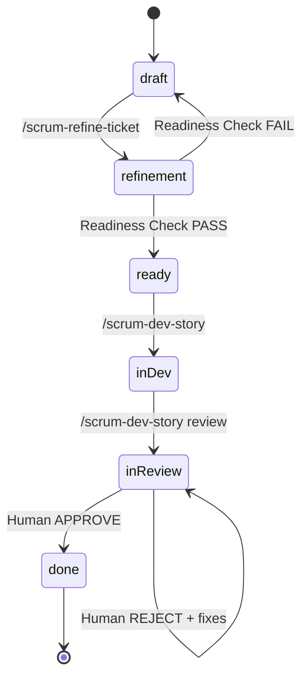

# State Machine

**← Back to [Index](00-index.md)** | **← Previous: [Command Reference](04-command-reference.md)** | **Next → [Phase Details](06-phase-details.md)**

---

## Status Values

| Status | Description | Next States |
|--------|-------------|-------------|
| `draft` | Story created, not yet refined | → refinement |
| `refinement` | Multi-agent refinement in progress | → ready (on PASS) |
| `ready` | Readiness check passed, ready for dev | → in-dev |
| `in-dev` | Development in progress | → in-review |
| `in-review` | Code review complete, awaiting approval | → done (approve) / in-review (reject) |
| `done` | Story complete with human approval | Terminal state |

---

## State Transition Diagram



---

## Guard Conditions

| Transition | Guard Condition | Error if Violated |
|------------|-----------------|-------------------|
| → `ready` | All 4 readiness criteria pass | Status reverted to `draft` |
| → `in-dev` | Status must be `ready` | Halt with error |
| → `in-review` | Implementation complete | Halt if tasks incomplete |
| → `done` | Explicit human approval | Never automatic |

---

## Readiness Criteria (for → `ready` transition)

1. ✅ **Description complete and clear**
2. ✅ **Acceptance criteria comprehensive**
3. ✅ **Estimation provided**
4. ✅ **Tasks/subtasks broken down**

**If any criteria FAIL**: Status reverts to `draft` with documented reasons

---

## Status Validation

Each workflow phase validates status before proceeding:

```python
def validate_status(current: str, required: str, command: str) -> None:
    """Validate status before command execution."""
    if current != required:
        raise StatusError(
            f"{command} requires status '{required}', "
            f"but story is in '{current}'"
        )
```

---

## Status Update Pattern

All status updates follow atomic write pattern:

```python
def update_status(story_path: str, new_status: str) -> None:
    """Update story status atomically."""
    # 1. Read current file
    content = read_file(story_path)

    # 2. Parse and update frontmatter
    frontmatter = parse_yaml_frontmatter(content)
    frontmatter['status'] = new_status
    frontmatter['updated'] = iso_timestamp()

    # 3. Write atomically
    new_content = reconstruct_file(frontmatter, content)
    write_atomic(story_path, new_content)

    # 4. Verify update
    verify_status(story_path, new_status)
```

---

## Common Status Patterns

### New Story Flow
```
draft → refinement → ready → in-dev → in-review → done
```

### Rejected Story Flow
```
... → in-review → (fix issues) → in-review → done
```

### Failed Readiness Flow
```
draft → refinement → (FAIL) → draft → refinement → ready → ...
```

---

## Status Queries

Check story status from command line:
```bash
# Extract status from story.md
grep "^status:" sprints/SW-XXX/story.md

# Or use YAML parser
yq '.status' sprints/SW-XXX/story.md
```

---

## Related Documentation

- [Write Boundary Rules](07-write-boundary-rules.md) - File write restrictions
- [Common Anti-Patterns](11-anti-patterns.md) - What NOT to do
- [Implementation Patterns](12-implementation-patterns.md) - Pattern 1: Guard Condition Enforcement

---

**← Back to [Index](00-index.md)** | **← Previous: [Command Reference](04-command-reference.md)** | **Next → [Phase Details](06-phase-details.md)**
