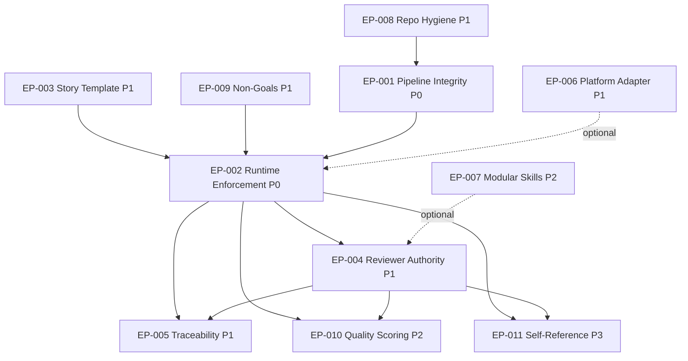

# Epic Index

Overview of all epics decomposed from **PB-001** (`scrum_workflow Hardening — From Workflow Set to Spec-to-PR Governance Layer`).

> **Pfad-Hinweis:** Diese Epics liegen unter `planning/`, **nicht** unter dem standardmäßigen `_scrum-output/epics/`-Pfad aus `src/core/workflows/epic-decomposition.md`. Grund: `_scrum-output/` ist per `.gitignore` ausgeschlossen (Runtime-Artifact-Verzeichnis). `planning/` ist der Top-Level-Pfad für **strategische Roadmap-Artefakte dieses Repos selbst** (Self-Reference, vgl. EP-011). Künftige Story-Artefakte (`_scrum-output/sprints/SW-XXX/`) bleiben am gewohnten Pfad.

## Summary

| # | Epic ID | Title | Prio | Status | Stories (est.) |
|---|---------|-------|------|--------|----------------|
| 1 | EP-001 | Pipeline Integrity (Golden-Path-Fix) | P0 | planned | 4 |
| 2 | EP-002 | Runtime Enforcement Layer (Schemas + Validators) | P0 | planned | 5 |
| 3 | EP-003 | Story-Template-Härtung | P1 | planned | 3 |
| 4 | EP-004 | Reviewer Authority (maschinenlesbare Findings) | P1 | planned | 4 |
| 5 | EP-005 | Source-to-Spec Traceability | P1 | planned | 4 |
| 6 | EP-006 | Platform Adapter Hardening | P1 | planned | 3 |
| 7 | EP-007 | Modular Skills & Token-Disziplin | P2 | planned | 4 |
| 8 | EP-008 | Repo-Hygiene & Test-Infrastruktur (pnpm-only) | P1 | planned | 5 |
| 9 | EP-009 | Non-Goals & Produkt-Positionierung | P1 | planned | 3 |
| 10 | EP-010 | Quality Scoring & Observability | P2 | planned | 3 |
| 11 | EP-011 | Self-Reference (scrum_workflow reviewt sich selbst) | P3 | planned | 3 |

**Gesamt:** 41 Stories (Schätzung; Sizing-Target 5±2 Stories/Epic laut `data/epic-decomposition-rules.yaml`).

## Suggested Sprint Sequence

| Sprint | Inhalt | Begründung |
|--------|--------|------------|
| Sprint 1 | EP-001 + EP-008 (Test-Setup-Teil) | Golden-Path-Fix ist Critical-Blocker; Tests müssen vorher grün sein |
| Sprint 2 | EP-003 + EP-009 | Story-Template-Härtung + Non-Goals — Voraussetzung für Schema-Arbeit |
| Sprint 3–4 | EP-002 | Schemas + Enforcement-Layer (großes Stück) |
| Sprint 5 | EP-004 + EP-008 (CI-Teil) | Reviewer-Authority + CI-Gates |
| Sprint 6–7 | EP-005 | Traceability (Differenzierungs-Hebel) |
| Sprint 8 | EP-006 | Plattform-Adapter Ehrlichkeit |
| Backlog | EP-007, EP-010, EP-011 | Polishing + Quality-Scoring + Self-Reference |

## Dependency Graph



## Decomposition Method

Diese Epics wurden **nicht** via `/scrum-decompose-epics` aus PB-001 generiert, sondern manuell aus zwei strategischen Reviews abgeleitet:

- Chat-Review (intern, Scorecard 3.2/5)
- Word-Dokument `4d97ef8d-SpecDriven_AI_Review_Agent…docx` (Scorecard 26/50)

Der Trigger im `status_history` jeder Epic-Datei ist daher `manual-decomposition`. Die Sizing-Schätzungen folgen dennoch `data/epic-decomposition-rules.yaml` (Target 5±2 Stories/Epic).

## Next Steps

Für jedes Epic, sobald es priorisiert wird:

```bash
/scrum-draft-stories EP-XXX
```

Dann individuelle Drafts zu Tickets promoten:

```bash
/scrum-create-ticket SW-XXX --from-epic EP-XXX --from-draft <index>
```

Empfohlener Start: **EP-001** (Golden-Path-Fix), gefolgt von **EP-008** (Test-Setup, damit alle weiteren Stories grün laufen können).
