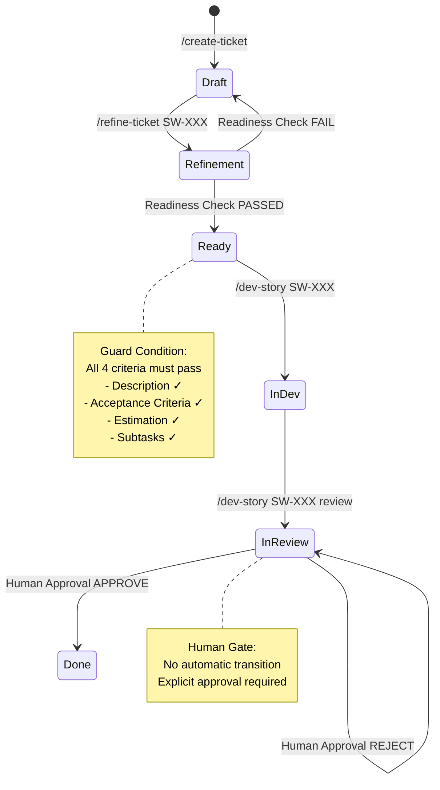

# Workflow Overview

**← Back to [Index](00-index.md)** | **← Previous: [Quick Start](02-quick-start.md)** | **Next → [Command Reference](04-command-reference.md)**

---

## End-to-End Flow



---

## Phase Summary

| Phase | Purpose | Input | Output | Status Change |
|-------|---------|-------|--------|---------------|
| **Spec Creation** | Create story from epic | Epic requirements | story.md (draft) | → draft |
| **Refinement** | Multi-agent perspectives | story.md | refinement.md + updated story.md | → refinement |
| **Readiness Check** | Quality gate before dev | story.md + refinement.md | plan.md | → ready |
| **Development** | Implement code | story.md + plan.md | Code files | → in-dev |
| **Code Review** | Evaluate implementation | Code changes | review-N.md | → in-review |
| **Approval** | Human sign-off | review-N.md | approval-N.md | → done |

**See also:** [Phase-by-Phase Details](06-phase-details.md) | [State Machine](05-state-machine.md)

---

## The Spec-First Philosophy

BMAD workflow emphasizes **specification before implementation**:

1. **Clarity**: Story is fully understood before coding starts
2. **Consensus**: Multiple agents provide perspectives
3. **Quality**: Readiness check validates completeness
4. **Traceability**: Each phase creates audit trail

---

## Human-in-the-Loop Gates

### Gate 1: Readiness Check
- **Automated validation** of 4 criteria
- **FAIL** → Story returned to draft with reasons
- **PASS** → Story moves to ready for development

### Gate 2: Human Approval
- **Explicit human decision** required
- **No automatic DONE** transition
- **REJECT** → Developer fixes and re-reviews
- **APPROVE** → Story marked done

---

## File Flow Diagram

```
EPIC REQUIREMENTS
       ↓
┌─────────────────────────────────────┐
│  Phase 1: Spec Creation              │
│  Command: /create-ticket             │
│  Output: sprints/SW-XXX/story.md     │
│  Status: draft                       │
└─────────────────────────────────────┘
       ↓
┌─────────────────────────────────────┐
│  Phase 2: Refinement                 │
│  Command: /refine-ticket SW-XXX      │
│  Output: refinement.md               │
│  Status: refinement → ready          │
└─────────────────────────────────────┘
       ↓
┌─────────────────────────────────────┐
│  Phase 3: Development                │
│  Command: /dev-story SW-XXX          │
│  Output: Code files                  │
│  Status: in-dev                      │
└─────────────────────────────────────┘
       ↓
┌─────────────────────────────────────┐
│  Phase 4: Code Review                │
│  Command: /dev-story SW-XXX review   │
│  Output: review-N.md                 │
│  Status: in-review                   │
└─────────────────────────────────────┘
       ↓
┌─────────────────────────────────────┐
│  Phase 5: Human Approval             │
│  Action: Review findings + approve   │
│  Output: approval-N.md               │
│  Status: done ✅                      │
└─────────────────────────────────────┘
```

---

## Key Concepts

### Blackboard Pattern
Each phase writes output files that become input for next phase:
- `story.md` → carries context through all phases
- `refinement.md` → perspectives synthesized into story
- `plan.md` → ordered subtasks for development
- `review-N.md` → findings for approval decision
- `approval-N.md` → permanent audit trail

### Write Boundary Rules
Each phase may only write specific files (see [Write Boundary Rules](07-write-boundary-rules.md)):
- Prevents unauthorized modifications
- Ensures phase isolation
- Maintains audit trail integrity

### Atomic Writes
All file writes are atomic (NFR1 compliance):
- Complete or not at all
- No partial writes
- No corruption from concurrent access

---

## Typical Timeline

| Story Points | Estimated Duration |
|--------------|-------------------|
| 1-2 points | 1-2 hours |
| 3-5 points | 2-4 hours |
| 5-8 points | 4-8 hours |
| 8+ points | Consider splitting |

**Note**: Times vary by complexity, developer experience, and review findings.

---

## Related Documentation

- [Phase-by-Phase Details](06-phase-details.md) - Detailed phase documentation
- [Command Reference](04-command-reference.md) - Command syntax and usage
- [Examples](09-examples.md) - Complete file examples
- [State Machine](05-state-machine.md) - Status transitions and guards

---

**← Back to [Index](00-index.md)** | **← Previous: [Quick Start](02-quick-start.md)** | **Next → [Command Reference](04-command-reference.md)**
