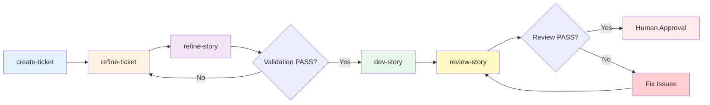

# Command Reference

**← Back to [Index](00-index.md)** | **← Previous: [Workflow Overview](03-workflow-overview.md)** | **Next → [State Machine](05-state-machine.md)**

---

## `/scrum-create-ticket`

**Creates a new story from epic requirements.**

### Usage
```
/scrum-create-ticket
```

### Prerequisites
- Epic exists with story requirements
- User provides story identifier or accepts default

### What happens
1. Loads epic requirements
2. Creates story.md with full context
3. Sets status to `draft`

### Output
- `_scrum-output/sprints/SW-XXX/story.md` (NEW)

### See also
[Examples: Complete story.md](09-examples.md#example-1-complete-storymd)

---

## `/scrum-refine-ticket SW-XXX`

**Multi-agent refinement with doc-discovery, cross-talk discussion, and estimation.**

### Usage
```
/scrum-refine-ticket SW-XXX
```

### Prerequisites
- story.md exists at `_scrum-output/sprints/SW-XXX/story.md`
- Status is `draft` or `refinement`
- Project context exists at `_scrum-output/context/index.md`

### What happens

The refinement workflow executes in **6 phases**:

#### Phase 1: Doc-Discovery
1. Loads auto-detected context from `_scrum-output/context/`
2. Prompts user for additional documents (file paths or URLs)
3. Validates paths and fetches URLs for inclusion in agent context
4. Stores discovered documents for cross-talk rounds

**Example prompt:**
```
**Document Discovery**

Auto-detected context loaded from `_scrum-output/context/`:
- context/index.md (project overview)
- context/backend.md (domain-specific context)

Are there additional documents I should consider for this refinement?
Examples: Architecture docs, API specs, coding standards, external references.

Provide file paths or URLs (one per line), or type **skip** to proceed.
```

#### Phase 2: Initial Perspectives (Round 0)
1. Spawns 3 agents (Architect, Developer, QA) in **parallel** with **isolated context**
2. Each agent receives: story.md + discovered documents + role-specific instructions ONLY
3. Each agent writes analysis to temp files in `sprints/SW-XXX/temp/`

**Isolation principle:** Agents do NOT see each other's perspectives in Round 0.

#### Phase 3: Cross-Talk Discussion Rounds
Iterative discussion rounds where agents see and debate each other's positions:

| Round | Word Limit | Focus |
|-------|------------|-------|
| Round 1 | 400 words | Initial agreements, disagreements, blind spots |
| Round 2 | 300 words | Resolve blockers, refine positions |
| Round 3 | 200 words | Final attempt to resolve blockers |

**Binary Blocker Classification:**
Each disagreement is classified as:
- **Blocker**: Must be resolved before synthesis
- **Non-Blocker**: Document and proceed

**Security Auto-Blocker:**
If any agent identifies a security risk, it is **automatically** classified as a blocker:
```
⚠️ Security issue detected: [description]
Automatically marked as BLOCKER (cannot be overridden)
```

**Early Consensus Exit:**
If all blockers are resolved and only non-blockers remain, the workflow exits early:
```
✅ Early Consensus Reached
All blockers resolved. Proceeding to synthesis without further rounds.
- Rounds completed: 1
- Remaining non-blockers: Y (documented for reference)
```

**Deadlock UX (after max rounds):**
If blockers remain after all rounds:
```
⚠️ REFINEMENT DEADLOCK after 3 rounds

Blocking Issues:
1. [Blocker 1 description]
2. [Blocker 2 description]

What would you like to do?
1. Accept Agent's Proposal (choose which agent)
2. Provide Alternative Resolution
3. Cancel (revert story to draft)
```

#### Phase 4: Estimation (Wideband Delphi)
Independent story point estimates using Planning Poker methodology:

1. **Initial Estimates**: Each agent provides estimate independently (prevents anchoring bias)
2. **Variance Check**: Calculate range (max - min)
   - If variance <= threshold (default: 2 points): Accept median
   - If variance > threshold: Proceed to re-estimation discussion
3. **Re-Estimation**: Agents discuss estimates and revise
4. **Final Estimate**: Median of final estimates with confidence level

**Estimation Scale:** Fibonacci (1, 2, 3, 5, 8, 13, 21)

**Confidence Levels:**
| Variance | Confidence |
|----------|------------|
| 0 points | High |
| 1-2 points | Medium |
| 3+ points | Low |

#### Phase 5: Synthesis
1. Merge agreed perspectives into story.md
2. Document blocker resolution in refinement.md
3. Cleanup temp files (configurable via `keep_agent_temp_files`)

#### Phase 6: Readiness Check
Validate story completeness:
- Description complete and clear
- Acceptance criteria comprehensive
- Estimation provided
- Tasks/subtasks broken down

**PASS** → Status: `ready` (proceed to `/scrum-dev-story`)
**FAIL** → Status: `draft` (address issues and re-run refinement)

### Output
- `refinement.md` (NEW - agent perspectives, cross-talk rounds, estimation)
- `story.md` (UPDATED - refined details, estimate, confidence)
- `plan.md` (CREATED - on readiness check PASS)
- `sprints/SW-XXX/temp/` (TEMP - agent analyses, cleaned up by default)

### Configuration Options

Configure in `scrum_workflow/config.yaml`:

| Option | Default | Description |
|--------|---------|-------------|
| `max_discussion_rounds` | 3 | Maximum cross-talk rounds before escalation |
| `keep_agent_temp_files` | false | Auto-cleanup temp files after synthesis |
| `estimation_variance_threshold` | 2 | Points variance triggering re-estimation |
| `early_exit_on_consensus` | true | Exit early if only non-blockers remain |
| `security_auto_blocker` | true | Force security issues as blockers |

**Example configuration:**
```yaml
refinement:
  max_discussion_rounds: 3
  keep_agent_temp_files: false
  estimation_variance_threshold: 2
  early_exit_on_consensus: true
  security_auto_blocker: true
```

### Temp Files

Agent analyses are stored in `sprints/SW-XXX/temp/`:
- `architect-round-0.md` - Initial architect analysis
- `developer-round-0.md` - Initial developer analysis
- `qa-round-0.md` - Initial QA analysis
- `round-N-summary.md` - Discussion round summaries

**.gitignore pattern:**
```gitignore
# Scrum Workflow temp files
_scrum-output/sprints/*/temp/
```

### Guard Condition
- Readiness check must PASS (4 criteria) to proceed to `/scrum-dev-story`

### Research Basis

This workflow implements patterns from multi-agent consensus research:
- **Opponent Processor Pattern**: Agents debate each other's positions
- **Progressive Truncation**: 400→300→200 words to force convergence
- **Wideband Delphi**: Independent estimation with variance discussion

See: `docs/research/multi-agent-consensus-patterns-refinement-2026-03-31.md`

### Example refinement.md Output

```markdown
# Refinement: SW-XXX

## Document Discovery
- Auto-detected: context/architecture.md, context/backend.md
- User-provided: docs/api-spec.md, https://example.com/standards

## Initial Perspectives (Round 0)
### Architect Analysis
[Summary of architectural findings]

### Developer Analysis
[Summary of implementation findings]

### QA Analysis
[Summary of quality/testing findings]

## Discussion Rounds
### Round 1 Summary
- Agreements: [List of agreed points]
- Disagreements: [List of disagreements]
- Blockers: 1 | Non-blockers: 2

### Round 2 Summary
- Agreements: [Updated list]
- Disagreements: [Remaining disagreements]
- Blockers: 0 | Non-blockers: 1

## Blocker Resolution
- Resolved: [Issue 1] - [Resolution description]
- Escalated: None

## Estimation
| Agent | Points | Confidence | Reasoning |
|-------|--------|------------|-----------|
| Architect | 5 | high | Clear requirements, known patterns |
| Developer | 3 | medium | Some complexity in edge cases |
| QA | 5 | high | Test coverage straightforward |

**Final Estimate**: 5 points (median)
**Confidence**: medium (lowest)
**Method**: wideband-delphi
```

### See also
- [Story Completion Checklist](10-checklist.md)
- [State Machine](05-state-machine.md) - Refinement internal states

---

## `/scrum-dev-story SW-XXX`

**Implements the story based on approved plan.**

### Usage
```
/scrum-dev-story SW-XXX
```

### Prerequisites
- `status: ready` (STRICT - no bypass)
- `plan.md` exists with ordered subtasks

### Guard Condition (FR17)
```python
if story.status != "ready":
    raise GuardConditionError(
        "Story must be in 'ready' status before /scrum-dev-story"
    )
```

### What gets written
- Code files (project-specific)
- `story.md` status → `in-dev`

### See also
[Implementation Patterns](12-implementation-patterns.md)

---

## `/scrum-refine-story SW-XXX`

**Validation-only agent using "Feature List as Immutable Contract" pattern.**

### Usage
```
/scrum-refine-story SW-XXX
```

### Prerequisites
- `status: refinement` (STRICT - no bypass)
- Story file exists at `_scrum-output/sprints/SW-XXX/story.md`

### Agentic Pattern

**Pattern:** [Feature List as Immutable Contract](https://www.agentic-patterns.com/patterns/feature-list-as-immutable-contract)

**Key Principles:**
- **Immutable Requirements:** The checklist acts as an immutable contract — the agent validates against it but cannot modify it.
- **Binary Pass/Fail:** Each criterion must pass — agent cannot modify requirements.
- **Prevents Premature Ready:** The immutable nature prevents the agent from marking a story "ready" when it's not.

### What happens
1. Loads story file with `status: refinement`
2. Validates against immutable checklist (5 criteria)
3. Sets status to `ready-for-dev` if ALL criteria PASS
4. Returns to `refinement` if ANY criterion FAIL

### Validation Checklist (Immutable Contract)

| # | Criterion | What to Check |
|---|----------|---------|
| 1 | Acceptance Criteria | All acceptance criteria are testable and unambiguous |
| 2 | Tasks Defined | All tasks/subtasks are clearly defined |
| 3 | Dev Notes | Dev Notes section contains necessary context |
| 4 | No Placeholders | No placeholders or TODO markers in story content |
| 5 | Dependencies | Dependencies are identified and documented |

### Output
- `_scrum-output/sprints/SW-XXX/story.md` -- Status updated to `ready-for-dev` (PASS) or unchanged (FAIL)
- `_scrum-output/sprints/SW-XXX/refinement.md` -- Validation report appended

### Status Transitions
```
refinement → ready-for-dev (all criteria PASS)
refinement → refinement    (any criterion FAIL - status unchanged)
```

### Relationship to refine-ticket Command

| Command | Purpose | Status Transition | Pattern |
|---------|---------|-------------------|---------|
| `/scrum-refine-ticket` | Multi-agent refinement (Architect, Dev, QA perspectives) | `draft` → `refinement` | Parallel agent spawning |
| `/scrum-refine-story` | Validation-only agent (immutable checklist) | `refinement` → `ready-for-dev` | Feature List as Immutable Contract |

### See also
[State Machine](05-state-machine.md) - Validation status transitions

---

## `/scrum-dev-story SW-XXX`

**Implements the story following "Inversion of Control" pattern.**

### Usage
```
/scrum-dev-story SW-XXX
```

### Prerequisites
- `status: ready-for-dev` (STRICT - no bypass)
- `plan.md` exists with ordered subtasks

### Agentic Pattern

**Pattern:** [Inversion of Control](https://www.agentic-patterns.com/patterns/inversion-of-control)

**Key Principles:**
- **Simplified Agent:** The agent follows the story spec without modification — it does not make design decisions.
- **External Control:** All requirements come from the story file, not the agent's internal state.
- **No Scope Creep:** The agent cannot add features or change requirements.

### What happens
1. Verifies guard condition: `status: ready-for-dev`
2. Loads story specification and plan
3. Implements code following story spec exactly
4. Updates status to `in-progress` during implementation
5. Updates status to `review` when complete

### Output
- `_scrum-output/sprints/SW-XXX/story.md` -- Status → `in-progress` → `review`
- Code files in the project directory (specific to story requirements)

### Status Transitions
```
ready-for-dev → in-progress → review
```

### See also
[Implementation Patterns](12-implementation-patterns.md)

---

## `/scrum-review-story SW-XXX`

**Review-only agent using "AI-Assisted Code Review" pattern.**

### Usage
```
/scrum-review-story SW-XXX
```

### Prerequisites
- `status: review` (STRICT - no bypass)
- Implementation is complete
- All tasks marked [x]

### Agentic Pattern

**Pattern:** [AI-Assisted Code Review / Verification](https://www.agentic-patterns.com/patterns/ai-assisted-code-review-verification)

**Key Principles:**
- **Separate Agent for Critique:** The reviewer is NOT the implementer — ensures unbiased perspective.
- **Multi-Agent Approach:** One generates, another verifies — catches blind spots.
- **Focus on Alignment:** Verify implementation matches specification, not just "looks good".

### Model Recommendation

**Important:** For best results, use a DIFFERENT model than the one that implemented the story.

**Rationale:**
- Different models have different blind spots
- Reduces groupthink and confirmation bias
- Fresh perspective catches issues the implementer missed
- Example: If implementation used Claude Sonnet, review could use Claude Opus or a different model family

### What happens
1. Loads story file with `status: review`
2. Reviews implementation against 5 criteria
3. Sets status to `approved` (all criteria PASS) or `changes-needed` (issues found)

### Review Criteria

| # | Criterion | What to Check |
|---|----------|---------|
| 1 | Specification Alignment | Code matches story specification (no extra features, no missing features) |
| 2 | Acceptance Criteria | All acceptance criteria are satisfied by implementation |
| 3 | Test Coverage | Adequate test coverage for the changes |
| 4 | Code Standards | Code follows project standards from `context/standards.md` |
| 5 | Architecture Compliance | Implementation follows architecture patterns from Dev Notes |

### Severity Levels

| Severity | Definition | Examples |
|----------|------------|----------|
| **Critical** | Blocks story completion, severe defect | Security vulnerability, data corruption risk, core feature missing |
| **Major** | Impacts quality, not blocking | Architecture violation, missing error handling, incomplete feature |
| **Minor** | Style, optimization, non-essential | Naming convention violation, minor optimization, edge case |

### Output
- `_scrum-output/sprints/SW-XXX/story.md` -- Status → `approved` or `changes-needed`
- `_scrum-output/sprints/SW-XXX/review-N.md` -- Review report with verdict and findings

### Status Transitions
```
review → approved         (verdict: APPROVED)
review → changes-needed   (verdict: CHANGES-NEEDED)
changes-needed → review   (after fixes applied)
```

### See also
[Examples: Complete review-N.md](09-examples.md#example-2-complete-review-nmd)

---

## `/scrum-research technical <topic>`

**Generates technical research documentation using agentic patterns.**

### Usage
```
/scrum-research technical <topic>
```

Examples:
```
/scrum-research technical React 18 concurrent features
/scrum-research technical PostgreSQL query optimization
/scrum-research technical OAuth2 implementation patterns
```

### Prerequisites
- WebSearch tool available (for external research)
- `docs/research/` directory exists (created automatically)

### What happens
1. **Scope Confirmation**: Confirms research topic and boundaries
2. **Research Plan**: Creates structured research approach with 6 phases
3. **Swarm Research**: Spawns 3-5 parallel subagents for independent research
4. **Verification**: Validates findings and cross-references sources
5. **Reflection Loop**: Self-critique for quality assurance (up to 2 iterations)
6. **Synthesis**: Produ AI-optimized documentation with structured frontmatter

### Agentic Patterns Used

| Pattern | Description |
|---------|-------------|
| **Plan-Then-Execute** | Separate planning from execution. Define scope first, then execute systematically. |
| **Swarm Migration** | 10x+ speedup via parallel subagents. Each researcher explores independent aspects. |
| **Reflection Loop** | Self-critique after synthesis. Checks completeness, citations, structure, clarity. |
| **Filesystem-Based State** | Persist to `docs/research/.research-state.json` for checkpoint recovery. |

### Output
- `docs/research/technical-research-{topic-slug}-{date}.md` (NEW)

### Frontmatter Example
```yaml
---
type: technical_research
topic: "Authentication with OAuth2"
date: 2026-03-30
sources:
  - https://oauth.net/2/
  - https://datatracker.ietf.org/doc/html/rfc6749
ai_optimized: true
version: 1.0
research_confidence: high  # high | medium | low
---
```

### Update Mode
Use `--update` to refresh existing research:
```
/scrum-research technical <existing-topic> --update
```

Behavior:
1. Reads existing research document
2. Performs targeted research for new information
3. Presents diff summary before applying changes
4. Preserves unchanged content

### See also
[Research Patterns](../docs/research/technical-research-agent-patterns-2026-03-30.md)

---

## `/scrum-research general <topic>`

**Generates general research documentation for business/market/strategic topics.**

### Usage
```
/scrum-research general <topic>
```

Examples:
```
/scrum-research general AI market trends 2026
/scrum-research general competitive analysis CI/CD tools
/scrum-research general enterprise adoption patterns
```

### Prerequisites
- WebSearch tool available (for external research)
- `docs/research/` directory exists (created automatically)

### What happens
1. **Scope Confirmation**: Confirms research topic and business context
2. **Research Plan**: Creates structured approach for non-technical research
3. **Swarm Research**: Spawns 2-3 parallel subagents for market/strategy research
4. **Verification**: Validates findings against business objectives
5. **Reflection Loop**: Self-critique for strategic insights
6. **Synthesis**: Produ AI-optimized documentation with executive focus

### Technical vs General Research

| Aspect | Technical Research | General Research |
|--------|-------------------|------------------|
| **Focus** | Code patterns, APIs, architecture | Market, strategy, business |
| **Output Type** | `technical_research` | `general_research` |
| **Sections** | 13 technical sections | 8 business sections |
| **Subagents** | 3-5 parallel researchers | 2-3 parallel researchers |
| **Example Topics** | "React 18 concurrent features", "PostgreSQL optimization" | "AI market trends 2026", "Competitive analysis: CI/CD tools" |

### Output
- `docs/research/general-research-{topic-slug}-{date}.md` (NEW)

### Frontmatter Example
```yaml
---
type: general_research
topic: "AI Market Trends 2026"
date: 2026-03-30
sources:
  - https://example.com/market-report
  - https://example.com/industry-analysis
ai_optimized: true
version: 1.0
research_confidence: medium
---
```

### Update Mode
Use `--update` to refresh existing research:
```
/scrum-research general <existing-topic> --update
```

### See also
[Research Patterns](../docs/research/technical-research-agent-patterns-2026-03-30.md)

---

## Human Approval Gate



### Three-Agent Workflow Commands

| Command | Purpose | Status Transition | Pattern |
|---------|---------|-------------------|---------|
| `/scrum-refine-ticket` | Multi-agent refinement | `draft` → `refinement` | Sub-Agent Spawning |
| `/scrum-refine-story` | Validation-only agent | `refinement` → `ready-for-dev` | [Feature List as Immutable Contract](https://www.agentic-patterns.com/patterns/feature-list-as-immutable-contract) |
| `/scrum-dev-story` | Implementation-only agent | `ready-for-dev` → `review` | [Inversion of Control](https://www.agentic-patterns.com/patterns/inversion-of-control) |
| `/scrum-review-story` | Review-only agent | `review` → `approved` or `changes-needed` | [AI-Assisted Code Review](https://www.agentic-patterns.com/patterns/ai-assisted-code-review-verification) |

---

## Common Command Errors

### Error: "Story must be in 'ready' status"
**Cause**: Trying to run `/scrum-dev-story` on non-ready story
**Fix**: Run `/scrum-refine-ticket` first

### Error: "Readiness check failed"
**Cause**: Story doesn't meet 4 criteria
**Fix**: Address failure reasons in story.md

### Error: "No review file found"
**Cause**: Trying to approve without review
**Fix**: Run `/scrum-dev-story SW-XXX review` first

---

**← Back to [Index](00-index.md)** | **← Previous: [Workflow Overview](03-workflow-overview.md)** | **Next → [State Machine](05-state-machine.md)**
