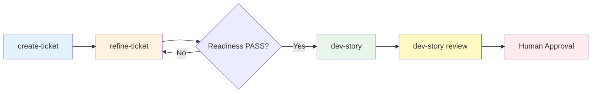

# Command Reference

**← Back to [Index](00-index.md)** | **← Previous: [Workflow Overview](03-workflow-overview.md)** | **Next → [State Machine](05-state-machine.md)**

---

## `/create-ticket`

**Creates a new story from epic requirements.**

### Usage
```
/create-ticket
```

### Prerequisites
- Epic exists with story requirements
- User provides story identifier or accepts default

### What happens
1. Loads epic requirements
2. Creates story.md with full context
3. Sets status to `draft`

### Output
- `sprints/SW-XXX/story.md` (NEW)

### See also
[Examples: Complete story.md](09-examples.md#example-1-complete-storymd)

---

## `/refine-ticket SW-XXX`

**Multi-agent refinement of story details.**

### Usage
```
/refine-ticket SW-XXX
```

### Prerequisites
- story.md exists
- Status is `draft` or `refinement`

### What happens
1. Multiple agents provide perspectives (Backend, Frontend, QA, Architecture)
2. Perspectives are synthesized
3. Story is updated with refined details
4. Readiness check validates completeness

### Output
- `refinement.md` (NEW - agent perspectives)
- `story.md` (UPDATED - refined details)
- `plan.md` (CREATED - on readiness check PASS)

### Guard Condition
- Readiness check must PASS (4 criteria) to proceed to `/dev-story`

### See also
[Story Completion Checklist](10-checklist.md)

---

## `/dev-story SW-XXX`

**Implements the story based on approved plan.**

### Usage
```
/dev-story SW-XXX
```

### Prerequisites
- `status: ready` (STRICT - no bypass)
- `plan.md` exists with ordered subtasks

### Guard Condition (FR17)
```python
if story.status != "ready":
    raise GuardConditionError(
        "Story must be in 'ready' status before /dev-story"
    )
```

### What gets written
- Code files (project-specific)
- `story.md` status → `in-dev`

### See also
[Implementation Patterns](12-implementation-patterns.md)

---

## `/dev-story SW-XXX review`

**Triggers code review after implementation.**

### Usage
```
/dev-story SW-XXX review
```

### Prerequisites
- `status: in-dev` or `status: in-review`
- Implementation is complete
- All tasks marked [x]

### Output
- `sprints/SW-XXX/review-N.md` (NEW - N increments each review)

### See also
[Examples: Complete review-N.md](09-examples.md#example-2-complete-review-nmd)

---

## Human Approval Gate

**Final gate - explicit human approval required.**

### Trigger
Review findings presented to human reviewer

### If APPROVED
- Creates `approval-N.md`
- Updates status to `done`
- Story is complete ✅

### If REJECTED
- Creates `approval-N.md` with rejection reason
- Status remains `in-review`
- Developer fixes issues and re-triggers review

### Guard Condition (FR28)
```
CRITICAL: No story can be marked as DONE without explicit human approval.
```

### See also
[Examples: Complete approval-N.md](09-examples.md#example-3-complete-approval-nmd)

---

## Command Flow Summary



---

## Common Command Errors

### Error: "Story must be in 'ready' status"
**Cause**: Trying to run `/dev-story` on non-ready story
**Fix**: Run `/refine-ticket` first

### Error: "Readiness check failed"
**Cause**: Story doesn't meet 4 criteria
**Fix**: Address failure reasons in story.md

### Error: "No review file found"
**Cause**: Trying to approve without review
**Fix**: Run `/dev-story SW-XXX review` first

---

**← Back to [Index](00-index.md)** | **← Previous: [Workflow Overview](03-workflow-overview.md)** | **Next → [State Machine](05-state-machine.md)**
