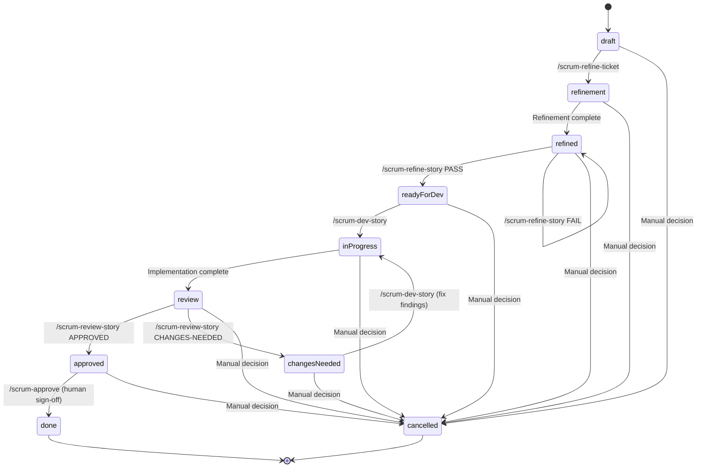

# State Machine

**← Back to [Index](00-index.md)** | **← Previous: [Command Reference](04-command-reference.md)** | **Next → [Phase Details](06-phase-details.md)**

---

> **Note:** The authoritative definition of all states and transitions lives in [`scrum_workflow/context/standards.md`](../context/standards.md) — Story Status State Machine section. This document provides diagrams and supplementary detail. In case of any conflict, `standards.md` is the single source of truth.

---

## Status Values

| Status | Description | Next States |
|--------|-------------|-------------|
| `draft` | Story created, not yet refined | → refinement |
| `refinement` | Multi-agent refinement in progress (implementation-internal sub-state, not in FR-4's 9 states) | → refined (on completion) |
| `refined` | Refinement complete, awaiting validation | → ready-for-dev |
| `ready-for-dev` | Validated and ready for implementation | → in-progress |
| `in-progress` | Development in progress | → review |
| `review` | Implementation complete, awaiting review | → approved / changes-needed |
| `approved` | Review passed, awaiting human approval | → done |
| `changes-needed` | Review found issues requiring fixes | → in-progress (after fixes) |
| `done` | Story complete with human approval | Terminal state |
| `cancelled` | Story cancelled by explicit user decision | Terminal state (from any state) |

---

## State Transition Diagram



---

## Guard Conditions

See [`scrum_workflow/context/standards.md`](../context/standards.md) for the authoritative Valid Transitions table. Summary of guard conditions:

| Transition | Guard Condition | Error if Violated |
|------------|-----------------|-------------------|
| → `refined` | Refinement agents complete | Status unchanged |
| → `ready-for-dev` | All 5 validation criteria pass | Status remains `refined` |
| → `in-progress` | Status must be `ready-for-dev` OR `changes-needed` | Halt with error |
| → `review` | Implementation complete, all tasks [x] | Halt if tasks incomplete |
| → `approved` | Review verdict: APPROVED | Never automatic |
| → `changes-needed` | Review verdict: CHANGES-NEEDED | Requires findings documented |
| → `done` | Status must be `approved`, explicit human approval via /scrum-approve | Never automatic |
| any → `cancelled` | Explicit user cancellation | Manual decision required |

---

## Readiness Criteria (for → `ready-for-dev` transition)

The `/scrum-refine-story` command validates against these criteria:

1. ✅ **Acceptance Criteria** — All acceptance criteria are testable and unambiguous
2. ✅ **Tasks Defined** — All tasks/subtasks are clearly defined
3. ✅ **Dev Notes** — Dev Notes section contains necessary context
4. ✅ **No Placeholders** — No placeholders or TODO markers in story content
5. ✅ **Dependencies** — Dependencies are identified and documented

**If any criteria FAIL**: Status remains `refined` with documented reasons

---

## Three-Agent Workflow (Epic 11)

The state machine supports the three-agent pattern split from Epic 11:

```
draft → refinement → refined → ready-for-dev → in-progress → review → approved/changes-needed
              ↑              ↑               ↑            ↑
        /refine-ticket  /refine-story   /dev-story  /review-story
```

### Agent Pattern Mapping

| Command | Pattern | Status Transition |
|---------|---------|-------------------|
| `/scrum-refine-ticket` | Sub-Agent Spawning | `draft` → `refinement` → `refined` |
| `/scrum-refine-story` | Feature List as Immutable Contract | `refined` → `ready-for-dev` |
| `/scrum-dev-story` | Inversion of Control | `ready-for-dev` → `in-progress` → `review` |
| `/scrum-review-story` | AI-Assisted Code Review | `review` → `approved` or `changes-needed` |

---

## Status Validation

Each workflow phase validates status before proceeding:

```python
def validate_status(current: str, required: str, command: str) -> None:
    """Validate status before command execution."""
    if current != required:
        raise StatusError(
            f"{command} requires status '{required}', "
            f"but story is in '{current}'"
        )
```

---

## Status Update Pattern

All status updates follow atomic write pattern:

```python
def update_status(story_path: str, new_status: str) -> None:
    """Update story status atomically."""
    # 1. Read current file
    content = read_file(story_path)

    # 2. Parse and update frontmatter
    frontmatter = parse_yaml_frontmatter(content)
    frontmatter['status'] = new_status
    frontmatter['updated'] = iso_timestamp()

    # 3. Write atomically
    new_content = reconstruct_file(frontmatter, content)
    write_atomic(story_path, new_content)

    # 4. Verify update
    verify_status(story_path, new_status)
```

---

## Common Status Patterns

### New Story Flow (Three-Agent Workflow)
```
draft → refinement → refined → ready-for-dev → in-progress → review → approved → done
```

### Validation Failed Flow
```
draft → refinement → refined → (validation FAIL) → refined → (fix issues) → ready-for-dev → ...
```

### Review Changes-Needed Flow
```
... → review → changes-needed → (fix issues) → review → approved → done
```

### Rejected Human Approval Flow
```
... → approved → (human REJECT) → changes-needed → review → approved → done
```

---

## Status Queries

Check story status from command line:
```bash
# Extract status from story.md
grep "^status:" _scrum-output/sprints/SW-XXX/story.md

# Or use YAML parser
yq '.status' _scrum-output/sprints/SW-XXX/story.md
```

---

## Related Documentation

- [Write Boundary Rules](07-write-boundary-rules.md) - File write restrictions
- [Common Anti-Patterns](11-anti-patterns.md) - What NOT to do
- [Implementation Patterns](12-implementation-patterns.md) - Pattern 1: Guard Condition Enforcement
- [Command Reference](04-command-reference.md) - Three-agent commands

---

**← Back to [Index](00-index.md)** | **← Previous: [Command Reference](04-command-reference.md)** | **Next → [Phase Details](06-phase-details.md)**
