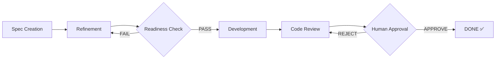
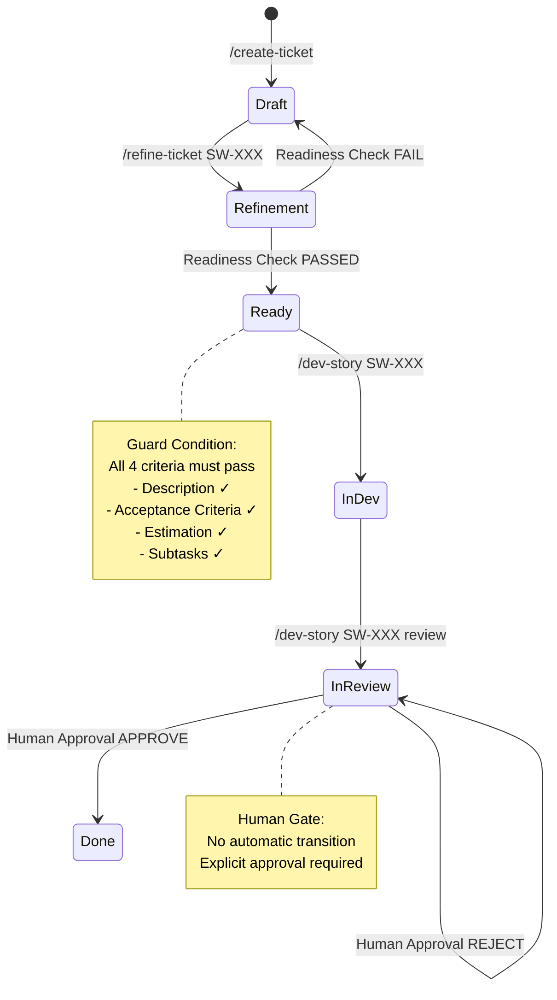
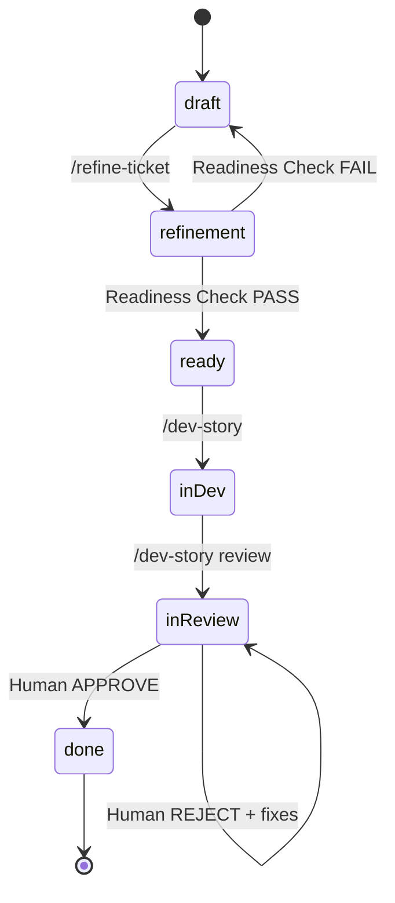
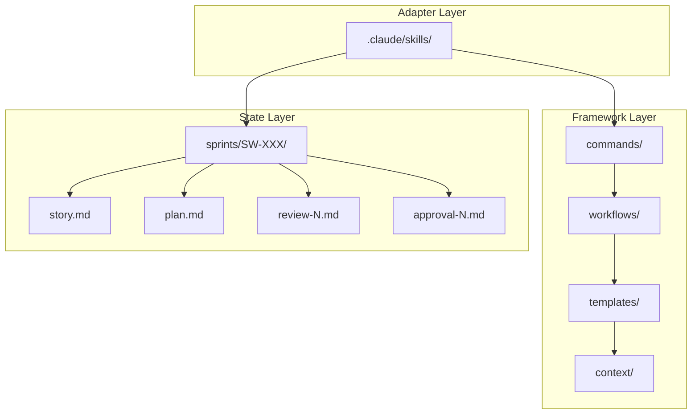

# BMAD Scrum Workflow - Complete Guide

**Version:** 3.1 (Complete Overhaul + Installation Guide)
**Last Updated:** 2026-03-25
**Project:** scrum_workflow
**Contributors:** Paige (Tech Writer), Bob (Scrum Master), Winston (Architect)

---

## Table of Contents

1. [Installation](#installation)
2. [Quick Start](#quick-start)
3. [Workflow Overview](#workflow-overview)
4. [Command Reference](#command-reference)
5. [State Machine](#state-machine)
6. [Phase-by-Phase Details](#phase-by-phase-details)
7. [Write Boundary Rules](#write-boundary-rules)
8. [Framework Architecture](#framework-architecture)
9. [Examples](#examples)
10. [Story Completion Checklist](#story-completion-checklist)
11. [Common Anti-Patterns](#common-anti-patterns)
12. [Implementation Patterns](#implementation-patterns)
13. [Error Recovery](#error-recovery)
14. [Extension Points](#extension-points)
15. [Best Practices](#best-practices)
16. [Troubleshooting](#troubleshooting)
17. [Appendix](#appendix)

---

## Installation

### Setup for New Projects

This section provides copy-paste instructions for installing the scrum_workflow framework in a new project.

#### Prerequisites

- **Claude Code** (or compatible AI coding assistant)
- Git repository (recommended but not required)
- Terminal access with basic shell commands

#### Installation Methods

**Choose one method:**

1. **Manual Copy (Recommended)** - Full control over what you copy
2. **Git Submodule** - Keep framework synced with upstream
3. **Scripted Install** - Automated setup

---

### Method 1: Manual Copy (Recommended)

#### Step 1: Copy the Framework Directory

```bash
# Navigate to your new project directory
cd /path/to/your/new-project

# Create the scrum_workflow directory
mkdir -p scrum_workflow

# Copy framework files from source project
cp -r /path/to/scrum_workflow/scrum_workflow/* scrum_workflow/

# Verify the structure
ls -la scrum_workflow/
```

Expected structure after copy:
```
scrum_workflow/
├── agents/          # Agent definitions
├── commands/        # CLI command workflows
├── config.yaml      # Framework configuration
├── context/         # Context templates
├── data/            # Data and schemas
├── docs/            # Documentation
├── skills/          # Reusable skill components
├── templates/       # Output templates
└── workflows/       # Phase workflows
```

#### Step 2: Copy Claude Skills

```bash
# Create .claude directory structure
mkdir -p .claude/skills

# Copy BMAD skills (required for workflow commands)
cp -r /path/to/scrum_workflow/.claude/skills/bmad-* .claude/skills/

# Copy workflow shortcut files (if present)
cp /path/to/scrum_workflow/.claude/*.md .claude/ 2>/dev/null || true

# Verify skills are copied
ls .claude/skills/bmad-create-story
ls .claude/skills/bmad-dev-story
```

#### Step 3: Create Required Directories

```bash
# Create BMAD output directory
mkdir -p _bmad-output/planning-artifacts
mkdir -p _bmad-output/implementation-artifacts

# Create sprints directory
mkdir -p sprints

# Verify structure
tree -L 2 . || find . -maxdepth 2 -type d
```

Expected project structure:
```
your-project/
├── .claude/
│   └── skills/
│       ├── bmad-create-story/
│       ├── bmad-dev-story/
│       └── ... (other BMAD skills)
├── _bmad-output/
│   ├── planning-artifacts/    # Epics, PRD, Architecture
│   └── implementation-artifacts/  # Story files
├── scrum_workflow/
│   ├── agents/
│   ├── commands/
│   ├── workflows/
│   └── ...
└── sprints/                   # Sprint folders (SW-101, SW-102, etc.)
```

#### Step 4: Configure Claude Code Settings

Create or update `.claude/settings.json`:

```json
{
  "extraKnownMarketplaces": {
    "bmad-local": {
      "source": {
        "source": "local",
        "path": ".claude/skills"
      }
    }
  },
  "skipDangerousModePermissionPrompt": false,
  "effortLevel": "high"
}
```

**Settings explained:**
- `extraKnownMarketplaces`: Register local skills directory
- `skipDangerousModePermissionPrompt`: Set to `true` for automated workflows
- `effortLevel`: Set to `high` for better code quality

#### Step 5: Create Initial Configuration

Create `config.yaml` in project root (optional, overrides scrum_workflow/config.yaml):

```yaml
# Project-specific configuration
platform: claude-code

project_name: "Your Project Name"
project_key: "YPREFIX"  # e.g., PROJ, for story IDs like PROJ-101

active_agents:
  - architect
  - developer
  - qa

# Output locations
story_location: "{project-root}/_bmad-output/implementation-artifacts"
sprint_location: "{project-root}/sprints"
```

#### Step 6: Verify Installation

```bash
# Test that framework is accessible
ls scrum_workflow/workflows/
ls scrum_workflow/commands/
ls .claude/skills/bmad-create-story/SKILL.md

# Check config is valid
cat scrum_workflow/config.yaml
```

---

### Method 2: Git Submodule

For keeping the framework synced with upstream updates:

```bash
# Navigate to your new project
cd /path/to/your/new-project

# Add scrum_workflow as a submodule
git submodule add https://github.com/your-org/scrum_workflow.git scrum_workflow

# Initialize and clone the submodule
git submodule update --init --recursive

# Copy skills to .claude directory (submodule skills don't auto-load)
cp -r scrum_workflow/.claude/skills/bmad-* .claude/skills/

# Create required directories
mkdir -p _bmad-output/{planning-artifacts,implementation-artifacts}
mkdir -p sprints
```

**Update workflow** (when upstream changes):
```bash
git submodule update --remote scrum_workflow
```

---

### Method 3: Scripted Install

Save this script as `install-scrum-workflow.sh`:

```bash
#!/bin/bash
set -e

# Configuration
SOURCE_PROJECT="${1:-/path/to/scrum_workflow}"
TARGET_DIR="${2:-.}"

echo "Installing scrum_workflow to: $TARGET_DIR"

# Create directories
mkdir -p "$TARGET_DIR/scrum_workflow"
mkdir -p "$TARGET_DIR/.claude/skills"
mkdir -p "$TARGET_DIR/_bmad-output/planning-artifacts"
mkdir -p "$TARGET_DIR/_bmad-output/implementation-artifacts"
mkdir -p "$TARGET_DIR/sprints"

# Copy framework
echo "Copying framework files..."
cp -r "$SOURCE_PROJECT/scrum_workflow/"* "$TARGET_DIR/scrum_workflow/"

# Copy skills
echo "Copying Claude skills..."
cp -r "$SOURCE_PROJECT/.claude/skills/bmad-"* "$TARGET_DIR/.claude/skills/"
cp "$SOURCE_PROJECT/.claude/"*.md "$TARGET_DIR/.claude/" 2>/dev/null || true

# Create settings.json if not exists
if [ ! -f "$TARGET_DIR/.claude/settings.json" ]; then
    echo "Creating .claude/settings.json..."
    cat > "$TARGET_DIR/.claude/settings.json" << 'EOF'
{
  "extraKnownMarketplaces": {
    "bmad-local": {
      "source": {
        "source": "local",
        "path": ".claude/skills"
      }
    }
  },
  "skipDangerousModePermissionPrompt": false,
  "effortLevel": "high"
}
EOF
fi

echo "Installation complete!"
echo "Next steps:"
echo "  1. Review scrum_workflow/config.yaml"
echo "  2. Create config.yaml in project root (optional)"
echo "  3. Start Claude Code in project directory"
```

**Usage:**
```bash
chmod +x install-scrum-workflow.sh
./install-scrum-workflow.sh /path/to/source/project /path/to/new/project
```

---

### Platform-Specific Setup

#### GitHub Copilot

```yaml
# config.yaml
platform: github-copilot
```

No additional setup required beyond framework copy.

#### Windsurf

```yaml
# config.yaml
platform: windsurf
```

Skills load automatically from `.claude/skills/` directory.

#### OpenCode

```yaml
# config.yaml
platform: opencode
```

Use Method 1 (Manual Copy) with these adjustments:
- Copy skills to project-specific skills directory
- Configure skills path in platform settings

---

### Post-Installation Checklist

- [ ] Framework directory copied: `scrum_workflow/`
- [ ] Skills installed: `.claude/skills/bmad-*`
- [ ] Output directories created: `_bmad-output/`, `sprints/`
- [ ] Settings configured: `.claude/settings.json`
- [ ] Config reviewed: `scrum_workflow/config.yaml`
- [ ] Commands accessible in Claude Code

---

### Verification Test

Run this test to verify installation:

```bash
# In Claude Code, run:
/create-ticket

# Expected behavior: System prompts for epic and story details
# If error: Check .claude/settings.json and skills directory
```

---

### Troubleshooting Installation

**Problem**: Skills not loading
- **Solution**: Check `.claude/settings.json` has correct `path` to skills directory
- **Solution**: Restart Claude Code after adding skills

**Problem**: Commands not recognized
- **Solution**: Verify `.claude/skills/bmad-create-story/SKILL.md` exists
- **Solution**: Check skill file has proper frontmatter

**Problem**: Cannot write to sprints directory
- **Solution**: Check directory permissions: `ls -la sprints/`
- **Solution**: Create directory if missing: `mkdir -p sprints`

---

### Next Steps After Installation

1. **Create planning artifacts**: Generate epics, PRD, architecture
2. **Run sprint planning**: Create sprint status from epics
3. **Create first story**: `/create-ticket` to start workflow
4. **Customize agents**: Edit `scrum_workflow/agents/*.md` for your project
5. **Adjust workflows**: Modify `scrum_workflow/workflows/*.md` as needed

For detailed workflow instructions, see [Quick Start](#quick-start).

---

## Quick Start

### The Workflow in 5 Minutes

The BMAD Scrum Workflow is a **spec-first, AI-assisted development process** with human oversight at critical gates. Each story passes through distinct phases with explicit handoffs and audit trails.



### Essential Commands

| Command | What It Does |
|---------|--------------|
| `/create-ticket` | Create a new story from epic requirements |
| `/refine-ticket SW-XXX` | Multi-agent refinement of story details |
| `/dev-story SW-XXX` | Implement the story (requires status: ready) |
| `/dev-story SW-XXX review` | Trigger code review (after implementation) |
| Human approval | Final gate - story not DONE without explicit approval |

### Critical Rules

1. **Never skip status phases** - The state machine enforces order
2. **Respect guard conditions** - `/dev-story` only works at `status: ready`
3. **Follow write boundary rules** - Each phase writes only specific files
4. **Human gate is mandatory** - No story ships without explicit approval

---

## Workflow Overview

### End-to-End Flow



### Phase Summary

| Phase | Purpose | Input | Output | Status Change |
|-------|---------|-------|--------|---------------|
| **Spec Creation** | Create story from epic | Epic requirements | story.md (draft) | → draft |
| **Refinement** | Multi-agent perspectives | story.md | refinement.md + updated story.md | → refinement |
| **Readiness Check** | Quality gate before dev | story.md + refinement.md | plan.md | → ready |
| **Development** | Implement code | story.md + plan.md | Code files | → in-dev |
| **Code Review** | Evaluate implementation | Code changes | review-N.md | → in-review |
| **Approval** | Human sign-off | review-N.md | approval-N.md | → done |

**See also:** [Phase-by-Phase Details](#phase-by-phase-details) | [State Machine](#state-machine)

---

## Command Reference

### `/create-ticket`

**Creates a new story from epic requirements.**

**Usage:**
```
/create-ticket
```

**Prerequisites:**
- Epic exists with story requirements
- User provides story identifier or accepts default

**What happens:**
1. Loads epic requirements
2. Creates story.md with full context
3. Sets status to `draft`

**Output:**
- `sprints/SW-XXX/story.md` (NEW)

**See also:** [Examples: Complete story.md](#example-1-complete-storymd)

---

### `/refine-ticket SW-XXX`

**Multi-agent refinement of story details.**

**Usage:**
```
/refine-ticket SW-XXX
```

**Prerequisites:**
- story.md exists
- Status is `draft` or `refinement`

**What happens:**
1. Multiple agents provide perspectives (Backend, Frontend, QA, Architecture)
2. Perspectives are synthesized
3. Story is updated with refined details
4. Readiness check validates completeness

**Output:**
- `refinement.md` (NEW - agent perspectives)
- `story.md` (UPDATED - refined details)
- `plan.md` (CREATED - on readiness check PASS)

**Guard Condition:**
- Readiness check must PASS (4 criteria) to proceed to `/dev-story`

**See also:** [Story Completion Checklist](#story-completion-checklist)

---

### `/dev-story SW-XXX`

**Implements the story based on approved plan.**

**Usage:**
```
/dev-story SW-XXX
```

**Prerequisites:**
- `status: ready` (STRICT - no bypass)
- `plan.md` exists with ordered subtasks

**Guard Condition (FR17):**
```python
if story.status != "ready":
    raise GuardConditionError(
        "Story must be in 'ready' status before /dev-story"
    )
```

**What gets written:**
- Code files (project-specific)
- `story.md` status → `in-dev`

**See also:** [Implementation Patterns](#implementation-patterns)

---

### `/dev-story SW-XXX review`

**Triggers code review after implementation.**

**Usage:**
```
/dev-story SW-XXX review
```

**Prerequisites:**
- `status: in-dev` or `status: in-review`
- Implementation is complete
- All tasks marked [x]

**Output:**
- `sprints/SW-XXX/review-N.md` (NEW - N increments each review)

**See also:** [Examples: Complete review-N.md](#example-2-complete-review-nmd)

---

### Human Approval Gate

**Final gate - explicit human approval required.**

**Trigger:** Review findings presented to human reviewer

**If APPROVED:**
- Creates `approval-N.md`
- Updates status to `done`
- Story is complete ✅

**If REJECTED:**
- Creates `approval-N.md` with rejection reason
- Status remains `in-review`
- Developer fixes issues and re-triggers review

**Guard Condition (FR28):**
```
CRITICAL: No story can be marked as DONE without explicit human approval.
```

**See also:** [Examples: Complete approval-N.md](#example-3-complete-approval-nmd)

---

## State Machine

### Status Values

| Status | Description | Next States |
|--------|-------------|-------------|
| `draft` | Story created, not yet refined | → refinement |
| `refinement` | Multi-agent refinement in progress | → ready (on PASS) |
| `ready` | Readiness check passed, ready for dev | → in-dev |
| `in-dev` | Development in progress | → in-review |
| `in-review` | Code review complete, awaiting approval | → done (approve) / in-review (reject) |
| `done` | Story complete with human approval | Terminal state |

### State Transition Diagram



### Guard Conditions

| Transition | Guard Condition | Error if Violated |
|------------|-----------------|-------------------|
| → `ready` | All 4 readiness criteria pass | Status reverted to `draft` |
| → `in-dev` | Status must be `ready` | Halt with error |
| → `in-review` | Implementation complete | Halt if tasks incomplete |
| → `done` | Explicit human approval | Never automatic |

**See also:** [Write Boundary Rules](#write-boundary-rules) | [Common Anti-Patterns](#common-anti-patterns)

---

## Phase-by-Phase Details

### Phase 1: Spec Creation (`/create-ticket`)

**Purpose:** Create story file from epic requirements

**Input:** Epic requirements, user acceptance criteria

**Output:** `sprints/SW-XXX/story.md`

**Status Change:** → `draft`

**What gets created:**
```markdown
---
schema_version: 1
ticket: "SW-XXX"
title: "Story Title"
status: "draft"
---

## Story
As a [role],
I want [feature],
So that [benefit].

## Acceptance Criteria
**Given** [precondition]
**When** [action]
**Then** [expected outcome]

## Tasks / Subtasks
- [ ] Task 1
  - [ ] Subtask 1.1
```

**See also:** [Examples: Complete story.md](#example-1-complete-storymd)

---

### Phase 2: Multi-Agent Refinement (`/refine-ticket`)

**Purpose:** Enrich story with diverse agent perspectives

**Agent Perspectives:**
- **Backend Agent:** Database, API, performance considerations
- **Frontend Agent:** UI/UX, user interaction, responsive design
- **QA Agent:** Testing strategy, edge cases, automation
- **Architecture Agent:** System design, patterns, scalability

**Readiness Check Gate:**
Validates 4 criteria before allowing `/dev-story`:
- ✅ Description complete and clear
- ✅ Acceptance criteria comprehensive
- ✅ Estimation provided
- ✅ Tasks/subtasks broken down

**If FAIL:** Status reverted to `draft` with documented reasons

**See also:** [Story Completion Checklist](#story-completion-checklist)

---

### Phase 3: Development (`/dev-story`)

**Implementation Pattern: Red-Green-Refactor**

1. **Red Phase:** Write failing tests first
2. **Green Phase:** Implement minimal code to pass
3. **Refactor Phase:** Improve structure while keeping tests green

**Write Boundary Rules:**
- ✅ MAY write: Code files, `story.md` (status only)
- ❌ MAY NOT write: `plan.md`, `refinement.md`, review files

**See also:** [Implementation Patterns](#implementation-patterns)

---

### Phase 4: Code Review (`/dev-story SW-XXX review`)

**Severity Levels:**

| Severity | Description | Examples |
|----------|-------------|----------|
| **Critical** | Blocks story completion | Security vulnerability, data corruption |
| **Major** | Impacts quality/maintainability | Architecture violation, missing error handling |
| **Minor** | Style/optimization | Code style, documentation improvement |

**Incremental Reviews:**
- First review: `review-1.md`
- Subsequent: `review-2.md`, `review-3.md`, etc.

**See also:** [Examples: Complete review-N.md](#example-2-complete-review-nmd)

---

### Phase 5: Human Approval Gate

**Re-Review Cycle:**
For rejected stories, the cycle continues until human approves.

**See also:** [Examples: Complete approval-N.md](#example-3-complete-approval-nmd)

---

## Write Boundary Rules

### The Principle

Each workflow phase may **only** write specific files. This enforces:
- Specification integrity
- Phase isolation
- Audit trail preservation
- Concurrent safety

### Write Permissions Matrix

```
┌─────────────────┬─────────────────────────────────────┐
│ Phase           │ MAY WRITE                           │
├─────────────────┼─────────────────────────────────────┤
│ Refinement      │ refinement.md, story.md (sections)  │
│ Readiness       │ plan.md, story.md (status→ready)    │
│ Development     │ Code files, story.md (status→in-dev)│
│ Code Review     │ review-N.md, story.md (status→review)│
│ Approval        │ approval-N.md, story.md (status→done)│
└─────────────────┴─────────────────────────────────────┘

┌─────────────────┬─────────────────────────────────────┐
│ Phase           │ MAY NOT WRITE                       │
├─────────────────┼─────────────────────────────────────┤
│ Refinement      │ plan.md, review-*.md, approval-*.md │
│ Readiness       │ refinement.md, code files           │
│ Development     │ plan.md, refinement.md, review-*.md │
│ Code Review     │ code files, plan.md, refinement.md  │
│ Approval        │ code files, review-*.md, plan.md    │
└─────────────────┴─────────────────────────────────────┘
```

### NFR1: Atomic Write Guarantee

**❌ NOT Atomic (Race Condition Possible):**
```bash
echo "status: done" >> story.md  # Multiple writes = corruptible
```

**✅ Atomic (Single Syscall):**
```python
def write_atomic(path: str, content: str) -> None:
    """Write file atomically (NFR1 compliance)."""
    import tempfile
    import os

    tmp_path = f"{path}.tmp"
    with open(tmp_path, 'w') as f:
        f.write(content)

    os.rename(tmp_path, path)  # Single syscall
```

**See also:** [Implementation Patterns](#implementation-patterns) | [Error Recovery](#error-recovery)

---

## Framework Architecture

### Three-Layer Separation



**See also:** [Extension Points](#extension-points)

---

## Examples

### Example 1: Complete story.md

```yaml
---
schema_version: 1
ticket: "SW-001"
title: "User Authentication"
status: "ready"
created: "2026-03-25T10:00:00Z"
updated: "2026-03-25T10:00:00Z"
points: 5
priority: high
---

## Story

As a **user**,
I want to **log in with email and password**,
So that **I can access my personalized dashboard**.

## Acceptance Criteria

**Given** a user is on the login page
**When** they enter valid email and password
**Then** they are redirected to their dashboard
**And** a session is established

**Given** a user enters invalid credentials
**When** they submit the login form
**Then** an error message is displayed
**And** they remain on the login page

## Tasks / Subtasks

- [x] Task 1: Design login UI
  - [x] Subtask 1.1: Create login form component
  - [x] Subtask 1.2: Add validation
- [x] Task 2: Implement authentication API
  - [x] Subtask 2.1: POST /auth/login endpoint
  - [x] Subtask 2.2: Password hashing
  - [x] Subtask 2.3: Session management

## Dev Notes

### Architecture Patterns
- Use JWT for session management
- Password hashing with bcrypt
- Rate limiting on login endpoint

### Constraints
- Must comply with OWASP security guidelines
- Session timeout: 24 hours
- Max login attempts: 5 per hour
```

### Example 2: Complete review-N.md

```yaml
---
schema_version: 1
ticket: "SW-001"
title: "User Authentication"
review_date: "2026-03-25T15:30:00Z"
review_number: "1"
reviewer: "AI Code Reviewer"
---

# Code Review: User Authentication

## Summary

| Total | Critical | Major | Minor |
|-------|----------|-------|-------|
| 12    | 2        | 7     | 3     |

## Findings

| # | Finding | Severity | AC Reference | Suggested Fix |
|---|---------|----------|--------------|--------------|
| 1 | No rate limiting on login endpoint | Critical | AC 3 | Add rate limiting (5/hour) |
| 2 | JWT secret hardcoded | Critical | Security | Move to env variable |
| 3 | Password not validated | Major | AC 2 | Add complexity validation |
```

### Example 3: Complete approval-N.md

```yaml
---
schema_version: 1
ticket: "SW-001"
title: "User Authentication"
approval_date: "2026-03-25T16:45:00Z"
approver: "Sami"
decision: "APPROVED"
review_reference: "review-2.md"
---

# Approval Record for User Authentication

**Decision:** APPROVED

**Rationale:** All Critical findings addressed. Rate limiting implemented, JWT secret properly configured.

## Next Steps

Story marked as DONE. Deployment to staging recommended.
```

---

## Story Completion Checklist

### Before Development
- [ ] Story created from epic requirements
- [ ] Acceptance criteria in BDD format
- [ ] Tasks/subtasks broken down
- [ ] Estimation provided

### After Refinement
- [ ] All agent perspectives collected
- [ ] Perspectives synthesized into story
- [ ] Readiness check PASSED (all 4 criteria)
- [ ] plan.md created

### During Development
- [ ] Guard condition verified (status: ready)
- [ ] Project context loaded
- [ ] Red-green-refactor cycle followed
- [ ] All tests passing

### Before Review
- [ ] All tasks marked [x]
- [ ] All acceptance criteria satisfied
- [ ] Code self-reviewed
- [ ] Review trigger ready

### After Review
- [ ] Review findings reviewed
- [ ] Critical findings addressed
- [ ] Major findings documented
- [ ] Ready for approval

### Final Approval
- [ ] Review-N.md findings understood
- [ ] Explicit APPROVE decision
- [ ] Approval rationale provided
- [ ] Status updated to done

**See also:** [Common Anti-Patterns](#common-anti-patterns) | [Troubleshooting](#troubleshooting)

---

## Common Anti-Patterns

### ❌ DON'T: Bypass Readiness Check

```python
# Wrong: Try to skip to development
/dev-story SW-XXX  # Will fail if not ready

# Right: Complete refinement first
/refine-ticket SW-XXX  # Then /dev-story
```

### ❌ DON'T: Approve Without Reviewing

```bash
# Wrong: Auto-approve story
# Never bypass human gate!

# Right: Review findings first
cat review-1.md  # Then make informed decision
```

### ❌ DON'T: Modify plan.md During Dev

```python
# Wrong: Change plan during implementation
vim plan.md  # VIOLATION

# Right: plan.md is read-only during dev
# If changes needed, restart refinement
```

### ❌ DON'T: Skip Code Review

```bash
# Wrong: Mark done without review
# This bypasses quality gate

# Right: Always run review
/dev-story SW-XXX review  # Then approve
```

### ❌ DON'T: Use Non-Atomic Writes

```bash
# Wrong: Multiple write operations
echo "status: done" >> story.md

# Right: Atomic write (NFR1 compliance)
write_atomic("story.md", content)
```

**See also:** [Write Boundary Rules](#write-boundary-rules) | [Implementation Patterns](#implementation-patterns)

---

## Implementation Patterns

### Pattern 1: Guard Condition Enforcement

```python
def require_status(story: Story, expected: Status) -> None:
    """Enforce state machine guard condition."""
    if story.status != expected:
        raise GuardConditionError(
            f"Story {story.id} is {story.status}, "
            f"but requires {expected}"
        )
```

### Pattern 2: Atomic File Write

```python
def write_atomic(path: str, content: str) -> None:
    """Write file atomically (NFR1 compliance)."""
    import tempfile
    import os

    tmp_path = f"{path}.tmp"
    with open(tmp_path, 'w') as f:
        f.write(content)

    os.rename(tmp_path, path)  # Single syscall
```

### Pattern 3: Write Boundary Validation

```python
class WriteBoundaryValidator:
    """Validate file write permissions."""

    def __init__(self, phase: str):
        self.phase = phase
        self.allowed = self._allowed_files()
        self.prohibited = self._prohibited_files()

    def validate_write(self, path: str) -> bool:
        """Check if write is allowed."""
        if path in self.prohibited:
            raise WriteBoundaryError(
                f"Phase {self.phase} cannot write {path}"
            )
        return True
```

### Pattern 4: Incremental File Numbering

```python
def get_next_increment(sprint_folder: str, pattern: str) -> int:
    """Get next number for incremental files."""
    import re
    import os

    highest = 0
    for filename in os.listdir(sprint_folder):
        match = re.match(f"{pattern}-(\\d+)\\.md", filename)
        if match:
            num = int(match.group(1))
            highest = max(highest, num)

    return highest + 1
```

---

### Pattern 5: Context Loading

**Purpose:** Load domain-specific context for story implementation.

```python
def load_context(story: Story, project_root: str) -> dict:
    """Load domain context based on story keywords."""
    import os
    import re

    context = {}
    context_dir = f"{project_root}/scrum_workflow/context"
    keywords = extract_keywords(story.description + story.acceptance_criteria)

    for keyword in keywords:
        # Match domain context files
        pattern = re.compile(re.escape(keyword), re.IGNORECASE)
        for filename in os.listdir(context_dir):
            if filename.endswith('.md') and pattern.search(filename):
                filepath = os.path.join(context_dir, filename)
                context[filename] = read_file(filepath)

    # Load domain skills
    skills_dir = f"{project_root}/scrum_workflow/skills"
    for keyword in keywords:
        skill_path = f"{skills_dir}/{keyword}/SKILL.md"
        if os.path.exists(skill_path):
            context[f"skill_{keyword}"] = read_file(skill_path)

    return context

def extract_keywords(text: str) -> list:
    """Extract domain keywords from text."""
    # Common domain keywords
    domains = ['backend', 'frontend', 'testing', 'devops', 'architecture']
    found = []
    for domain in domains:
        if re.search(re.escape(domain), text, re.IGNORECASE):
            found.append(domain)
    return found
```

**Usage:**
```python
# In development workflow
story = load_story("SW-001")
context = load_context(story, project_root)

# Use context for implementation
if 'skill_backend' in context:
    apply_backend_patterns(context['skill_backend'])
```

---

### Pattern 6: Status Transition with Rollback

**Purpose:** Safely update story status with automatic rollback on failure.

```python
def update_status_safe(story_path: str, new_status: Status) -> bool:
    """Update story status with rollback on failure."""
    import os
    import yaml

    try:
        # Read current file
        with open(story_path, 'r') as f:
            content = f.read()
            lines = content.split('\n', 1)

        # Parse YAML frontmatter
        if lines[0].startswith('---'):
            # Find end of frontmatter
            try:
                end = lines[1:].index('---')
                frontmatter = ''.join(lines[:end+2])
                body = ''.join(lines[end+2:])
            except ValueError:
                # No end marker found
                frontmatter = ''
                body = content
        else:
            frontmatter = ''
            body = content

        # Parse and update status
        if frontmatter:
            data = yaml.safe_load(frontmatter)
            old_status = data.get('status')
            data['status'] = new_status
            data['updated'] = datetime.now().isoformat()

            # Reconstruct frontmatter
            import io
            output = io.StringIO()
            yaml.dump(data, output)
            new_frontmatter = output.getvalue()

            # Reconstruct file
            new_content = f"---\n{new_frontmatter}---\n{body}"

            # Write atomically
            write_atomic(story_path, new_content)

            # Verify update
            with open(story_path, 'r') as f:
                verify = yaml.safe_load(f)

            if verify.get('status') == new_status:
                return True
            else:
                # Rollback
                write_atomic(story_path, content)
                raise StatusUpdateError("Verification failed")
        else:
            raise ValueError("No YAML frontmatter found")

    except Exception as e:
        # Rollback to original content
        write_atomic(story_path, content)
        raise StatusUpdateError(f"Status update failed: {e}")
```

**Usage:**
```python
# In approval workflow
try:
    update_status_safe("sprints/SW-001/story.md", Status.DONE)
    print("✅ Story marked as DONE")
except StatusUpdateError as e:
    print(f"❌ Status update failed: {e}")
```

---

### Pattern 7: Sprint Status Sync

**Purpose:** Keep sprint-status.yaml synchronized with story status.

```python
def sync_sprint_status(sprint_file: str, story_key: str, new_status: str):
    """Update sprint status tracking."""
    import yaml
    from datetime import datetime

    # Load current sprint status
    with open(sprint_file, 'r') as f:
        sprint_data = yaml.safe_load(f)

    # Update story status
    if story_key in sprint_data.get('development_status', {}):
        sprint_data['development_status'][story_key] = new_status
        sprint_data['last_updated'] = datetime.now().strftime(
            "%Y-%m-%d (updated by code review for %s)" % story_key
        )

        # Write atomically
        write_atomic(sprint_file, yaml.dump(sprint_data))

        # Verify
        with open(sprint_file, 'r') as f:
            verify = yaml.safe_load(f)

        if verify['development_status'][story_key] == new_status:
            return True

    raise SprintStatusError("Sprint status sync failed")
```

**Usage:**
```python
# After approval
sync_sprint_status(
    "_bmad-output/implementation-artifacts/sprint-status.yaml",
    "4-3-human-approval-gate-and-story-completion",
    "done"
)
```

---

### Pattern 8: Review Findings Generation

**Purpose:** Generate structured review findings from code analysis.

```python
def generate_review_finding(
    finding_id: int,
    issue: str,
    severity: str,
    ac_reference: str,
    suggested_fix: str
) -> dict:
    """Generate a structured review finding."""
    return {
        '#': finding_id,
        'Finding': issue,
        'Severity': severity,
        'AC Reference': ac_reference,
        'Suggested Fix': suggested_fix
    }

def categorize_severity(issue: str) -> str:
    """Categorize issue severity."""
    critical_keywords = [
        'security', 'vulnerability', 'injection', 'bypass',
        'corruption', 'data loss', 'critical', 'blocker'
    ]

    major_keywords = [
        'architecture', 'violation', 'missing', 'performance',
        'error handling', 'incomplete', 'quality'
    ]

    issue_lower = issue.lower()

    if any(kw in issue_lower for kw in critical_keywords):
        return 'Critical'
    elif any(kw in issue_lower for kw in major_keywords):
        return 'Major'
    else:
        return 'Minor'

def generate_review_summary(findings: list) -> dict:
    """Generate review summary table."""
    summary = {
        'Total': len(findings),
        'Critical': sum(1 for f in findings if f['Severity'] == 'Critical'),
        'Major': sum(1 for f in findings if f['Severity'] == 'Major'),
        'Minor': sum(1 for f in findings if f['Severity'] == 'Minor')
    }
    return summary
```

**Usage:**
```python
# In code review workflow
findings = []

# Analyze code
for issue in analyze_code(story, code_changes):
    finding = generate_review_finding(
        finding_id=len(findings) + 1,
        issue=issue['description'],
        severity=categorize_severity(issue['description']),
        ac_reference=issue['ac_reference'],
        suggested_fix=issue['suggested_fix']
    )
    findings.append(finding)

# Generate summary
summary = generate_review_summary(findings)
```

---

### Pattern 9: Template Variable Substitution

**Purpose:** Safely substitute template variables with default values.

```python
def substitute_template(template: str, variables: dict, defaults: dict) -> str:
    """Substitute template variables with fallback to defaults."""
    import re

    result = template
    pattern = re.compile(r'\{\{(\w+)(?:\|([^}]*))?\}\}')

    for match in pattern.finditer(template):
        var_name = match.group(1)
        default_val = match.group(2) if match.group(2) else None

        # Get value from variables or use default
        if var_name in variables and variables[var_name]:
            value = variables[var_name]
        elif default_val is not None:
            value = default_val
        else:
            value = f"{{{var_name}}}"  # Keep unsubstituted

        result = result.replace(match.group(0), str(value))

    return result

# Example usage:
template = "{{title}} - {{total_findings|0}} findings"
variables = {'title': 'Code Review', 'critical_count': 2}
defaults = {'total_findings': '0', 'critical_count': '0'}

output = substitute_template(template, variables, defaults)
# Output: "Code Review - 0 findings" (if total_findings not in variables)
```

**Advanced Version with Type Coercion:**
```python
def substitute_template_advanced(template: str, variables: dict, defaults: dict) -> str:
    """Substitute template variables with type coercion."""
    result = template
    pattern = re.compile(r'\{\{(\w+)(?:\|([^}]*))?\}\}')

    for match in pattern.finditer(template):
        var_name = match.group(1)
        default_expr = match.group(2) if match.group(2) else None

        # Get value
        if var_name in variables and variables[var_name] is not None:
            value = variables[var_name]
        elif default_expr is not None:
            # Evaluate default expression
            value = eval(default_expr, {'__builtins__': {}}, {})
        else:
            value = f"{{{var_name}}}"

        result = result.replace(match.group(0), str(value))

    return result
```

---

### Pattern 10: Audit Trail Logging

**Purpose:** Create permanent audit trail for compliance and debugging.

```python
import logging
from datetime import datetime
import json

class AuditTrail:
    """Manage audit trail logging for workflow events."""

    def __init__(self, sprint_folder: str):
        self.sprint_folder = sprint_folder
        self.log_file = f"{sprint_folder}/audit.log"
        self._setup_logger()

    def _setup_logger(self):
        """Setup structured logging."""
        self.logger = logging.getLogger('workflow_audit')
        self.logger.setLevel(logging.INFO)

        handler = logging.FileHandler(self.log_file)
        formatter = logging.Formatter(
            '%(asctime)s | %(levelname)-8s | %(message)s'
        )
        handler.setFormatter(formatter)
        self.logger.addHandler(handler)

    def log_status_transition(
        self,
        story_id: str,
        from_status: str,
        to_status: str,
        actor: str,
        reason: str = ""
    ):
        """Log status transition."""
        event = {
            'event': 'status_transition',
            'story_id': story_id,
            'from': from_status,
            'to': to_status,
            'actor': actor,
            'reason': reason,
            'timestamp': datetime.now().isoformat()
        }
        self.logger.info(json.dumps(event))

    def log_file_write(
        self,
        story_id: str,
        file_path: str,
        phase: str,
        size_bytes: int
    ):
        """Log file write for audit."""
        event = {
            'event': 'file_write',
            'story_id': story_id,
            'file': file_path,
            'phase': phase,
            'size': size_bytes,
            'timestamp': datetime.now().isoformat()
        }
        self.logger.info(json.dumps(event))

    def log_approval_decision(
        self,
        story_id: str,
        decision: str,
        approver: str,
        rationale: str,
        review_reference: str
    ):
        """Log approval decision."""
        event = {
            'event': 'approval_decision',
            'story_id': story_id,
            'decision': decision,
            'approver': approver,
            'rationale': rationale,
            'review': review_reference,
            'timestamp': datetime.now().isoformat()
        }
        self.logger.info(json.dumps(event))

# Usage:
audit = AuditTrail("sprints/SW-001")
audit.log_status_transition("SW-001", "in-review", "done", "Sami", "All findings addressed")
audit.log_approval_decision("SW-001", "APPROVED", "Sami", "All critical findings addressed", "review-2.md")
```

---

### Pattern 11: Story File Parsing

**Purpose:** Parse and extract story.md YAML frontmatter and content.

```python
import yaml
import re

def parse_story_file(story_path: str) -> dict:
    """Parse story.md and extract frontmatter and content."""
    with open(story_path, 'r') as f:
        content = f.read()

    # Split frontmatter and body
    if content.startswith('---'):
        # Find end of frontmatter
        try:
            end_idx = content.index('\n---\n', 4)
            frontmatter_text = content[4:end_idx]
            body_text = content[end_idx+4:]
        except ValueError:
            raise ValueError("Invalid YAML frontmatter format")
    else:
        raise ValueError("No YAML frontmatter found")

    # Parse YAML frontmatter
    try:
        frontmatter = yaml.safe_load(frontmatter_text)
    except yaml.YAMLError as e:
        raise ValueError(f"Invalid YAML frontmatter: {e}")

    # Validate required fields
    required_fields = ['schema_version', 'ticket', 'title', 'status']
    for field in required_fields:
        if field not in frontmatter:
            raise ValueError(f"Missing required field: {field}")

    return {
        'frontmatter': frontmatter,
        'body': body_text,
        'content': content
    }

def extract_tasks(body_text: str) -> list:
    """Extract tasks/subtasks from story body."""
    tasks = []
    current_task = None

    for line in body_text.split('\n'):
        # Task heading
        task_match = re.match(r'- \[([ x])\] (.+)', line)
        if task_match:
            status = task_match.group(1) == 'x'
            title = task_match.group(2)
            current_task = {
                'title': title,
                'status': 'complete' if status else 'pending',
                'subtasks': []
            }
            tasks.append(current_task)
        # Subtask
        elif current_task and line.strip().startswith('- ['):
            subtask_match = re.match(r'- \[([ x])\] (.+)', line)
            if subtask_match:
                sub_status = subtask_match.group(1) == 'x'
                subtask_title = subtask_match.group(2)
                current_task['subtasks'].append({
                    'title': subtask_title,
                    'status': 'complete' if sub_status else 'pending'
                })

    return tasks
```

---

### Pattern 12: Concurrent Access Prevention

**Purpose:** Prevent race conditions when multiple processes access files.

```python
import fcntl
import errno
from contextlib import contextmanager

@contextmanager
def file_lock(lock_path: str, timeout: float = 5.0):
    """Context manager for file locking (Unix only)."""
    lock_file = None
    try:
        lock_file = open(lock_path, 'w')
        fcntl.flock(lock_file.fileno(), fcntl.LOCK_EX)
        yield lock_file
    finally:
        if lock_file:
            fcntl.flock(lock_file.fileno(), fcntl.LOCK_UN)
            lock_file.close()

# Usage for protecting critical sections
def update_story_with_lock(story_path: str, updates: dict):
    """Update story file with concurrent access protection."""
    lock_path = f"{story_path}.lock"

    with file_lock(lock_path):
        # Critical section - only one process can execute
        story = parse_story_file(story_path)
        for key, value in updates.items():
            story['frontmatter'][key] = value
        write_story_file(story_path, story)
    # Lock released automatically
```

**Alternative: File-based locking (cross-platform):**
```python
import os
import time

class FileLock:
    """Cross-platform file-based locking."""

    def __init__(self, lock_path: str, timeout: float = 5.0):
        self.lock_path = lock_path
        self.timeout = timeout

    def acquire(self) -> bool:
        """Try to acquire lock."""
        start = time.time()
        while time.time() - start < self.timeout:
            try:
                fd = os.open(self.lock_path, os.O_CREAT | os.O_EXCL)
                os.close(fd)
                return True
            except OSError as e:
                if e.errno != errno.EEXIST:
                    raise
                time.sleep(0.1)
        return False

    def release(self):
        """Release lock."""
        try:
            os.unlink(self.lock_path)
        except FileNotFoundError:
            pass  # Already released
```

---

### Pattern 13: Human Input Validation

**Purpose:** Validate and sanitize human input for security and usability.

```python
import re
from typing import Optional, Tuple

class HumanInputValidator:
    """Validate human input for approval decisions."""

    @staticmethod
    def validate_approval_decision(input_str: str) -> Tuple[bool, Optional[str]]:
        """Validate approval/reject decision."""
        if not input_str:
            return False, "Input cannot be empty"

        input_clean = input_str.strip().lower()

        # Valid approval inputs
        approve_patterns = ['1', 'approve', 'approved', 'yes', 'y']
        reject_patterns = ['2', 'reject', 'rejected', 'no', 'n']

        if input_clean in approve_patterns:
            return True, 'APPROVED'
        elif input_clean in reject_patterns:
            return False, 'REJECTED'
        else:
            return False, None

    @staticmethod
    def validate_story_id(story_id: str) -> Tuple[bool, Optional[str]]:
        """Validate story ID format (SW-XXX)."""
        pattern = r'^SW-(\d{3})$'

        if not story_id:
            return False, "Story ID cannot be empty"

        match = re.match(pattern, story_id.strip().upper())
        if match:
            return True, match.group(0)
        else:
            return False, None

    @staticmethod
    def validate_rejection_reason(reason: str) -> Tuple[bool, str]:
        """Validate rejection reason (required when rejecting)."""
        reason_clean = reason.strip()

        if not reason_clean:
            return False, "Rejection reason cannot be empty"

        if len(reason_clean) < 10:
            return False, "Rejection reason too short (min 10 chars)"

        if len(reason_clean) > 1000:
            return False, "Rejection reason too long (max 1000 chars)"

        return True, reason_clean

    @staticmethod
    def sanitize_input(input_str: str, max_length: int = 1000) -> str:
        """Sanitize input string by removing dangerous characters."""
        # Remove control characters except newline, tab
        cleaned = re.sub(r'[\x00-\x08\x0b-\x1f\x7f]', '', input_str)

        # Truncate to max length
        if len(cleaned) > max_length:
            cleaned = cleaned[:max_length] + '...'

        return cleaned
```

---

### Pattern 14: Sprint Folder Creation

**Purpose:** Initialize sprint folder with proper structure.

```python
import os
import shutil

def create_sprint_folder(project_root: str, story_id: str) -> str:
    """Create sprint folder with proper structure."""
    sprint_id = story_id.replace('_', '-')
    sprint_folder = os.path.join(project_root, 'sprints', sprint_id)

    # Create sprint folder
    os.makedirs(sprint_folder, exist_ok=True)

    # Create subdirectories (if needed)
    subdirs = ['code', 'tests', 'docs']
    for subdir in subdirs:
        subdir_path = os.path.join(sprint_folder, subdir)
        os.makedirs(subdir_path, exist_ok=True)

    # Create .gitkeep in empty directories
    for subdir in subdirs:
        gitkeep_path = os.path.join(sprint_folder, subdir, '.gitkeep')
        open(gitkeep_path, 'w').close()

    return sprint_folder

def initialize_story_files(sprint_folder: str, story_id: str, title: str):
    """Initialize empty story files in sprint folder."""
    story_path = os.path.join(sprint_folder, 'story.md')

    if not os.path.exists(story_path):
        # Create story template
        template = f"""---
schema_version: 1
ticket: "{story_id}"
title: "{title}"
status: "draft"
created: "{datetime.now().isoformat()}"
updated: "{datetime.now().isoformat()}"
---

## Story

## Acceptance Criteria

## Tasks / Subtasks

## Dev Notes
"""
        write_atomic(story_path, template)

    return story_path
```

---

### Pattern 15: Diff Generation

**Purpose:** Detect and generate code changes for review.

```python
import subprocess
import os

class DiffGenerator:
    """Generate code diffs for review."""

    def __init__(self, base_branch: str = 'main'):
        self.base_branch = base_branch

    def get_git_diff(self, files: list = None) -> str:
        """Get git diff for specified files."""
        cmd = ['git', 'diff', self.base_branch]

        if files:
            cmd.extend(['--'] + files)

        try:
            result = subprocess.run(
                cmd,
                capture_output=True,
                text=True,
                check=False
            )
            return result.stdout
        except FileNotFoundError:
            raise RuntimeError("Git not available")

    def get_uncommitted_diff(self, files: list = None) -> str:
        """Get diff of uncommitted changes."""
        cmd = ['git', 'diff', 'HEAD']

        if files:
            cmd.extend(['--'] + files)

        result = subprocess.run(
            cmd,
            capture_output=True,
            text=True,
            check=False
        )
        return result.stdout

    def get_staged_diff(self, files: list = None) -> str:
        """Get diff of staged changes."""
        cmd = ['git', 'diff', '--staged']

        if files:
            cmd.extend(['--'] + files)

        result = subprocess.run(
            cmd,
            capture_output=True,
            text=True,
            check=False
        )
        return result.stdout

    def detect_changed_files(self) -> list:
        """Detect list of changed files."""
        # Check for uncommitted changes
        result = subprocess.run(
            ['git', 'status', '--porcelain'],
            capture_output=True,
            text=True,
            check=False
        )

        files = []
        for line in result.stdout.split('\n'):
            if not line:
                continue
            parts = line.split()
            if len(parts) >= 2:
                status = parts[0]
                filepath = parts[1]
                if status in ('M', 'A', 'R'):  # Modified, Added, Renamed
                    files.append(filepath)

        return files

    def has_changes(self) -> bool:
        """Check if there are any code changes."""
        return len(self.detect_changed_files()) > 0
```

---

### Pattern 16: Error Recovery with Graceful Degradation

**Purpose:** Handle errors gracefully with fallback strategies.

```python
import logging
from typing import Optional, Callable, Any
from functools import wraps

logger = logging.getLogger(__name__)

def recoverable_error(
    fallback_value: Any = None,
    log_error: bool = True
):
    """Decorator for recoverable errors with fallback."""
    def decorator(func):
        @wraps(func)
        def wrapper(*args, **kwargs):
            try:
                return func(*args, **kwargs)
            except Exception as e:
                if log_error:
                    logger.error(f"Error in {func.__name__}: {e}")

                # Try fallback strategy
                if fallback_value is not None:
                    logger.info(f"Using fallback for {func.__name__}")
                    return fallback_value

                # Re-raise if no fallback
                raise
        return wrapper
    return decorator

class ErrorRecovery:
    """Centralized error recovery strategies."""

    @staticmethod
    def recover_file_operation(
        operation: Callable,
        file_path: str,
        max_retries: int = 3
    ) -> bool:
        """Recover from file operation failures with retries."""
        last_error = None

        for attempt in range(max_retries):
            try:
                operation()
                return True
            except (IOError, OSError) as e:
                last_error = e
                logger.warning(f"Attempt {attempt + 1} failed: {e}")
                if attempt < max_retries - 1:
                    import time
                    time.sleep(0.5 * (attempt + 1))  # Exponential backoff

        logger.error(f"All {max_retries} attempts failed: {last_error}")
        return False

    @staticmethod
    def validate_with_backup(
        validator: Callable,
        file_path: str
    ) -> Tuple[bool, Optional[str]]:
        """Validate file with backup before modifications."""
        # Create backup
        backup_path = f"{file_path}.backup"

        try:
            import shutil
            shutil.copy2(file_path, backup_path)

            # Run validation
            is_valid = validator()

            if is_valid:
                # Remove backup on success
                os.unlink(backup_path)
                return True, None
            else:
                # Restore from backup
                shutil.move(backup_path, file_path)
                return False, "Validation failed, restored from backup"

        except Exception as e:
            # Try to restore from backup
            try:
                if os.path.exists(backup_path):
                    shutil.move(backup_path, file_path)
            except:
                pass
            return False, f"Validation failed with error: {e}"

    @staticmethod
    def graceful_degradation(
        primary: Callable,
        fallback: Callable,
        error_log: str = "Primary method failed"
    ):
        """Try primary method, fall back to secondary on failure."""
        try:
            return primary()
        except Exception as e:
            logger.warning(f"{error_log}: {e}")
            logger.info("Attempting fallback method...")
            return fallback()
```

**Usage Examples:**
```python
# Recoverable file read
@recoverable_error(fallback_value={}, log_error=False)
def load_context_safely(file_path: str) -> dict:
    with open(file_path, 'r') as f:
        return yaml.safe_load(f)

# File operation with retries
def write_with_retries(file_path: str, content: str):
    def operation():
        write_atomic(file_path, content)

    ErrorRecovery.recover_file_operation(operation, file_path)

# Validation with backup
def validate_and_update(story_path: str):
    def validator():
        story = parse_story_file(story_path)
        return story['frontmatter']['status'] == 'ready'

    success, error = ErrorRecovery.validate_with_backup(
        validator, story_path
    )
    return success
```

---

## Pattern Summary

| Pattern | Purpose | Complexity |
|---------|---------|------------|
| **Guard Condition** | Enforce state machine | ⭐ Simple |
| **Atomic Write** | NFR1 compliance | ⭐⭐ Medium |
| **Write Boundary** | Phase isolation | ⭐⭐ Medium |
| **Incremental Numbering** | File versioning | ⭐ Simple |
| **Context Loading** | Domain-specific loading | ⭐⭐⭐ Complex |
| **Status Transition** | Safe status updates | ⭐⭐⭐⭐ Advanced |
| **Sprint Status Sync** | Status tracking | ⭐⭐ Medium |
| **Review Findings** | Structured findings | ⭐⭐⭐ Complex |
| **Template Substitution** | Template filling | ⭐⭐ Medium |
| **Audit Trail** | Compliance logging | ⭐⭐⭐ Complex |
| **Story File Parsing** | YAML frontmatter extraction | ⭐⭐ Medium |
| **Concurrent Access** | Race condition prevention | ⭐⭐⭐⭐ Advanced |
| **Input Validation** | Human input sanitization | ⭐⭐ Medium |
| **Folder Creation** | Sprint initialization | ⭐⭐ Medium |
| **Diff Generation** | Change detection | ⭐⭐⭐ Complex |
| **Error Recovery** | Graceful degradation | ⭐⭐⭐⭐ Advanced |

**See also:** [Error Recovery](#error-recovery) | [Extension Points](#extension-points)

---

## Error Recovery

### Recovery 1: Corrupted story.md

**Detection:** YAML parsing fails

**Recovery:**
```bash
# Option 1: Restore from git history
git log --follow -- sprints/SW-XXX/story.md
git show <commit>:sprints/SW-XXX/story.md > story.md

# Option 2: Re-run refinement
/refine-ticket SW-XXX  # Regenerates story.md
```

### Recovery 2: Lost plan.md

**Detection:** plan.md missing

**Recovery:**
```bash
# Re-run readiness check
/refine-ticket SW-XXX  # Regenerates plan.md
```

### Recovery 3: Inconsistent review-N.md

**Detection:** Review has malformed findings

**Recovery:**
```bash
# Trigger new review
/dev-story SW-XXX review  # Creates review-(N+1).md
```

### Recovery 4: Approval File Missing

**Detection:** approval.md lost

**Recovery:**
```bash
# Check approval history
ls sprints/SW-XXX/approval-*.md

# If no approvals exist, re-run approval from review-N.md
```

### Recovery 5: Status Stuck in Wrong State

**Detection:** Story not transitioning despite meeting criteria

**Recovery:**
```bash
# Manual status correction (last resort)
vim sprints/SW-XXX/story.md
# Update status field manually
# Use atomic write!
```

**See also:** [Troubleshooting](#troubleshooting) | [Implementation Patterns](#implementation-patterns)

---

## Extension Points

### Adding a New Command

1. Create command file:
```bash
scrum_workflow/commands/my-command.md
```

2. Follow SKILL.md format:
```yaml
---
trigger: /my-command
requires_status: ready
sets_status: in-progress
---

# My Command

Does something useful...
```

3. Create workflow:
```bash
scrum_workflow/workflows/my-workflow.md
```

4. Reference workflow in command

### Adding a New Phase

1. Define phase in state machine
2. Create workflow file
3. Add write boundary rules
4. Update documentation

### Custom Rules

Define in story.md Dev Notes:
```yaml
## Custom Rules
- Must use TDD
- Must have 100% test coverage
- Must include performance benchmark
```

**See also:** [Framework Architecture](#framework-architecture)

---

## Best Practices

### For Scrum Masters

**Story Preparation:**
- Ensure epic requirements are clear
- Break down epics into story-sized chunks
- Include acceptance criteria in BDD format

**Quality Gates:**
- Don't bypass readiness check
- Review refinement.md before approving
- Ensure all tasks have estimates

**Sprint Management:**
- Keep stories in `ready` status as buffer
- Monitor `in-review` stories for bottlenecks

### For Developers

**Following the Workflow:**
- Always use `/dev-story` - never bypass guard condition
- Follow red-green-refactor cycle
- Load project context before implementing

**Code Quality:**
- Write tests first (TDD)
- Follow domain patterns from context files
- Keep write boundary rules in mind

### For Code Reviewers

**Review Process:**
- Use fresh context (new LLM session)
- Review against specification, not preference
- Provide actionable suggested fixes

**Findings Quality:**
- Reference specific acceptance criteria
- Include severity justification
- Suggest concrete fixes with examples

### For Human Approvers

**Before Approving:**
- Review all Critical findings
- Review Major findings
- Verify Minor findings are noted

**Approval Decision:**
- Only approve if you've reviewed findings
- Provide rationale for approval
- If rejecting, provide clear reasons

---

## Troubleshooting

### Common Errors

#### "Story must be in 'ready' status"

**Error:**
```
Error: Story SW-XXX is in status 'draft', but '/dev-story' requires 'ready'
```

**Cause:** Story hasn't passed readiness check

**Fix:** Run `/refine-ticket SW-XXX` and address failures

#### "Readiness check failed"

**Error:**
```
Readiness check FAILED for SW-XXX
- Description: incomplete
```

**Cause:** Story doesn't meet 4 readiness criteria

**Fix:** Update story.md with missing information

#### "Write boundary violation"

**Error:**
```
Error: Write boundary violation - cannot modify 'plan.md'
```

**Cause:** Attempting to write read-only file in current phase

**Fix:** Only write files allowed in current phase

### Status Issues

#### Story stuck in `refinement`

**Cause:** Readiness check keeps failing

**Solution:** Review failure reasons, update story

#### Story stuck in `in-review`

**Cause:** No human approval provided

**Solution:** Review review-N.md, provide approval/rejection

**See also:** [Error Recovery](#error-recovery)

---

## Appendix

### File Format Reference

#### Story File (story.md)

```yaml
---
schema_version: 1
ticket: "SW-XXX"
title: "Story Title"
status: "draft|refinement|ready|in-dev|in-review|done"
created: "2026-03-25T10:00:00Z"
updated: "2026-03-25T10:00:00Z"
---
```

#### Review File (review-N.md)

```yaml
---
schema_version: 1
ticket: "SW-XXX"
review_date: "2026-03-25"
review_number: "1"
---
```

#### Approval File (approval-N.md)

```yaml
---
schema_version: 1
ticket: "SW-XXX"
decision: "APPROVED|REJECTED"
approval_date: "2026-03-25"
---
```

### Glossary

| Term | Definition |
|------|------------|
| **BMAD** | Business Model & Architecture Development framework |
| **Guard Condition** | Precondition before state transition |
| **Write Boundary Rules** | File write restrictions per phase |
| **Atomic Write** | File write that completes entirely or not at all |
| **NFR1** | Non-Functional Requirement 1: Atomic file writes |
| **FR17** | Guard condition before implementation |
| **FR28** | No DONE without human approval |

### Related Documentation

- **Epic Specifications:** `_bmad-output/planning-artifacts/epics.md`
- **Architecture Decisions:** `_bmad-output/planning-artifacts/architecture.md`
- **Product Requirements:** `_bmad-output/planning-artifacts/prd.md`
- **Sprint Status:** `_bmad-output/implementation-artifacts/sprint-status.yaml`

---

**Document Version:** 2.0 (Complete Overhaul)
**Last Updated:** 2026-03-25
**Maintained By:** Scrum Workflow Team
**Contributors:** Paige (Tech Writer), Bob (Scrum Master), Winston (Architect)
