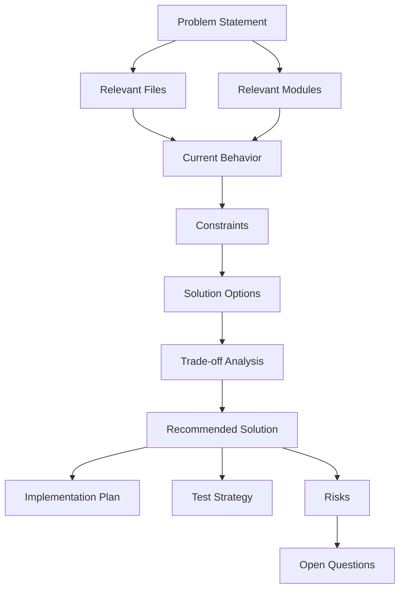

# Concept: {{title}}

## 1. Problem Summary

{{problem_summary}}

## 2. Context

{{context}}

## 3. Analysis Graph

## 4. Relevant Files and Modules

{{relevant_files}}

## 5. Current Project Behavior

{{current_behavior}}

## 6. Existing Patterns Found

{{existing_patterns}}

## 7. Constraints

{{constraints}}

## 8. Solution Options

### Option A: {{option_a_title}}

{{option_a_description}}

**Pros**

{{option_a_pros}}

**Cons**

{{option_a_cons}}

**Complexity**

{{option_a_complexity}}

**Risk**

{{option_a_risk}}

---

### Option B: {{option_b_title}}

{{option_b_description}}

**Pros**

{{option_b_pros}}

**Cons**

{{option_b_cons}}

**Complexity**

{{option_b_complexity}}

**Risk**

{{option_b_risk}}

---

### Option C: {{option_c_title}}

{{option_c_description}}

**Pros**

{{option_c_pros}}

**Cons**

{{option_c_cons}}

**Complexity**

{{option_c_complexity}}

**Risk**

{{option_c_risk}}

## 9. Trade-off Analysis

{{tradeoff_analysis}}

## 10. Recommended Solution

{{recommended_solution}}

## 11. Implementation Plan

{{implementation_plan}}

## 12. Test Strategy

{{test_strategy}}

## 13. Risks

{{risks}}

## 14. Open Questions

{{open_questions}}

## 15. Suggested Follow-up Ticket

{{suggested_followup_ticket}}
