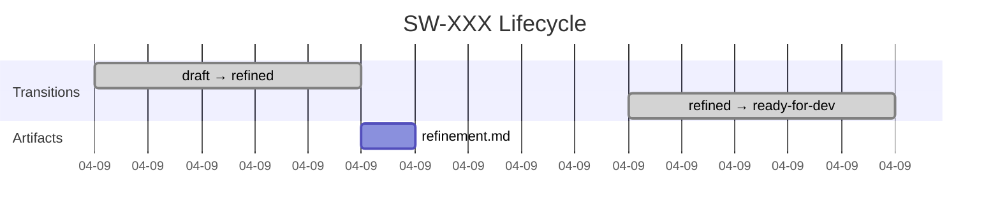

# Ticket Changes Tutorial Workflow

**Purpose:** Define the deterministic transformation that turns a ticket's audit trail and lifecycle artifacts into a tutorial-style Markdown document under `_scrum-output/tutorials/`.

**Referenced by:** `/scrum-ticket-changes` (`commands/ticket-changes.md`).

---

## Inputs

| Input | Required? | Source |
|-------|-----------|--------|
| `ticketId` | yes (or `--all` / `--epic`) | CLI argument, validated against `^SW-\d{3}$`. |
| `options.format` | no, default `markdown` | CLI flag `--format`. |
| `options.includeDiffs` | no, default `false` | CLI flag `--include-diffs`. |
| `options.timeline` | no, default `true` | Inverse of `--no-timeline`. |
| `options.since` | no | ISO 8601 date string from `--since`. |
| `options.bundleName` | no | String from `--bundle`. |

---

## Resolution Rules

When the user passes `--all` or `--epic N`, expand the input list before generation:

1. `--all` → list every directory matching `_scrum-output/sprints/SW-???/`.
2. `--epic N` → for each story directory, parse `story.md` frontmatter and keep only those with `epic: N`.
3. Multiple positional `SW-XXX` arguments → use as-is, after validation.

If, after resolution, the list is empty, halt with:

```
ℹ️ No tickets matched the requested filter.
```

---

## Per-Ticket Pipeline

For each resolved ticket the workflow runs the following deterministic steps. Steps 1–3 are reads; steps 4–6 are pure transformations; step 7 is the only write.

### Step 1 — Load Story Snapshot

Read `_scrum-output/sprints/SW-XXX/story.md`:

- Parse YAML frontmatter (title, status, type, risk_level, depth, domain_tags, estimation, status_history, epic).
- Extract description and acceptance criteria sections.
- Capture `status_history[]` entries.

If the file is missing, set `snapshot = null` and continue — the `getAuditTrail()` query may still return useful data.

### Step 2 — Load Audit Trail

Use `utils/audit.js#getAuditTrail(ticketId, options)` to obtain:

```js
{
  entries: AuditEntry[],
  summary: AuditSummary,
  totalCount: number
}
```

When `options.since` is set, pass it through as `startDate` so the helper filters entries by timestamp.

### Step 3 — Load Lifecycle Artifacts

For each known artifact, read the file if it exists, otherwise mark it as `null`:

| Symbol | Path |
|--------|------|
| `refinement` | `_scrum-output/sprints/SW-XXX/refinement.md` |
| `plan` | `_scrum-output/sprints/SW-XXX/plan.md` |
| `verification` | `_scrum-output/sprints/SW-XXX/verification-report.md` |
| `reviews[]` | `_scrum-output/sprints/SW-XXX/review-*.md` (sorted) |
| `approvals[]` | `_scrum-output/sprints/SW-XXX/approval-*.md` (sorted) |

For `--include-diffs`, also collect:

```bash
git log --pretty=format:"%h %ad %s" --date=iso -- _scrum-output/sprints/SW-XXX/
git log --pretty=format:"%h %ad %s" --date=iso --grep="SW-XXX"
```

…and resolve diffs with `git show <hash> -- <files>`.

### Step 4 — Build Chapter Model

Assemble a structured object that downstream renderers can serialize into Markdown or JSON:

```js
{
  ticket: "SW-XXX",
  title: snapshot?.frontmatter.title ?? "(unknown)",
  finalStatus: snapshot?.frontmatter.status ?? "(unknown)",
  generated: <ISO timestamp>,
  chapters: {
    idea:           { description, acceptanceCriteria },
    refinement:     { perspectives, decisions } | null,
    planning:       { steps, risks } | null,
    implementation: { transitions, commits, diffs? } | null,
    verification:   { result, summary, failures } | null,
    reviewApproval: { reviews[], approvals[] } | null,
    timeline:       { mermaid: <string> },
    lessons:        { risks, decisions, followUps }
  },
  source: {
    auditEntries: number,
    artifactsFound: string[]
  }
}
```

Any chapter whose source data is missing MUST be set to `null` so the renderer can substitute the `*No data recorded for this phase.*` placeholder.

### Step 5 — Render Mermaid Timeline

Generate a Mermaid Gantt chart from `auditTrail.entries`:



If `--no-timeline` is set, omit this chapter entirely.

### Step 6 — Render Markdown Tutorial

Use the template below. Skip headings whose chapter is `null`, but keep their placeholder so the tutorial reads as a complete narrative.

```markdown
---
schema_version: 1
ticket: SW-XXX
title: "{{title}}"
final_status: "{{finalStatus}}"
generated: "{{generated}}"
entry_count: {{auditEntries}}
---

# Tutorial: SW-XXX — {{title}}

> A walk-through of every change this ticket went through, from idea to done.
> Generated by `/scrum-ticket-changes` on {{generated}}.

## Chapter 1 — The Idea

**Why this story exists**

{{description}}

**Acceptance Criteria**

{{acceptanceCriteria as bullet list}}

## Chapter 2 — Refinement

{{summarize refinement.perspectives}} or *No data recorded for this phase.*

## Chapter 3 — Planning

{{summarize plan.steps & risks}} or *No data recorded for this phase.*

## Chapter 4 — Implementation

{{transitions table}}
{{commits list}}
{{optional diffs}}

## Chapter 5 — Verification

{{verification.result + summary}} or *No data recorded for this phase.*

## Chapter 6 — Review & Approval

{{review rounds + approval rounds}} or *No data recorded for this phase.*

## Chapter 7 — Timeline

```mermaid
{{mermaid timeline}}
```

## Chapter 8 — Lessons Learned

- **Risks raised:** {{risks}}
- **Decisions taken:** {{decisions}}
- **Follow-ups:** {{followUps}}

---

*This tutorial is regenerated on every run of `/scrum-ticket-changes`.*
```

### Step 7 — Write Output

The agent MAY write multiple files per run. All writes stay inside `_scrum-output/tutorials/`. Use the same atomic write pattern as `utils/audit.js` (`temp file → rename`) for every file to avoid partial writes.

#### 7a. Single-file mode (default)

- Single ticket: `_scrum-output/tutorials/SW-XXX-tutorial.md` (overwrite).
- `--bundle <name>`: concatenate per-ticket outputs into `_scrum-output/tutorials/<name>-tutorial.md`, separated by `\n---\n` rules.
- Multiple tickets without `--bundle`: write each per-ticket file, then write `_scrum-output/tutorials/index.md` listing all generated tutorials in chronological order of `last_updated`.

#### 7b. Split mode (`--split`)

For each ticket, materialise the chapter model from step 4 into a directory:

```
_scrum-output/tutorials/SW-XXX/
├── README.md              # landing page
├── 01-the-idea.md
├── 02-refinement.md
├── 03-planning.md
├── 04-implementation.md
├── 05-verification.md
├── 06-review-approval.md
├── 07-timeline.md
├── 08-lessons.md
└── assets/                # only created if at least one asset is needed
    ├── timeline.mmd
    └── diffs/<short-sha>.diff
```

Rules:

1. Before writing, the agent MAY remove the existing `_scrum-output/tutorials/SW-XXX/` directory contents to ensure a clean, deterministic re-run. It MUST NOT touch sibling tickets.
2. Every chapter file is created even if the source data is missing — its body is the `*No data recorded for this phase.*` placeholder. This guarantees a stable file count between runs.
3. The `README.md` landing page contains the frontmatter, a short overview paragraph, and an ordered list linking to each chapter file.
4. Chapter 7 (`07-timeline.md`) embeds the Mermaid block. When `--split` is used, the agent SHOULD also write the raw diagram source to `assets/timeline.mmd` so it can be edited or rendered with external tools.
5. With `--include-diffs`, large diffs (>200 lines) MUST be written to `assets/diffs/<short-sha>.diff` and linked from `04-implementation.md`. Smaller diffs MAY be inlined.
6. `--bundle` is mutually exclusive with `--split`. If both are passed, halt with a clear error before any file is written.

For multi-ticket runs in split mode, also write `_scrum-output/tutorials/index.md` linking to each per-ticket `README.md`.

#### 7c. JSON mode (`--format json`)

Skip steps 5–6 and emit the chapter model from step 4 directly. With `--split`, write one `<chapter>.json` per chapter alongside a top-level `metadata.json`. Without `--split`, write a single `_scrum-output/tutorials/SW-XXX-tutorial.json`.

---

## Index File Format

When multiple tickets are generated and `--bundle` is **not** used, also emit:

```markdown
---
generated: "<ISO timestamp>"
count: <N>
---

# Ticket Tutorials

| Ticket | Title | Final Status | File |
|--------|-------|--------------|------|
| SW-001 | … | done | [SW-001-tutorial.md](./SW-001-tutorial.md) |
| SW-002 | … | review | [SW-002-tutorial.md](./SW-002-tutorial.md) |
```

---

## Error Handling

| Scenario | Behavior |
|----------|----------|
| Invalid ticket ID format | Halt before any file access; print the formatted error from `commands/ticket-changes.md`. |
| Both `--split` and `--bundle` passed | Halt before any file access with: `❌ --split and --bundle are mutually exclusive.` |
| Ticket has no story.md and no audit trail | Skip the ticket and emit the `Nothing to tutor` notice. In multi-ticket mode the run continues for the remaining IDs. |
| `_scrum-output/tutorials/` missing | Create it (created by the installer, but defensively `mkdir -p`). In split mode, also `mkdir -p` the per-ticket subdirectory and `assets/`, `assets/diffs/` on demand. |
| Concurrent write conflict | Retry up to 3 times with backoff 1s/2s/4s. After that, halt. |
| Git commands fail when `--include-diffs` is set | Emit a warning, omit the diff sub-chapter (or skip writing `assets/diffs/` in split mode), and continue. Never abort the tutorial because of git issues. |

---

## Determinism Rules

1. The renderer MUST sort all collections by ISO 8601 timestamp ascending.
2. Acceptance criteria, perspectives, and review rounds MUST be rendered in the order they appear in their source files (no re-ordering).
3. Re-running the command with identical inputs MUST produce a byte-for-byte identical Markdown output, except for the `generated` timestamp in the frontmatter.

---

*This workflow is referenced by the `/scrum-ticket-changes` command.*
