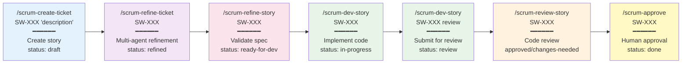
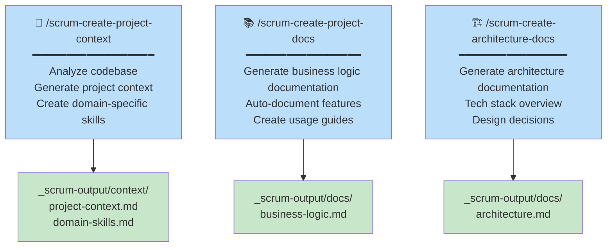
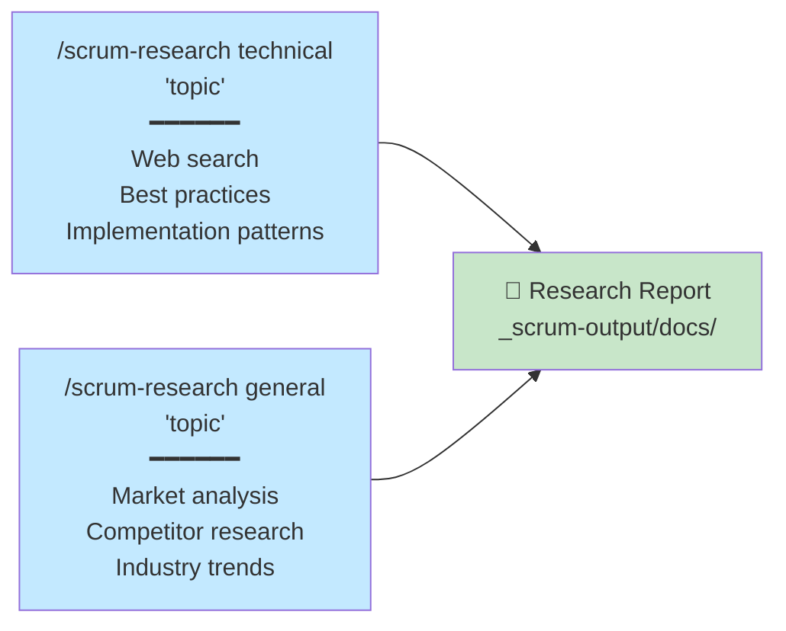
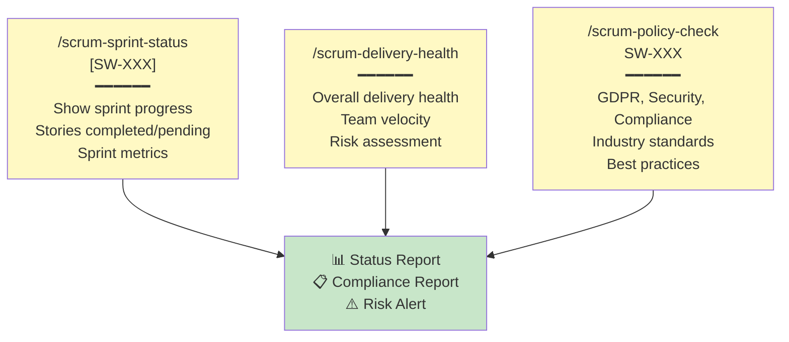
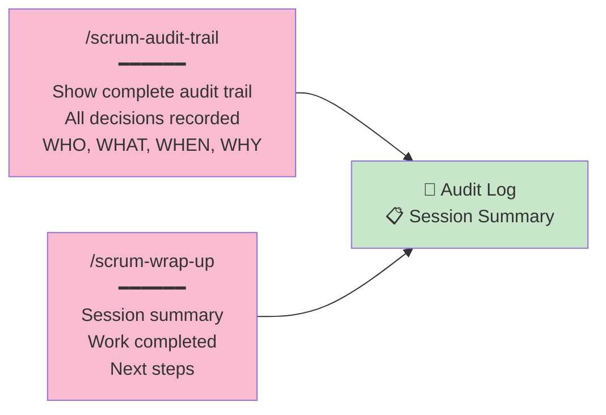
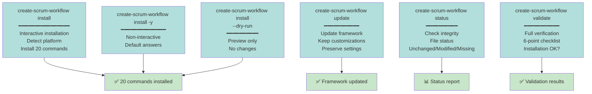
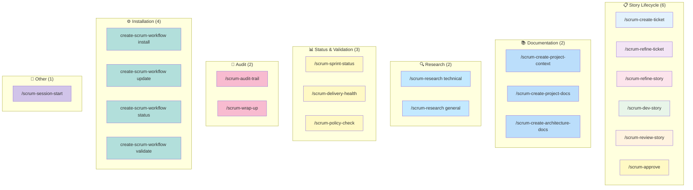

# 🎯 All 20 Scrum Workflow Commands

Complete visual overview of all commands organized by category.

---

## Story Lifecycle (6 Commands)



---

## Documentation Commands (2)



---

## Research Commands (2)



---

## Status & Validation Commands (3)



---

## Audit & Session Commands (2)



---

## Installation & Maintenance (4)



---

## All 20 Commands Summary



---

## Quick Reference: Command Categories

| Category | Count | Commands |
|----------|-------|----------|
| **Story Lifecycle** | 6 | create, refine, validate, dev, review, approve |
| **Documentation** | 3 | project-context, project-docs, architecture-docs |
| **Research** | 2 | research (technical), research (general) |
| **Status & Validation** | 3 | sprint-status, delivery-health, policy-check |
| **Audit & Session** | 2 | audit-trail, wrap-up |
| **Installation** | 4 | install, update, status, validate |
| **Other** | 1 | session-start |
| **TOTAL** | **20** | All commands |

---

## Command Usage Frequency

```
Most Used (Daily):
  /scrum-dev-story SW-XXX          — Implementation
  /scrum-review-story SW-XXX       — Code review

Regular Use (Per Story):
  /scrum-create-ticket SW-XXX      — Create
  /scrum-refine-ticket SW-XXX      — Refinement
  /scrum-refine-story SW-XXX       — Validation
  /scrum-approve SW-XXX            — Approval

Periodic Use (Weekly/Monthly):
  /scrum-sprint-status             — Status check
  /scrum-delivery-health           — Health check
  /scrum-policy-check              — Compliance
  /scrum-audit-trail               — Audit

One-time Setup:
  create-scrum-workflow install    — Initial setup
  /scrum-create-project-context    — Project init

Maintenance:
  create-scrum-workflow update     — Framework updates
  create-scrum-workflow validate   — Integrity check
```

---

## See Also

- [WORKFLOW-QUICK-REFERENCE.md](./WORKFLOW-QUICK-REFERENCE.md) — Detailed command examples
- [README.md](../../README.md) — Complete command reference
- [GETTING-STARTED.md](./GETTING-STARTED.md) — Workflow walkthrough
- [scrum_workflow/commands/README.md](../../src/core/commands/README.md) — All command definitions

---

**Version:** 1.2.0  
**Last Updated:** 2026-04-09
