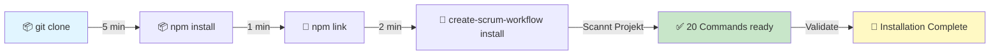
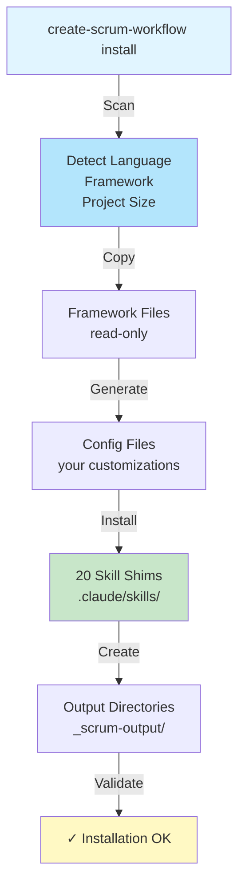
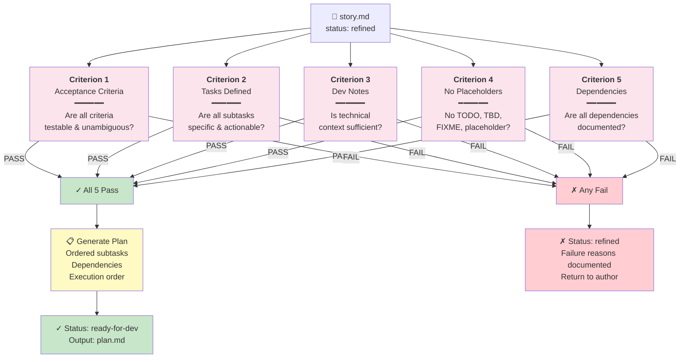
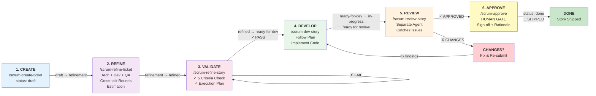

# Getting Started with Scrum Workflow

**Zielgruppe:** Product Owner, Tech Lead, Entwickler  
**Dauer:** 15 Minuten  
**Voraussetzungen:** Node.js 16+, Git, AI-Editor (Claude Code empfohlen)

---

## Phase 1: Installation (5 Minuten)

### Installation Overview



### Schritt 1: Repository klonen

```bash
git clone <repo-url>
cd scrum_workflow
```

### Schritt 2: CLI installieren und verlinken

```bash
# Dependencies installieren
cd create-scrum-workflow
npm install

# CLI global verfügbar machen
npm link
cd ..
```

### Schritt 3: In dein Projekt installieren

```bash
cd /path/to/your-project

# Installation starten
create-scrum-workflow install

# Oder für Automation
create-scrum-workflow install --yes
```

**Das Installer macht:**


### Schritt 4: Installation verifizieren

```bash
create-scrum-workflow status
create-scrum-workflow validate
```

Sollte alles grün sein ✓

---

## Phase 2: Projekt initialisieren (5 Minuten)

### Schritt 1: Projektkontext generieren

Dies ist ein **einmaliger Schritt** — der AI Assistem analysiert dein Code-Repository:

```bash
/scrum-create-project-context
```

**Was passiert:**
1. Scans dein Codebase (Struktur, Dependencies, Tech Stack)
2. Erstellt eine Projektbeschreibung
3. Generiert Domain-spezifische Skills für intelligentere Vorschläge
4. Erstellt Architektur-Dokumentation

**Output:** 
- `_scrum-output/context/project-context.md` — Dein Projektkontext
- `_scrum-output/docs/` — Auto-generierte Dokumentation
- `_scrum-output/skills/` — Domain-spezifische Skills

---

## Phase 2.5: Starting from Zero (optional, für neue Projekte)

Wenn du ein brandneues Projekt bei **null** startest und nur eine Idee hast (noch keine klar umrissenen Features), nutze den Greenfield-Flow **bevor** du das erste Ticket erstellst:

### Schritt A: Idee einfangen (Multi-Agent-Brainstorming)

```bash
/scrum-create-brief "A habit tracker that gamifies daily routines for ADHD users"
```

Drei Agents (product-strategist, architect, qa) analysieren die Idee parallel. Dann startet ein Interview-Loop, der so lange Fragen stellt, bis alle offenen Punkte geklärt sind.

**Output:** `_scrum-output/briefs/PB-001.md` mit Status `complete`.

### Schritt B: Brief in Epics zerlegen (Plan-Then-Execute)

```bash
/scrum-decompose-epics PB-001
```

Ein einzelner Agent committet sich auf den kompletten Epic-Graph — keine Drift mitten in der Zerlegung.

**Output:** `_scrum-output/epics/index.md` + `EP-001/epic.md`, `EP-002/epic.md`, ...

### Schritt C: Story-Drafts pro Epic generieren (Orchestrator-Worker)

```bash
/scrum-draft-stories EP-001
```

N Subagents draften parallel je einen Kandidaten — aggregiert in `draft-stories.md`.

### Schritt D: Einzelne Drafts als Tickets promoten

```bash
/scrum-create-ticket SW-001 --from-epic EP-001 --from-draft 1
```

Ab hier geht es weiter mit dem bestehenden Lifecycle (refine → dev → review → approve). Jeder Draft ist ein Human-Gate — du entscheidest, was gebaut wird.

**Unterbrechung?** Jeder Schritt ist resume-fähig: nach Ctrl-C einfach `/scrum-create-brief PB-001 --resume` oder `/scrum-draft-stories EP-001 --resume`.

Details: [greenfield-workflow.md](./greenfield-workflow.md)

---

## Phase 3: Deine erste Story (5 Minuten)

### Schritt 1: Story erstellen

Wenn du **nicht** den Greenfield-Flow genutzt hast und eine konkrete Feature-Idee hast:

```bash
/scrum-create-ticket SW-001 "Beschreibung deiner Feature"
```

**Beispiel:**
```bash
/scrum-create-ticket SW-001 "Add user authentication with OAuth2"
```

Wenn du den Greenfield-Flow genutzt hast, nutze stattdessen die Promote-Variante:

```bash
/scrum-create-ticket SW-001 --from-epic EP-001 --from-draft 1
```

**Output:**
```
_scrum-output/sprints/SW-001/
├── story.md          # Deine Story-Spezifikation
└── status: draft     # Noch nicht verfeinert
```

### Schritt 2: Story verfeinern

Jetzt durchläuft deine Story einen **Multi-Agent Refinement**:

```bash
/scrum-refine-ticket SW-001
```

**Was passiert (3-5 Minuten):**
1. **Architect Agent** — Prüft Architektur, Sicherheit, Skalierung
2. **Developer Agent** — Prüft Machbarkeit, Dependencies, Komplexität
3. **QA Agent** — Prüft Testbarkeit, Akzeptanzkriterien

Diese Agents diskutieren miteinander und erstellen ein **Refinement Audit Trail**.

**Output:**
```
_scrum-output/sprints/SW-001/
├── story.md            # Updated mit Findings
├── refinement.md       # Vollständige Analyse (Architect/Dev/QA)
└── status: refined     # Bereit zur Validierung
```

### Schritt 3: Validierung

Bevor die Entwicklung startet, wird die Story gegen **5 Kriterien validiert**:

```bash
/scrum-refine-story SW-001
```



**Ergebnis:**
- ✓ **PASS:** Status → `ready-for-dev`, Execution Plan erstellt
- ✗ **FAIL:** Status bleibt `refined`, Fehler dokumentiert (Fix & Retry)

**Output (bei PASS):**
```
_scrum-output/sprints/SW-001/
├── plan.md            # Ausführungsplan mit Subtasks
└── status: ready-for-dev
```

---

## Phase 4: Development (Variable Dauer)

### Schritt 1: Implementierung starten

```bash
/scrum-dev-story SW-001
```

Der Developer Agent implementiert deinen Plan:
- Folgt exakt dem `plan.md`
- Schreibt Code in echte Dateien
- Führt Tests aus
- Macht KEINE Selbstvalidierung (separate Phase)

**Output:**
```
_scrum-output/sprints/SW-001/
├── story.md           # Status: in-progress
└── (Dein Code ist implementiert)
```

### Schritt 2: Tests prüfen

Bevor du zur Überprüfung gehst:

```bash
# Tests manuell prüfen
npm test

# Oder lass AI einen Review anfragen
/scrum-dev-story SW-001 review
```

**Output:**
```
_scrum-output/sprints/SW-001/
├── story.md           # Status: review
└── (Wartet auf Code Review)
```

---

## Phase 5: Code Review (5-10 Minuten)

### Schritt 1: Review-Agent ausführen

```bash
/scrum-review-story SW-001
```

Ein **separater Agent** (idealerweise anderes Model) überprüft den Code gegen:
1. ✓ Entspricht die Story-Spec genau?
2. ✓ Sind alle Akzeptanzkriterien erfüllt?
3. ✓ Ist die Test-Coverage ausreichend?
4. ✓ Folgt der Code den Projekt-Konventionen?
5. ✓ Folgt die Architektur den Dev Notes?

**Ergebnis:**
- ✓ **APPROVED:** Status → `approved` (siehe Phase 6)
- ✗ **CHANGES-NEEDED:** Status → `changes-needed`

**Output:**
```
_scrum-output/sprints/SW-001/
├── review-1.md        # Review Findings (Severity, Fixes)
└── status: approved OR changes-needed
```

### Schritt 2 (falls CHANGES-NEEDED): Fixes durchführen

```bash
# Fixes implementieren
/scrum-dev-story SW-001

# Re-Submit für Review
/scrum-dev-story SW-001 review

# Re-Review
/scrum-review-story SW-001
```

Dieser Cycle kann mehrmals wiederholt werden bis APPROVED.

---

## Phase 6: Human Approval (2 Minuten)

### Schritt 1: Approval durchführen

Dies ist der **kritische Gate** — nur Menschen können abnicken:

```bash
/scrum-approve SW-001
```

Interaktive Abfrage:
```
Story SW-001: Add user authentication with OAuth2

Refinement: ✓ Architect, Developer, QA Findings
Review:     ✓ All 5 criteria checked
Status:     approved

Approve this story? (y/n)
Rationale: [Text input]
```

**Output:**
```
_scrum-output/sprints/SW-001/
├── approval.md        # Approval Record + Timestamp
└── status: done       # 🎉 Fertig!
```

---

## Zusätzliche Commands (für später)

### Status & Überblick

```bash
# Sprint Status
/scrum-sprint-status SW-001

# Delivery Health Check
/scrum-delivery-health

# Audit Trail (wer, was, wann)
/scrum-audit-trail
```

### Dokumentation & Recherche

```bash
# Projektdokumentation generieren
/scrum-create-project-docs

# Architektur-Dokumentation
/scrum-create-architecture-docs

# Technische Recherche
/scrum-research technical "Redis performance tuning"

# Business/Market Recherche
/scrum-research general "competitor analysis in payments"
```

### Validierung & Prüfungen

```bash
# Policy Check (GDPR, Security, etc.)
/scrum-policy-check SW-001

# Installation Status
create-scrum-workflow status

# Installation Validierung
create-scrum-workflow validate

# Update Framework
create-scrum-workflow update
```

---

## Workflow-Übersicht (Visual)



**Time Breakdown:**
- Create: 1 min
- Refine: 5 min (AI doing the heavy lifting)
- Validate: 2 min
- Develop: 15-40 min (depends on complexity)
- Review: 5 min
- Approve: 2 min
- **Total: ~30-60 min for typical story**

---

## Häufige Fragen

### F: Wie lange dauert es von Story bis Done?
**A:** Ca. 30-60 Minuten pro durchschnittliche Story:
- Create: 1 min
- Refine: 5 min
- Validate: 2 min
- Develop: 15-40 min (abhängig von Komplexität)
- Review: 5 min
- Approval: 2 min

### F: Was wenn eine Story zu groß ist?
**A:** Split sie! Nutze `/scrum-create-ticket` für mehrere kleinere Stories.

### F: Kann ich Stories manuell editieren?
**A:** Ja, aber **begrenzt**:
- ✓ Akzeptanzkriterien ändern (solange status ≤ `ready-for-dev`)
- ✗ Status manuell ändern (nur durch Commands)
- ✗ `plan.md` ändern (wird von Validator erstellt)

### F: Was ist ein "blocker" vs "non-blocker"?
**A:** 
- **Blocker:** Verhindert Shipping (Security, Test, spec mismatch)
- **Non-blocker:** Nice-to-have (Performance optimization, doc improvement)

Nur Blockers stoppen Stories.

### F: Kann ich den Workflow unterbrechen?
**A:** Ja! Git stash deine Änderungen, komm später zurück. Status wird nicht verloren.

---

## Nächste Schritte

1. ✓ Installation testen: `create-scrum-workflow status`
2. ✓ Projekt-Kontext generieren: `/scrum-create-project-context`
3. ✓ Erste Story erstellen: `/scrum-create-ticket SW-001 "Your feature"`
4. ✓ Dokumentation lesen: [DOCUMENTATION-GUIDE.md](./DOCUMENTATION-GUIDE.md)
5. ✓ Framework konfigurieren: `scrum_workflow/config.yaml`

---

**Fragen?** Siehe [README.md](../../README.md) für vollständige Referenz oder [DOCUMENTATION-GUIDE.md](./DOCUMENTATION-GUIDE.md) für alle Dokumente.

**Version:** 1.2.0  
**Last Updated:** 2026-04-09
