# ⚡ Workflow Quick Reference

Visual quick reference for all 20 Scrum Workflow commands.

---

## Story Lifecycle Commands

### Phase 1️⃣: Create Story

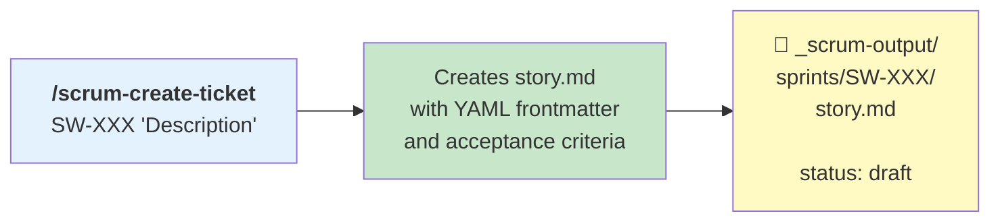

**Example:**
```bash
/scrum-create-ticket SW-001 "Add OAuth2 login with Google and GitHub"
```

---

### Phase 2️⃣: Refine Story

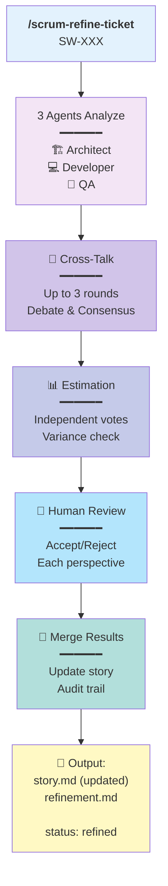

**Example:**
```bash
/scrum-refine-ticket SW-001
```

**What gets generated:**
- `story.md` — Updated with findings
- `refinement.md` — Full audit trail (findings from all agents)

---

### Phase 2b️⃣: Validate Story

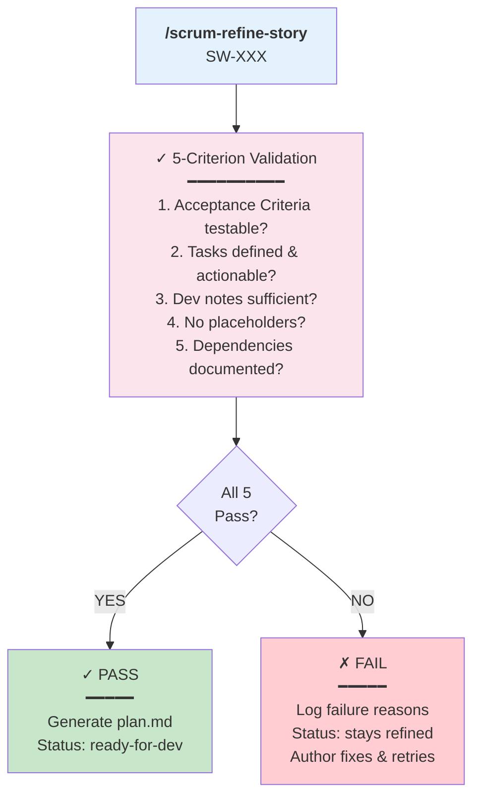

**Example:**
```bash
/scrum-refine-story SW-001
```

**What gets generated (on PASS):**
- `plan.md` — Execution plan with ordered tasks
- `story.md` — Status updated to `ready-for-dev`

---

### Phase 3️⃣: Develop Story

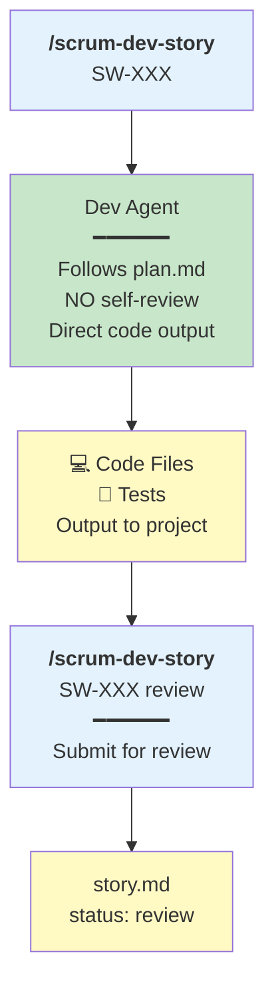

**Example:**
```bash
# Start development
/scrum-dev-story SW-001

# ... tests pass locally ...

# Submit for review
/scrum-dev-story SW-001 review
```

---

### Phase 4️⃣: Review Story

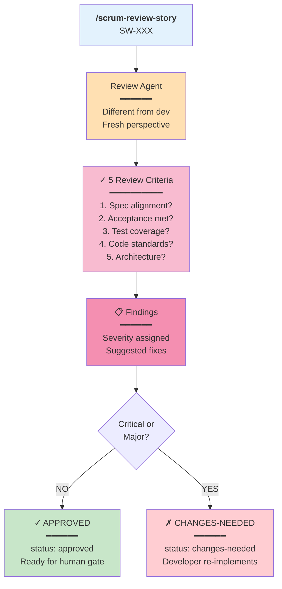

**Example:**
```bash
/scrum-review-story SW-001
```

**What gets generated:**
- `review-1.md` — Review findings with severity
- `story.md` — Status updated to `approved` or `changes-needed`

---

### Phase 5️⃣: Human Approval

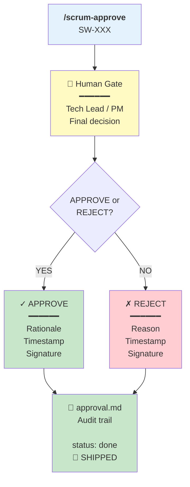

**Example:**
```bash
/scrum-approve SW-001
```

**What gets generated:**
- `approval.md` — Human approval record with full audit trail
- `story.md` — Status updated to `done`

---

## Documentation Commands

### Generate Project Context

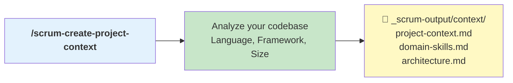

**Example:**
```bash
/scrum-create-project-context
```

---

### Generate Documentation

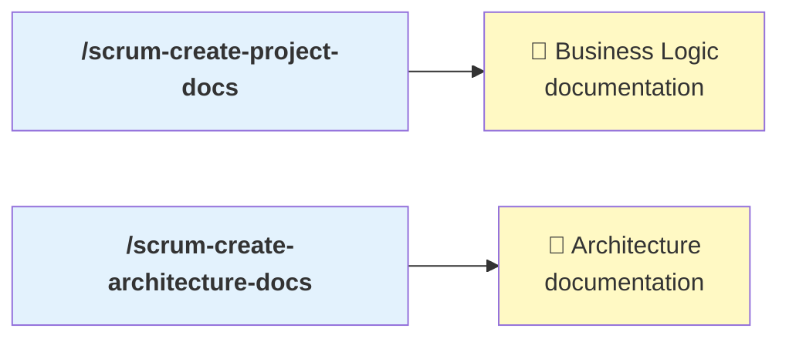

**Examples:**
```bash
/scrum-create-project-docs
/scrum-create-architecture-docs
```

---

## Research Commands

### Technical Research

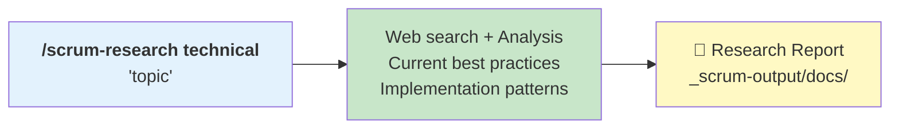

**Example:**
```bash
/scrum-research technical "Redis performance tuning for caching"
```

---

### Business Research

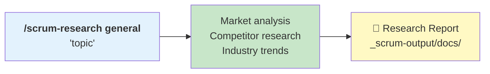

**Example:**
```bash
/scrum-research general "payment processing trends in Europe"
```

---

## Validation Commands

### Sprint Status

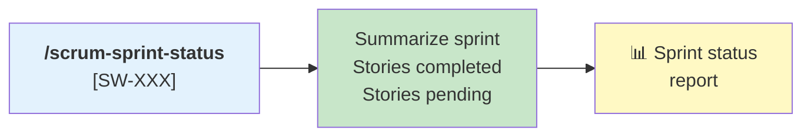

**Example:**
```bash
/scrum-sprint-status SW-001
```

---

### Policy Check

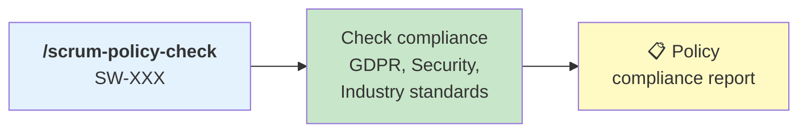

**Example:**
```bash
/scrum-policy-check SW-001
```

---

## Installer Commands

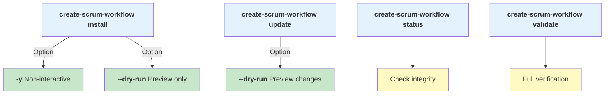

**Examples:**
```bash
# Interactive installation
create-scrum-workflow install

# Non-interactive
create-scrum-workflow install -y

# Preview
create-scrum-workflow install --dry-run

# Update framework
create-scrum-workflow update

# Check status
create-scrum-workflow status

# Validate installation
create-scrum-workflow validate
```

---

## All 20 Commands Summary

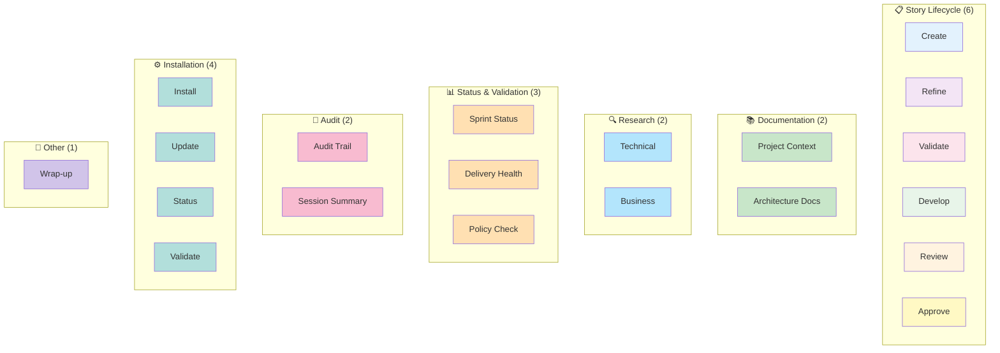

**Total: 20 Commands**
- 6 Story Lifecycle (required in order)
- 2 Documentation Generation
- 2 Research
- 3 Status & Validation
- 2 Audit
- 4 Installation
- 1 Wrap-up

---

## Command Cheatsheet

| Command | Phase | Status In | Status Out |
|---------|-------|-----------|------------|
| `/scrum-create-ticket` | 1 | — | `draft` |
| `/scrum-refine-ticket` | 2 | `draft` | `refined` |
| `/scrum-refine-story` | 2b | `refined` | `ready-for-dev` \|  `refined` |
| `/scrum-dev-story` | 3 | `ready-for-dev` | `in-progress` |
| `/scrum-dev-story review` | 3b | `in-progress` | `review` |
| `/scrum-review-story` | 4 | `review` | `approved` \| `changes-needed` |
| `/scrum-approve` | 5 | `approved` | `done` |

---

## Typical Story Timeline

```mermaid
gantt
    title "Typical Story (13 story points)"
    dateFormat YYYY-MM-DD HH:mm
    
    Create :create, 2026-04-09 09:00, 5m
    Refine :refine, after create, 5m
    Validate :validate, after refine, 2m
    Develop :develop, after validate, 1h 30m
    Review :review, after develop, 5m
    Approve :approve, after review, 2m
    
    section Legend
    Phase 1-2b :phase1, 0m, 12m
    Phase 3 :phase3, 0m, 90m
    Phase 4-5 :phase4, 0m, 7m
```

**Total time from story creation to shipped: ~30-60 minutes** (typical)

---

## Next Steps

1. **Quick Reference:** Save this page (Cmd+D)
2. **Deep Dive:** [GETTING-STARTED.md](./GETTING-STARTED.md) for step-by-step walkthrough
3. **Full Details:** [README.md](../../README.md) for complete reference
4. **Architecture:** [ARCHITECTURE-VISUAL.md](./ARCHITECTURE-VISUAL.md) for system design

---

**Version:** 1.2.0  
**Last Updated:** 2026-04-09
