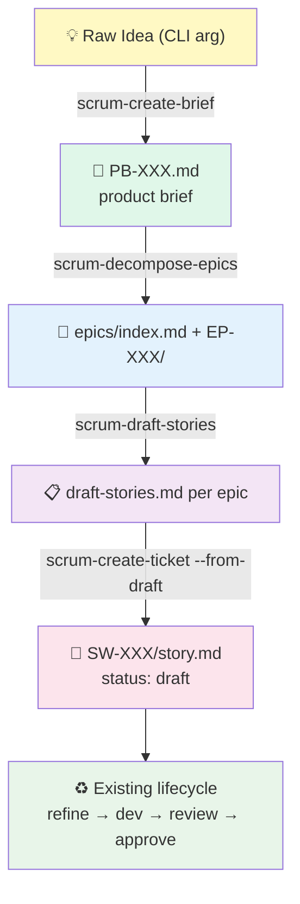

# Greenfield Workflow: Idea → Brief → Epics → Tickets

**Status:** v1.3.0 (Production-Ready)
**Target Audience:** Product Owner, Tech Lead, Developer starting a brand-new project

---

## Why This Exists

`scrum_workflow` v1.0–1.2 assumed you already knew **what** to build: `/scrum-create-ticket` takes a feature description and creates a story. But real projects start earlier — with an idea, not a feature list. You need a structured path from "I have an idea" to "I have tickets I can refine and implement."

The Greenfield flow adds three commands **before** ticket creation:

1. **`/scrum-create-brief`** — turn a raw idea into a structured Product Brief
2. **`/scrum-decompose-epics`** — break the brief into a deterministic graph of Epics
3. **`/scrum-draft-stories`** — generate candidate story drafts per epic in parallel

Then `/scrum-create-ticket SW-XXX --from-epic EP-XXX --from-draft N` promotes a draft into a real ticket that enters the existing lifecycle.

---

## Flow Overview



---

## Multi-Agent Patterns

Each phase applies a distinct pattern from [agentic-patterns.com](https://www.agentic-patterns.com/patterns?tag=multi-agent):

### Phase 1: Brief — Iterative Multi-Agent Brainstorming + Reflection Loop

- **Parallel perspectives:** `product-strategist`, `architect`, `qa` analyze the raw idea in isolation. `developer` is deliberately omitted — engineering lens at this stage biases product framing.
- **Synthesis:** outputs merged via the reused `skills/synthesis` skill.
- **Aggressive Reflection:** after synthesis, the orchestrator enumerates `open_questions`. If non-empty, it interviews the user, folds answers in, and re-evaluates. Loop runs **until `open_questions` is empty** (safety net: `greenfield.brief_max_interview_rounds` in `config.yaml`, default 5).

**Why aggressive?** A brief with unanswered questions produces fuzzy epics and fuzzy stories. Better to spend tokens up-front than rework downstream.

### Phase 2: Epics — Plan-Then-Execute

- **One agent, one commitment:** `epic-decomposer` reads the entire brief, applies `data/epic-decomposition-rules.yaml`, and emits the full epic graph in a single pass.
- **No dynamic replanning:** parallel sub-agents would produce inconsistent epic boundaries. Single-agent Plan-Then-Execute guarantees coherence.
- **Validation before write:** output must satisfy size (3–`max_epics_per_brief`), coverage (every capability assigned), and structural (≥2 AC per epic) constraints. Violations halt before any file is written.

### Phase 3: Stories — Orchestrator-Worker

- **N parallel subagents:** orchestrator splits the epic's capability breakdown into N slices; spawns up to `max_parallel_story_drafters` subagents (default 5).
- **Map-reduce aggregation:** each subagent returns one draft; orchestrator sorts by index, classifies via `story-classifier`, and writes `draft-stories.md`.
- **Partial failure tolerance:** if some subagents crash, the rest still complete and are written. Failed indices are tracked in `.draft-state.json` for resume.

### Cross-cutting: Feature List as Immutable Contract

Once an artifact's status advances, downstream commands treat it as **read-only**:

- Brief with `status: decomposed` → cannot be edited by `/scrum-create-brief`
- Epic with `status: drafted` → body is frozen; `/scrum-draft-stories` updates only the `status` field
- Draft-stories.md → only consumed by `/scrum-create-ticket`, never modified

---

## Artifact & Status Reference

### Product Brief — `_scrum-output/briefs/PB-XXX.md`

| Status | Set by | Meaning |
|--------|--------|---------|
| `captured` | `/scrum-create-brief` (start) | Raw idea logged, brainstorming runs |
| `interview` | `/scrum-create-brief` (mid-loop) | Open questions remain, next round pending |
| `complete` | `/scrum-create-brief` (end) | Zero open questions; ready for decomposition |
| `decomposed` | `/scrum-decompose-epics` | Epics derived; brief is now read-only |

### Epic — `_scrum-output/epics/EP-XXX/epic.md`

| Status | Set by | Meaning |
|--------|--------|---------|
| `planned` | `/scrum-decompose-epics` | Epic exists, no drafts yet |
| `drafting` | `/scrum-draft-stories` (start) | Parallel subagents running |
| `drafted` | `/scrum-draft-stories` (end) | `draft-stories.md` ready for promotion |
| `in-progress` | `/scrum-create-ticket --from-epic` | ≥1 story promoted from this epic |
| `complete` | *(derived, not persisted)* | All this epic's stories have `status: done` — computed on read |

**Not a state machine:** epic statuses are **progress markers**. There are no guards preventing, say, editing an epic after `drafted` — the markers give the user visibility, not enforcement. The hard enforcement is on **write boundaries** (who can write what), not on **status transitions** of epics.

---

## Interruption & Recovery

All greenfield commands reuse the filesystem-based state pattern from the `researcher` agent.

| Command | State file | Contains |
|---------|-----------|----------|
| `/scrum-create-brief` | `_scrum-output/briefs/.brief-state-PB-XXX.json` | `current_phase`, `current_round`, `agents_completed`, `pending_questions` |
| `/scrum-decompose-epics` | *(none — idempotent single-pass)* | — |
| `/scrum-draft-stories` | `_scrum-output/epics/EP-XXX/.draft-state.json` | `subagents_completed`, `subagents_pending`, `subagents_failed` |

### Resume Semantics

- **Re-invocation with state file present and no flag:** halts with "state file exists, use --resume or --restart"
- **`--resume`:** loads state, continues from last checkpoint (e.g., re-spawns only pending subagents, re-presents pending questions)
- **`--restart`:** prompts confirmation, deletes state + artifact, starts fresh
- **Successful completion:** state file auto-deleted

### Crash Scenarios

| Scenario | Outcome |
|----------|---------|
| Ctrl-C during `/scrum-create-brief` round 3 | Partial brief + state remain; re-run prompts resume |
| One of N drafting subagents fails | Others complete; state file lists failed index; `--resume` retries only that one |
| `/scrum-decompose-epics` crashes mid-write | Atomic writes (temp + rename) mean each epic file is either complete or absent; re-run with `--force` to retry |
| User edits brief after `status: decomposed` | No automatic re-decomposition; user must explicitly `/scrum-decompose-epics PB-XXX --force` |

---

## Configuration

In `config.yaml` (or project-local override):

```yaml
greenfield:
  brief_max_interview_rounds: 5          # Safety net for Reflection Loop
  epic_target_story_count: 5             # Decomposer's target size per epic
  max_parallel_story_drafters: 5         # Cap for /scrum-draft-stories subagents
  brief_brainstorm_agents:               # Agents in /scrum-create-brief parallel phase
    - product-strategist
    - architect
    - qa
```

To add a security agent to the brief phase (e.g., for fintech or health projects):

```yaml
greenfield:
  brief_brainstorm_agents:
    - product-strategist
    - architect
    - qa
    - security-reviewer
```

---

## End-to-End Example

```bash
# Start a new project from an idea
/scrum-create-brief "A habit tracker that gamifies daily routines for ADHD users"

# ... agents run, interview loop asks 3 rounds of clarifying questions ...
# Output: _scrum-output/briefs/PB-001.md (status: complete)

# Decompose into epics
/scrum-decompose-epics PB-001
# Output: _scrum-output/epics/index.md + EP-001, EP-002, EP-003, EP-004

# Generate drafts for the first epic
/scrum-draft-stories EP-001
# Output: _scrum-output/epics/EP-001/draft-stories.md (5 drafts)

# Review drafts, decide which to promote
cat _scrum-output/epics/EP-001/draft-stories.md

# Promote the first draft into a real ticket
/scrum-create-ticket SW-001 --from-epic EP-001 --from-draft 1
# Output: _scrum-output/sprints/SW-001/story.md (status: draft, parent_epic: EP-001)

# Continue with the existing lifecycle
/scrum-refine-ticket SW-001
/scrum-refine-story SW-001
/scrum-dev-story SW-001
/scrum-dev-story SW-001 review
/scrum-review-story SW-001
/scrum-approve SW-001
```

---

## FAQ

**Do I have to use the Greenfield flow?**
No. It's optional. If you already have well-scoped features, continue with `/scrum-create-ticket SW-XXX "description"` as before.

**Can I skip epics and go directly from brief to tickets?**
Not recommended. Epics give the decomposer a place to keep scope coherent; jumping straight to stories produces more orphaned drafts. If you really have a single-epic project, that's fine — the decomposer will emit one epic.

**Why not auto-create tickets from all drafts at once?**
Human-gate. Each draft should be a deliberate decision. If you want to promote many drafts quickly, script the loop yourself — the command is idempotent per SW-XXX.

**What happens to `draft-stories.md` after all drafts are promoted?**
Nothing automatic. It stays as an audit record of the epic's initial story plan. The epic's `status` flips to `in-progress` on first promotion; there is no `promoted` state on the individual draft entries (their state is implied by the existence of the matching `SW-XXX/story.md`).

**Can I re-run `/scrum-decompose-epics` on an updated brief?**
Yes, with `--force`. Existing epics are archived to `_scrum-output/epics/.archive/<timestamp>/`. Stories that reference archived epics via `parent_epic` continue to exist but now point to a stale epic — accept this trade-off or update them manually.

---

## See Also

- Root [README.md](../../README.md) — quick-start and overall workflow
- [GETTING-STARTED.md](./GETTING-STARTED.md) — full walkthrough including this Phase 2.5
- [src/core/commands/create-brief.md](../core/commands/create-brief.md) — command spec
- [src/core/workflows/brief-creation.md](../core/workflows/brief-creation.md) — step-by-step execution
- [agentic-patterns.com](https://www.agentic-patterns.com/patterns?tag=multi-agent) — pattern catalog
- [piercelamb/deep-plan](https://github.com/piercelamb/deep-plan) — inspiration for the Research → Interview → Planning phase structure
